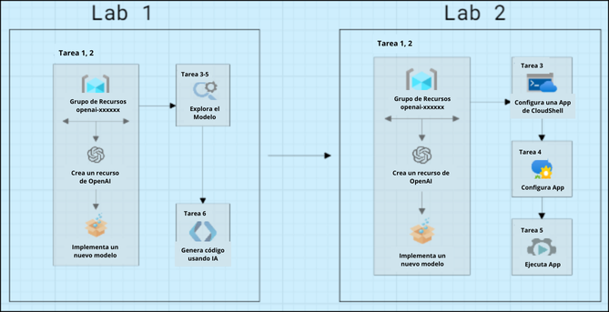

# Get Started With OpenAI And Build Natural Language Solution

### Overall Estimated Duration: 4 Hours

## Overview

Azure OpenAI Service brings the generative AI models developed by OpenAI to the Azure platform, enabling the development of powerful AI solutions with the security, scalability, and integration of Azure's cloud services. In this lab, you'll learn to provision Azure OpenAI as a resource and use Azure OpenAI Studio to deploy and explore OpenAI models. With Azure OpenAI, developers can create applications like chatbots and language models that excel in understanding natural human language. The service provides access to pre-trained AI models and a suite of APIs and tools for customizing and fine-tuning these models to meet specific application requirements. In this scenario, you'll assume the role of a software developer tasked with implementing an app to provide hiking recommendations using generative AI, demonstrating techniques applicable to any app utilizing Azure OpenAI APIs.

## Objective

By the end of this lab, you will be able to:

- **Get started with Azure OpenAI Servic**e: This hands-on exercise aims to provision an Azure OpenAI resource and deploying a model. Explore the model's capabilities in the Completions playground, then interact with it using the Chat playground. Fine-tune responses by adjusting prompts and parameters, and leverage code-generation to automate tasks.
- **Use Azure OpenAI SDKs in your app**: This hands-on exercise aims to provision an Azure OpenAI resource, deploy a model, set up and configure an application in Cloud Shell, and then run the application, demonstrating the full lifecycle from resource creation to application deployment and execution.

## Pre-requisites

- Familiarity with Azure OpenAI Service, Azure CLI, and REST APIs
- Basic understanding of AI and machine learning concepts

## Architecture

The architecture flow for this task begins with provisioning an Azure OpenAI resource within your Azure subscription and deploying a pre-trained model using Azure OpenAI Studio. Next, you'll explore the model's capabilities in the Completions playground and test its conversational abilities in the Chat playground, experimenting with different prompts and parameters to customize responses. You'll also investigate the model's code-generation capabilities. In the application development phase, you'll set up your application environment in Azure Cloud Shell, configure the application to integrate with the deployed OpenAI model, and finally, run the application to provide hiking recommendations using generative AI.

## Architecture Diagram

 

## Explanation of Components

1. **Azure OpenAI**: Integrates your data with large language models, enabling customized and secure interactions.
1. **Azure OpenAI Models**: Offers pre-trained and customizable large language models for various AI applications.
1. **Azure CloudShell**: Provides an online, browser-based shell for managing Azure resources and running scripts.

## Getting Started with the Lab
 
## Accessing Your Lab Environment
 
Once you're ready to dive in, your virtual machine and lab guide will be right at your fingertips within your web browser.
 

### Virtual Machine & Lab Guide
 
Your virtual machine is your workhorse throughout the workshop. The lab guide is your roadmap to success.
 
## Exploring Your Lab Resources
 
To get a better understanding of your lab resources and credentials, navigate to the **Environment** tab.
 

 
## Utilizing the Split Window Feature
 
For convenience, you can open the lab guide in a separate window by selecting the **Split Window** button from the Top right corner.
 

 
## Managing Your Virtual Machine
 
Feel free to start, stop, or restart your virtual machine as needed from the **Resources** tab. Your experience is in your hands!
 

## **Lab Duration Extension**

1. To extend the duration of the lab, kindly click the **Hourglass** icon in the top right corner of the lab environment. 

    

    >**Note:** You will get the **Hourglass** icon when 10 minutes are remaining in the lab.

2. Click **OK** to extend your lab duration.
 
   

3. If you have not extended the duration prior to when the lab is about to end, a pop-up will appear, giving you the option to extend. Click **OK** to proceed. 

## Let's Get Started with Azure Portal
 
1. On your virtual machine, click on the Azure Portal icon as shown below:
 
   .png)
 
2. You'll see the **Sign into Microsoft Azure** tab. Here, enter your credentials:
 
   - **Email/Username:** <inject key="AzureAdUserEmail"></inject>
 
       
 
3. Next, provide your password:
 
   - **Password:** <inject key="AzureAdUserPassword"></inject>
 
       
 
4. If prompted to stay signed in, you can click "No."
 
5. If a **Welcome to Microsoft Azure** pop-up window appears, simply click **Cancel** to skip the tour.
 
6. Click "Next" from the bottom right corner to embark on your Lab journey!
 
     .png)
 
This lab will equip you with the skills to deploy and customize Azure OpenAI models, enabling you to create advanced AI applications like chatbots and recommendation systems.

## Happy Learning!!
