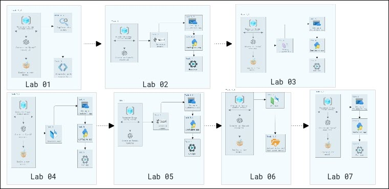
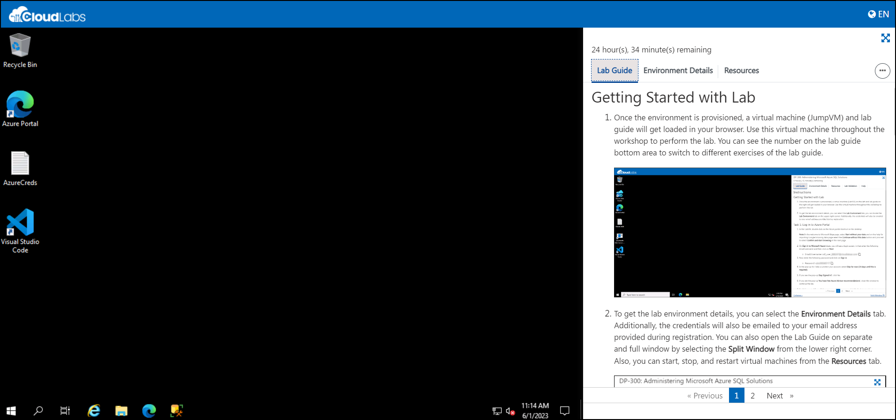
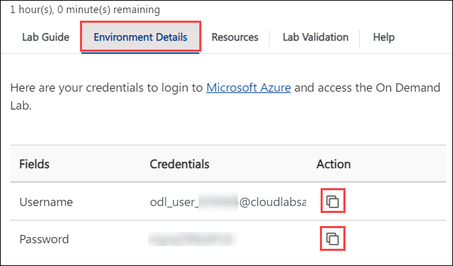
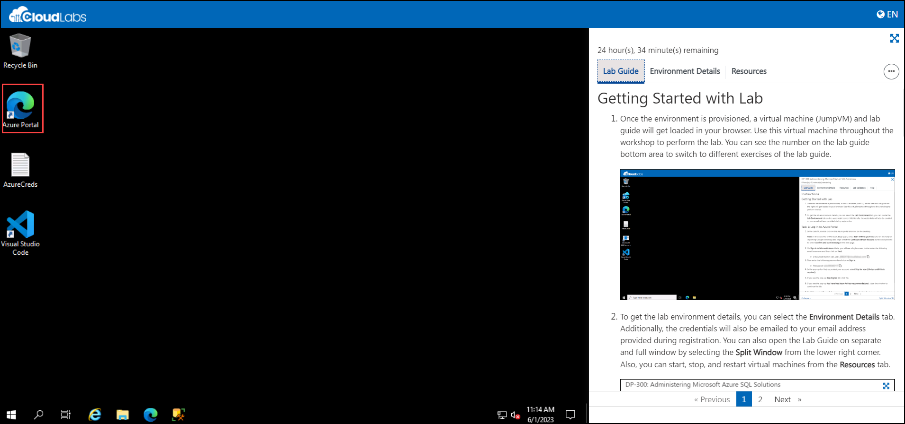
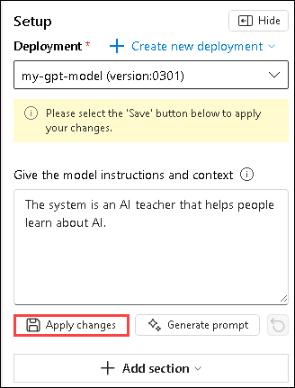
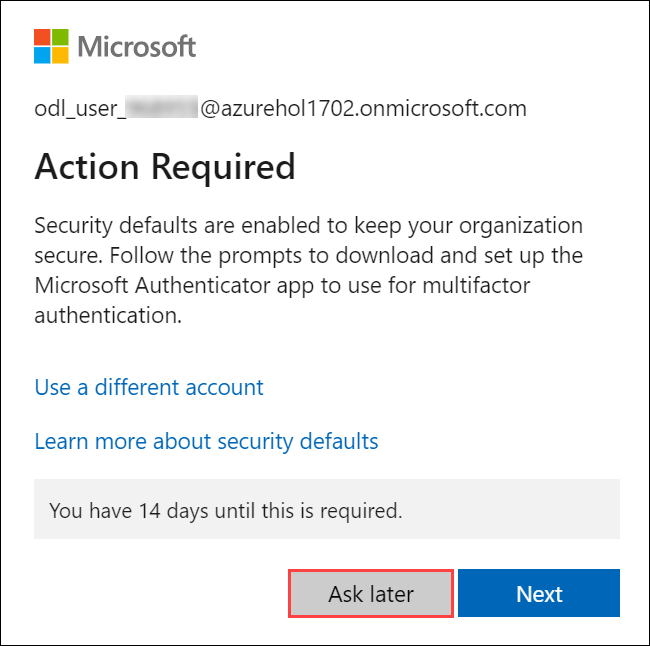
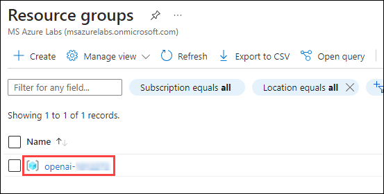

# Develop Generative AI solutions with Azure OpenAI Service
### Overall Estimated Duration: 8 Hours
### Overview

This hands-on labs offer a comprehensive introduction to Azure OpenAI Service. You will begin by configuring the service and integrating Azure OpenAI SDKs into your application. Techniques in prompt engineering will refine interactions, and you'll also gain skills in generating and enhancing code. The DALL-E model will be utilized for image generation, and you will explore the use of your own data for retrieval-augmented generation (RAG). Additionally, you will delve into content filtering to manage and regulate generated outputs. Throughout the labs, you'll gain practical experience with real-world AI applications, learn best practices for deploying and scaling these services in a production environment, and understand how to integrate various Azure services to develop resilient, scalable, and secure AI-powered applications.

## Objective 

This lab is aimed to give learners hands-on experience with Azure OpenAI resources, deploy and explore models using the Completions and Chat playgrounds, and experiment with prompts, parameters, and code generation. By completing this lab

Participants will learn:

1. **Get started with the Azure OpenAI Service**: This hands-on exercise aims to teach you the fundamentals of using Azure OpenAI Service to integrate advanced AI models into your apps. Participants will set up and begin utilizing the Azure OpenAI Service to integrate AI models into their applications.

2. **Use Azure OpenAI SDKs in your app**: This hands-on exercise demonstrates how to integrate Azure OpenAI SDKs into your application to improve AI capabilities. Participants will integrate and use Azure OpenAI SDKs within their application.

3. **Utilize prompt engineering in your app**: This hands-on exercise demonstrates how to use prompt engineering methods to improve AI interactions in your application. Participants will use prompt engineering strategies to enhance the performance and relevance of AI.

4. **Generate and improve code with Azure OpenAI Service**: The goal of this hands-on exercise is to demonstrate how to effectively generate and refine code using Azure OpenAI. Participants will improve their abilities to create and refine code with Azure OpenAI Service tools and approaches.

5. **Generate images with a DALL-E model**: The goal of this hands-on activity is to produce and alter images using the DALL-E model. To attain the intended visual results, participants will develop and alter images using the DALL-E model.

6. **Add your data for RAG using Azure OpenAI Service**: This hands-on exercise will help you integrate your data with the Azure OpenAI Service for Retrieval-Augmented Generation (RAG) to improve AI responses. Participants will integrate data into the Azure OpenAI Service to boost AI-powered retrieval and generation.

7. **Explore content filters in Azure OpenAI**: This hands-on exercise demonstrates how to construct and maintain content filters in Azure OpenAI to control and refine generated outputs. Participants will learn about and implement content filters in Azure OpenAI to control and refine created material.

### Prerequisites
Participants should have:

1. **Development Skills**: Basic programming knowledge and experience with APIs and SDKs.
2. **AI Concepts**: Understanding prompt engineering, code development, and image generation using models such as DALL-E.
3. **Content Management**: Understanding data integration for RAG and content filtering techniques.
   
### Architecture

This lab provides robust functionalities for leveraging AI within Azure. Azure OpenAI integrates your data with large language models, enabling customized and secure interactions tailored to your needs. Azure OpenAI Models offer pre-trained and customizable models for various applications, such as text generation and language translation. Azure CloudShell provides an online, browser-based shell for managing Azure resources and running scripts, streamlining cloud management. DALL-E generates images from textual descriptions using advanced AI technology, enhancing creative capabilities. Finally, prompt engineering refines input prompts to optimize AI model responses, ensuring accuracy and relevance in outputs.

### Architecture Diagram

### Explanation of Components

- **Azure OpenAI**: Integrates your data with massive language models, allowing for personalized and secure interactions.Allows for fine-tuning of AI models with your own datasets, resulting in specialized and relevant outputs for your business needs.
- **Azure OpenAI Models**: Provides pre-trained and customisable big language models for a variety of AI applications, including text generation, sentiment analysis, and language translation, with the option to tailor models to specific use cases.
- **Azure CloudShell**: Offers an online, browser-based shell for managing Azure resources and running scripts.Allows you to deploy, manage, and automate Azure services directly from your web browser, eliminating the need for local installations.
- **DALL-E**: DALL-E uses artificial intelligence technology to generate visuals from written descriptions.Enhances creativity by translating word inputs into distinct and coherent pictures.
- **Prompt Engineering**: Prompt engineering fine-tunes input prompts to improve AI model replies, ensuring accurate and relevant outputs by optimizing how prompts are produced and delivered to AI models.
- **AI chat**: AI chat also known as an AI chatbot or conversational AI, is a technology that uses artificial intelligence to facilitate automated, human-like conversations between machines and users. These systems are designed to understand and interpret natural language inputs, enabling them to respond in a way that simulates a real conversation.

## Getting Started with Lab

1. Once the environment is provisioned, a virtual machine (JumpVM) and lab guide will get loaded in your browser. Use this virtual machine throughout the workshop to perform the lab. You can see the number on the lab guide bottom area to switch to different exercises of the lab guide.

   
   
1. To get the lab environment details, you can select the **Environment Details** tab. Additionally, the credentials will also be emailed to your email address provided during registration. You can start, stop, and restart virtual machines from the **Resources** tab.

   

## Login to Azure Portal
1. In the JumpVM, click on Azure portal shortcut of Microsoft Edge browser which is created on desktop.

   
   
1. On **Sign into Microsoft Azure** tab you will see login screen, in that enter following email/username and then click on **Next**. 
   * Email/Username: <inject key="AzureAdUserEmail"></inject>
   
     
     
1. Now enter the following password and click on **Sign in**.
   * Password: <inject key="AzureAdUserPassword"></inject>
   
     
     
1. If you see the pop-up **Action Required**, click **Ask Later**.

     
     
    > If you are getting popup **save password**, then select **Save & Turn on** option.
       
1. If you see the pop-up **Stay Signed in?**, click **No**.

1. If you see the pop-up **You have free Azure Advisor recommendations!**, close the window to continue the lab.

1. If a **Welcome to Microsoft Azure** popup window appears, click **Cancel** to skip the tour.

1. Now you will see Azure Portal Dashboard, click on **Resource groups** from the Navigate panel to see the resource groups.

     

1. Confirm you have a resource group **openai-<inject key="Deployment-id" enableCopy="false"/>** present as shown in the below screenshot. You need to use the **openai-<inject key="Deployment-id" enableCopy="false"/>** resource group throughout the entire process of lab execution.

     
   
1. Use **Next** button from lower right corner to move on to the next page.

   

This hands-on lab empowers participants to master Azure OpenAI Service by guiding them through setup, SDK integration, and prompt engineering. It also covers code generation, image creation with DALL-E, RAG data integration, and content filtering for comprehensive learning.

### Support Contact
 
The CloudLabs support team is available 24/7, 365 days a year, via email and live chat to ensure seamless assistance at any time. We offer dedicated support channels tailored specifically for both learners and instructors, ensuring that all your needs are promptly and efficiently addressed.

Learner Support Contacts:

- Email Support: cloudlabs-support@spektrasystems.com
- Live Chat Support: https://cloudlabs.ai/labs-support

### Happy learning !
