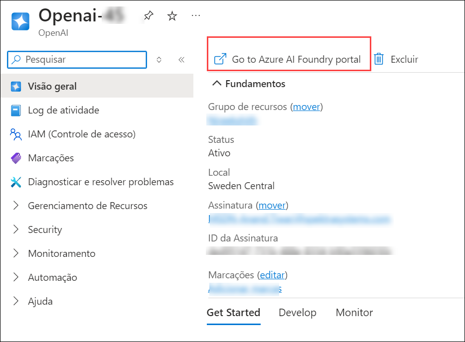
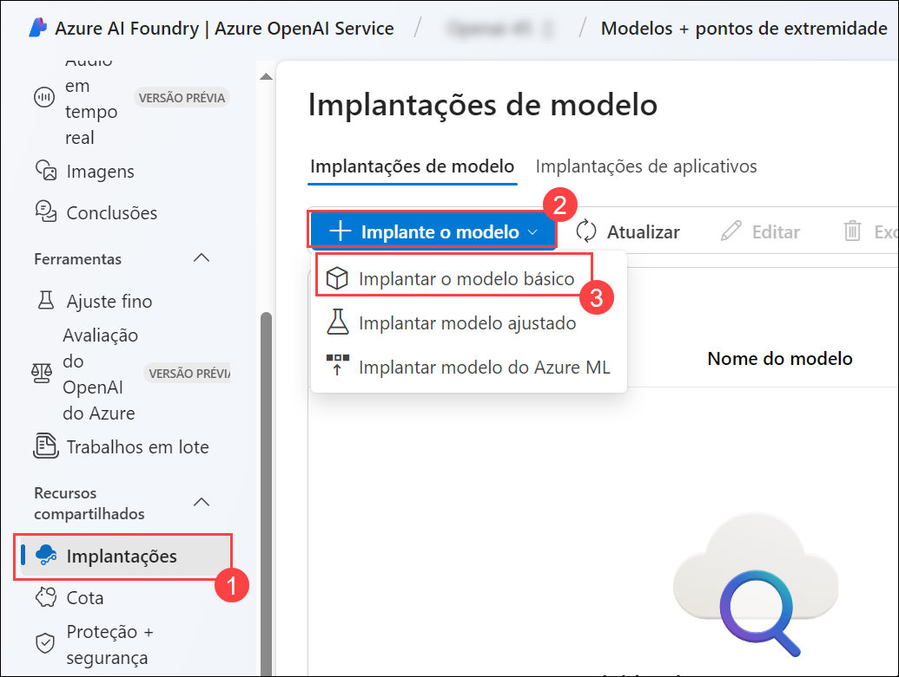
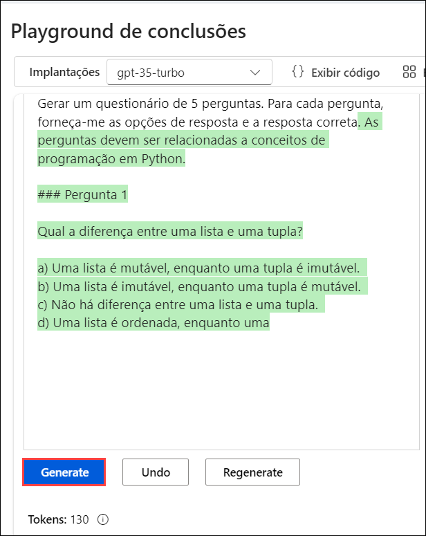
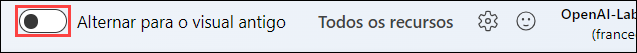
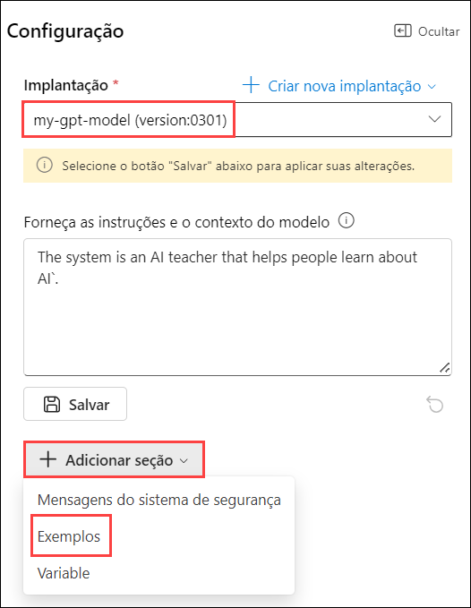
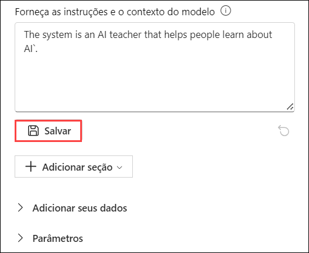
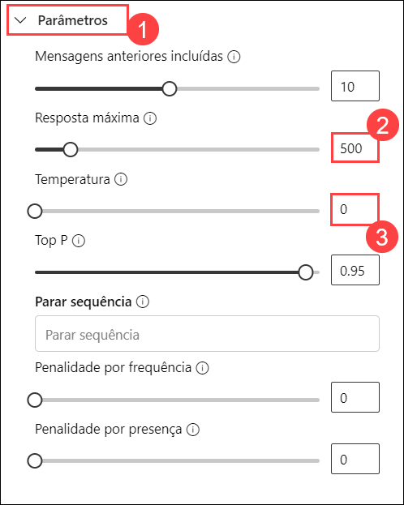

# Laboratório 01: Iniciar com o Serviço Azure OpenAI

### Duração Estimada: 40 minutos

## Cenário do Laboratório
O Serviço Azure OpenAI traz os modelos de IA generativa desenvolvidos pela OpenAI para a plataforma Azure, permitindo que você desenvolva soluções de IA poderosas que se beneficiam da segurança, escalabilidade e integração dos serviços fornecidos pela plataforma de nuvem Azure. Neste exercício, você aprenderá como começar a usar o Azure OpenAI provisionando o serviço como um recurso do Azure e usando o Azure OpenAI Studio para implantar e explorar modelos OpenAI.

## Objetivos do Laboratório
Neste laboratório, você completará as seguintes tarefas:

- Tarefa 1: Provisionar um recurso Azure OpenAI
- Tarefa 2: Implantar um modelo
- Tarefa 3: Explorar um modelo no playground de Completações
- Tarefa 4: Usar o playground de Chat
- Tarefa 5: Explorar prompts e parâmetros
- Tarefa 6: Explorar a geração de código

## Tarefa 1: Provisionar um recurso Azure OpenAI

Antes de usar os modelos do Azure OpenAI, você deve provisionar um recurso Azure OpenAI na sua assinatura do Azure.

1. No **portal do Azure**, pesquise por **Azure OpenAI (1)** e selecione **OpenAI (2)**.

   .png)

2. Na tela **Azure AI services | OpenAI**, clique em **+ Criar**.

   .png)

3. Crie um recurso **Azure OpenAI** com as seguintes configurações:
   
    - **Assinatura**: Padrão - Assinatura pré-atribuída.
    - **Grupo de recursos**: openai-<inject key="DeploymentID" enableCopy="false"></inject>
    - **Região**: **FranceCentral**
    - **Nome**: OpenAI-Lab01-<inject key="DeploymentID" enableCopy="false"></inject>
    - **Tipo de preço**: Standard S0
  
      .png)

4. Clique em **Próxima** três vezes e clique em **Criar**.

   .png)

5. Aguarde a conclusão da implementação. Depois, vá para o recurso Azure OpenAI implementado através do portal de Azure.

#### Validação

> **Parabéns** por completar a tarefa! Agora é hora de validá-la. Aqui estão os passos:
> - Clique no botão Validar para a tarefa correspondente. Se você receber uma mensagem de sucesso, pode prosseguir para a próxima tarefa. 
> - Caso contrário, leia atentamente a mensagem de erro e tente novamente seguindo as instruções do guia do laboratório.
> - Se precisar de assistência, entre em contato conosco pelo cloudlabs-support@spektrasystems.com. Estamos disponíveis 24/7 para ajudar você.

   <validation step="1fa0e87b-eb46-463d-b63b-edf6e2282e16" />

## Tarefa 2: Implementar um modelo

O Azure OpenAI fornece um portal baseado na web chamado **Azure OpenAI Studio**, que você pode usar para Implementar, gerenciar e explorar modelos. Você começará sua exploração do Azure OpenAI usando o Azure OpenAI Studio para Implementar um modelo.

1. No **portal do Azure**, pesquise por **OpenAI** e selecione **OpenAI**.

   .png)

2. Na tela **Azure AI services | OpenAI**, selecione **OpenAI-Lab01-<inject key="DeploymentID" enableCopy="false"></inject>**

   .png)

3. No painel de recursos do Azure OpenAI, clique em **Go to Azure AI Foundry portal** para navegar até o **Azure AI Foundry portal**.

    

4. Clique em **Implantações (1)** no painel de navegação à esquerda, clique em **+ Implante o modelo (2)**, selecione **Implantar o modelo básico (3)**.  

   

5. Na janela **Selecionar um modelo**, selecione **gpt-35-turbo** e clique em **Confirmar**.

   .png)

6. Na interface de **Implantar o modelo**, insira os seguintes detalhes:
    
    - Na interface pop-up do modelo de implantação, insira os seguintes detalhes:
    
    - Nome da implantação: **my-gpt-model (1)**

    - Tipo de implantação: **Standard (2)**
  
    - Clique em **Recolher**
    
    - Versão do modelo: **0301 (padrão) (3)**
    
    - Limite de Taxa de Tokens por Minuto: **10K (4)**
    
    - Habilitar cota dinâmica: **Habilitado (5)**
    
    - Clique em **Implantar (6)**
      

      -1.png)

7. Isso irá implementar um modelo que você explorará nas próximas etapas.

   > **Observação**: Você pode ignorar qualquer erro relacionado à atribuição de papéis para visualizar os limites de cota.

   > **Observação**: O Azure OpenAI inclui vários modelos, cada um otimizado para um equilíbrio diferente entre capacidades e desempenho. Neste exercício, você usará o modelo **GPT-35-Turbo**, que é um bom modelo geral para resumir e gerar linguagem natural e código. Para mais informações sobre os modelos disponíveis no Azure OpenAI, consulte [Modelos](https://learn.microsoft.com/azure/cognitive-services/openai/concepts/models) na documentação do Azure OpenAI.

#### Validação

> **Parabéns** por completar a tarefa! Agora é hora de validá-la. Aqui estão os passos:
> - Clique no botão Validar para a tarefa correspondente. Se você receber uma mensagem de sucesso, pode prosseguir para a próxima tarefa. 
> - Caso contrário, leia atentamente a mensagem de erro e tente novamente seguindo as instruções do guia do laboratório.
> - Se precisar de assistência, entre em contato conosco pelo cloudlabs-support@spektrasystems.com. Estamos disponíveis 24/7 para ajudar você.

   <validation step="3b4a472e-f956-45d8-b828-3e2cc01c2e88" />

## Tarefa 3: Explorar um modelo no playground de Completações

Os *Playgrounds* são interfaces úteis no Azure OpenAI Studio que você pode usar para experimentar seus modelos implementados sem precisar desenvolver a sua aplicação cliente.

1. No Azure OpenAI Studio, no painel esquerdo, em **Playgrounds**, selecione **conclusões**.

2. Na página **Conclusões**, certifique-se de que sua implantação **my-gpt-model** esteja selecionada. Digite `Gerar um questionário de 5 perguntas. Para cada pergunta, forneça-me as opções de resposta e a resposta correta` no prompt.

   > **Observação:** O texto resumido consiste em um *prompt* que fornece algum texto para dizer ao modelo que tipo de resposta é necessária e inclui algumas informações contextuais.

3. Na parte inferior da página, observe o número de *tokens* detectados no texto. Tokens são as unidades básicas de um prompt - essencialmente palavras ou partes de palavras no texto.

4. Use o botão **Generate** para enviar o prompt ao modelo e recuperar uma resposta (talvez seja necessário rolar para baixo). A resposta consiste em um quiz baseado no exemplo no prompt.

   

   >**Observação**: Se você não receber a saída esperada na nova experiência, siga as etapas abaixo:

5. No canto superior direito, alterne a barra para alternar para a experiência antiga.

   

5. Na página **Completações**, certifique-se de que sua implementação **my-gpt-model** esteja selecionada e, na lista **Exemplos**, selecione **Gerar um questionário (1)**.

6. Use o botão **Gerar (2)** para enviar o prompt ao modelo e obter uma resposta.

   .png)

   A resposta consiste em um questionário baseado no exemplo no prompt.

   >**Observação**: Você pode clicar em gerar novamente, se a resposta estiver incompleta.

   >**Observação**: Você pode usar o botão **Regenerate** para reenviar o prompt (novas alterações foram feitas) e observe que a resposta pode variar da original. Um modelo de IA generativo pode produzir uma nova linguagem cada vez que for chamado.

7. Use o botão **Ver Código** para visualizar o código que um aplicativo cliente usaria para enviar o prompt. Você pode selecionar sua linguagem de programação preferida. O prompt contém o texto que você enviou ao modelo. A solicitação é enviada à API *Completações* para o seu serviço Azure OpenAI.

   .png)
   
   .png)

9. Feche o **Código de amostra**.

## Tarefa 4: Use o playground de Chat

O playground *Chat* fornece uma interface de chatbot para os modelos GPT 3.5 e superiores. Ele usa a API *ChatCompletions* em vez da antiga API *Completions*.

1. Na seção **Playgrounds**, selecione a página **Chat** e certifique-se de que o modelo **my-gpt-model** esteja selecionado no painel de configuração.

2. Na seção **Configuração**, na caixa **Forneça as instruções e o contexto do modelo**, substitua o texto atual pela seguinte declaração: `The system is an AI teacher that helps people learn about AI`.

3. Abaixo da caixa **+ adicionar seção**, clique em **Exemplos**. Insira a seguinte mensagem e resposta nas caixas designadas:

   

4. Digite a seguinte mensagem e resposta nas caixas designadas:

    - **Usuário**: `What are different types of artificial intelligence?`
    
    - **Assistente**: `There are three main types of artificial intelligence: Narrow or Weak AI (such as virtual assistants like Siri or Alexa, image recognition software, and spam filters), General or Strong AI (AI designed to be as intelligent as a human being. This type of AI does not currently exist and is purely theoretical), and Artificial Superintelligence (AI that is more intelligent than any human being and can perform tasks that are beyond human comprehension. This type of AI is also purely theoretical and has not yet been developed).`

      .png)

      > **Nota**: Exemplos de poucos-tiros são usados para fornecer ao modelo exemplos dos tipos de respostas esperadas. O modelo tentará refletir o tom e o estilo dos exemplos em suas próprias respostas.
  
5. Salve as alterações clicando em **Salvar** e na mensagem pop-up Atualizar sistema?, clique em **Continuar**.

   

7. Na caixa de consulta na parte inferior da página, insira o texto `What is artificial intelligence?`

8. Use o botão **Enviar** para submeter a mensagem e visualizar a resposta.

     .png)

    > **Nota**: Você pode receber uma resposta informando que a implantação da API ainda não está pronta. Caso isso aconteça, aguarde alguns minutos e tente novamente.

9. Revise a resposta e, em seguida, envie a seguinte mensagem para continuar a conversa: `How is it related to machine learning?`

10. Revise a resposta, observando que o contexto da interação anterior é mantido (portanto, o modelo entende que "isso" se refere à inteligência artificial).

11. Use o botão **Exibir Código** para visualizar o código da interação. O prompt consiste na mensagem *system*, os exemplos de poucos-tiros de mensagens *user* e *assistant*, e a sequência de mensagens *user* e *assistant* na sessão de chat até o momento.

    .png)

## Tarefa 5: Explore prompts e parâmetros

Você pode usar o prompt e os parâmetros para maximizar a probabilidade de gerar a resposta que você precisa.

1. No painel **Configuração**, selecione **Parâmetros (1)**, defina os seguintes valores de parâmetro:

    - **Resposta máxima: (2)**: 500
    - **Temperatura (3)**: 0

      

2. Envie a seguinte mensagem na sessão de chat 

      ```
      Write three multiple choice questions based on the following text.

      Most computer vision solutions are based on machine learning models that can be applied to visual input from cameras, videos, or images.

      - Image classification involves training a machine learning model to classify images based on their contents. For example, in a traffic monitoring solution you might use an image classification model to classify images based on the type of vehicle they contain, such as taxis, buses, cyclists, and so on.

      - Object detection machine learning models are trained to classify individual objects within an image, and identify their location with a bounding box. For example, a traffic monitoring solution might use object detection to identify the location of different classes of vehicle.

      - Semantic segmentation is an advanced machine learning technique in which individual pixels in the image are classified according to the object to which they belong. For example, a traffic monitoring solution might overlay traffic images with "mask" layers to highlight different vehicles using specific colors.
      ```

3. Revise os resultados, que devem consistir em perguntas de múltipla escolha que um professor poderia usar para testar os alunos sobre os tópicos de visão computacional no prompt. A resposta total deve ser menor do que o comprimento máximo especificado como parâmetro.

4. Observe o seguinte sobre o prompt e os parâmetros que você usou:

    - O prompt especifica que a saída desejada deve ser três perguntas de múltipla escolha.
    
    - Os parâmetros incluem *Temperatura*, que controla o grau em que a geração de resposta inclui um elemento de aleatoriedade. O valor de **0** usado na sua submissão minimiza a aleatoriedade, resultando em respostas estáveis e previsíveis.

      .png)

## Tarefa 6: Explore a geração de código

Além de gerar respostas em linguagem natural, você pode usar modelos GPT para gerar código.

1. No painel **Configuração**, selecione o **Exemplo** na seção **+ Adicionar Seção** para redefinir a mensagem, se solicitado, clique em **Continuar**. Insira `You are a Python developer.` para Dar instruções e contexto ao modelo e salvar as alterações clicando em **Aplicar Alterações** quando solicitado, clique em **Continuar**.
  
   

3. No painel **Sessão de Chat**, selecione **Limpar chat** e, em seguida, clique em **Limpar** na aba de limpeza de chat para limpar o histórico de chat e iniciar uma nova sessão.

   .png)

4. Envie a seguinte mensagem do usuário:

    ```
    Write a Python function named Multiply that multiplies two numeric parameters.
    ```
    
5. Revise a resposta, que deve incluir um código Python de exemplo que atenda ao requisito no prompt.

     .png)

## Resumo

Neste laboratório, você completou o seguinte:
- Provisionou um recurso Azure OpenAI
- Implementou um modelo Azure OpenAI dentro do estúdio Azure OpenAI
- Usou o playground de chat para utilizar as funcionalidades de prompts, parâmetros e geração de código

### Você completou com sucesso o laboratório.
