# Laboratório 01: Iniciar com o Serviço Azure OpenAI

### Duração Estimada: 40 minutos

## Cenário do Laboratório
O Serviço Azure OpenAI traz os modelos de IA generativa desenvolvidos pela OpenAI para a plataforma Azure, permitindo que você desenvolva soluções de IA poderosas que se beneficiam da segurança, escalabilidade e integração dos serviços fornecidos pela plataforma de nuvem Azure. Neste exercício, você aprenderá como começar a usar o Azure OpenAI provisionando o serviço como um recurso do Azure e usando o Azure OpenAI Studio para implantar e explorar modelos OpenAI.

## Objetivos do Laboratório
Neste laboratório, você completará as seguintes tarefas:

- Tarefa 1: Provisionar um recurso Azure OpenAI
- Tarefa 2: Implantar um modelo
- Tarefa 3: Explorar um modelo no playground de Completações
- Tarefa 4: Usar o playground de Chat
- Tarefa 5: Explorar prompts e parâmetros
- Tarefa 6: Explorar a geração de código

## Tarefa 1: Provisionar um recurso Azure OpenAI

Antes de usar os modelos do Azure OpenAI, você deve provisionar um recurso Azure OpenAI na sua assinatura do Azure.

1. No **portal do Azure**, pesquise por **OpenAI** e selecione **OpenAI**.

   

2. Na tela **Serviços de IA do Azure | OpenAI**, clique em **+ Criar**.

   

3. Crie um recurso **Azure OpenAI** com as seguintes configurações:
   
    - **Assinatura**: Padrão - Assinatura pré-atribuída.
    - **Grupo de recursos**: openai-<inject key="DeploymentID" enableCopy="false"></inject>
    - **Região**: **FranceCentral**
    - **Nome**: OpenAI-Lab01-<inject key="DeploymentID" enableCopy="false"></inject>
    - **Tipo de preço**: Standard S0
  
      .png)

4. Clique em **Avançar** três vezes e clique em **Criar**.

5. Aguarde a conclusão da implementação. Depois, vá para o recurso Azure OpenAI implementado através do portal de Azure.

#### Validação

> **Parabéns** por completar a tarefa! Agora é hora de validá-la. Aqui estão os passos:
> - Clique no botão Validar para a tarefa correspondente. Se você receber uma mensagem de sucesso, pode prosseguir para a próxima tarefa. 
> - Caso contrário, leia atentamente a mensagem de erro e tente novamente seguindo as instruções do guia do laboratório.
> - Se precisar de assistência, entre em contato conosco pelo labs-support@spektrasystems.com. Estamos disponíveis 24/7 para ajudar você.

   <validation step="1fa0e87b-eb46-463d-b63b-edf6e2282e16" />

## Tarefa 2: Implementar um modelo

O Azure OpenAI fornece um portal baseado na web chamado **Azure OpenAI Studio**, que você pode usar para Implementar, gerenciar e explorar modelos. Você começará sua exploração do Azure OpenAI usando o Azure OpenAI Studio para Implementar um modelo.

1. No **portal do Azure**, pesquise por **OpenAI** e selecione **OpenAI**.

   

2. Na tela **Serviços de IA do Azure | OpenAI**, selecione **OpenAI-Lab01-<inject key="DeploymentID" enableCopy="false"></inject>**

   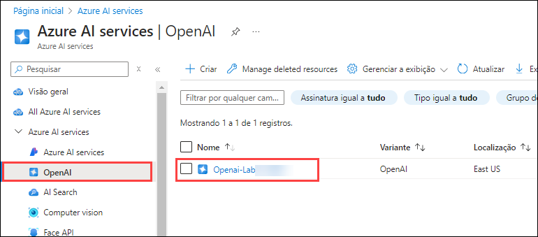

3. No painel de recursos do Azure OpenAI, clique em **Ir para Azure OpenAI Studio** para navegar até o **Azure AI Studio**.

   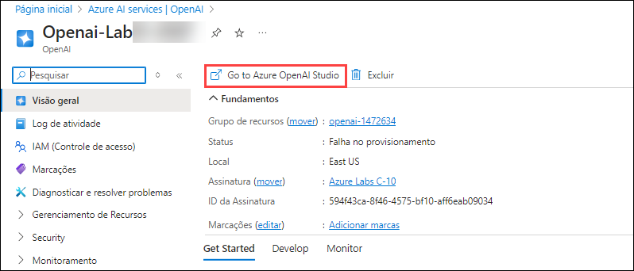

5. Clique em **Implantações (1)** no painel de navegação à esquerda, clique em **+ Implementar o modelo (2)**, selecione **Implementar modelo base (3)**.  

   .png)

6. Na janela **Selecionar um modelo**, selecione **gpt-35-turbo (1)** e clique em **Confirmar (3)**.

   .png)

7. Na interface de **Implementar modelo**, insira os seguintes detalhes:
    
    - **Nome da Implementação (1)**: my-gpt-model
    - **Versão do modelo (2)**: 0301(Default)
    - **Tipo de Implementação (3)**: Standard
    - **Limite de Velocidade de Tokens por Minuto (milhares) (4)**: 10K
    - Clique em **Implementar (5)**
  
      

8. Isso irá implementar um modelo que você explorará nas próximas etapas.

   > **Nota**: Você pode ignorar qualquer erro relacionado à atribuição de papéis para visualizar os limites de cota.

   > **Nota**: O Azure OpenAI inclui vários modelos, cada um otimizado para um equilíbrio diferente entre capacidades e desempenho. Neste exercício, você usará o modelo **GPT-35-Turbo**, que é um bom modelo geral para resumir e gerar linguagem natural e código. Para mais informações sobre os modelos disponíveis no Azure OpenAI, consulte [Modelos](https://learn.microsoft.com/azure/cognitive-services/openai/concepts/models) na documentação do Azure OpenAI.

#### Validação

   <validation step="3b4a472e-f956-45d8-b828-3e2cc01c2e88" />

> **Parabéns** por completar a tarefa! Agora é hora de validá-la. Aqui estão os passos:
> - Clique no botão Validar para a tarefa correspondente. Se você receber uma mensagem de sucesso, pode prosseguir para a próxima tarefa. 
> - Caso contrário, leia atentamente a mensagem de erro e tente novamente seguindo as instruções do guia do laboratório.
> - Se precisar de assistência, entre em contato conosco pelo labs-support@spektrasystems.com. Estamos disponíveis 24/7 para ajudar você.

## Tarefa 3: Explorar um modelo no playground de Completações

Os *Playgrounds* são interfaces úteis no Azure OpenAI Studio que você pode usar para experimentar seus modelos implementados sem precisar desenvolver a sua aplicação cliente.

1. No Azure OpenAI Studio, no painel esquerdo, em **Playground**, selecione **Completações**.

2. Na página **Completações**, certifique-se de que sua implementação **my-gpt-model** esteja selecionada e, na lista **Exemplos**, selecione **Gerar um questionário**.

    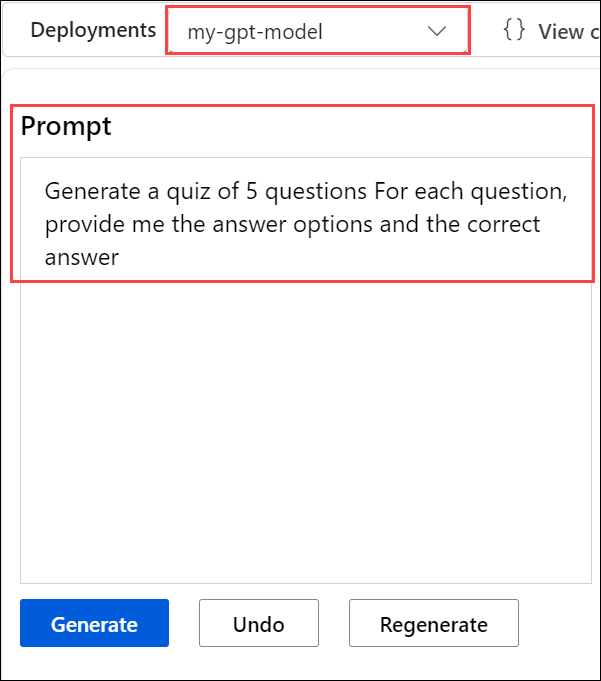
   
   O texto resumido consiste em um *prompt* que fornece algum texto para dizer ao modelo que tipo de resposta é necessária e inclui algumas informações contextuais.

4. Na parte inferior da página, observe o número de *tokens* detectados no texto. Tokens são as unidades básicas de um prompt - essencialmente palavras ou partes de palavras no texto.

5. Use o botão **Gerar** para enviar o prompt ao modelo e obter uma resposta.

   A resposta consiste em um questionário baseado no exemplo no prompt.

   >**Nota**: Você pode usar o botão **Regenerar** para reenviar o prompt (novas alterações foram feitas) e observe que a resposta pode variar da original. Um modelo de IA generativa pode produzir uma nova linguagem cada vez que é chamado.

6. Use o botão **Ver Código** para visualizar o código que um aplicativo cliente usaria para enviar o prompt. Você pode selecionar sua linguagem de programação preferida. O prompt contém o texto que você enviou ao modelo. A solicitação é enviada à API *Completações* para o seu serviço Azure OpenAI.

   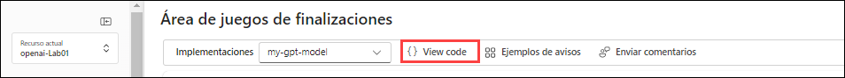
   
   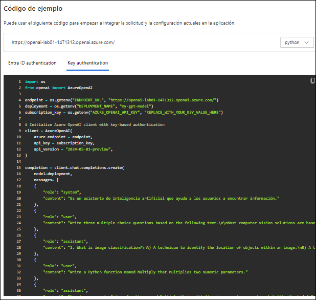

## Tarefa 4: Use o playground de Chat

O playground *Chat* fornece uma interface de chatbot para os modelos GPT 3.5 e superiores. Ele usa a API *ChatCompletions* em vez da antiga API *Completions*.

1. Na seção **Playground**, selecione a página **Chat** e certifique-se de que o modelo **my-gpt-model** esteja selecionado no painel de configuração.

2. Na seção **Setup**, na caixa **System message**, substitua o texto atual pela seguinte declaração: `O sistema é um professor de IA que ajuda as pessoas a aprender sobre IA`.

3. Abaixo da caixa **Mensagem do sistema**, clique em **+Adicionar seção** selecione **exemplo** e insira a seguinte mensagem e resposta nas caixas designadas:

   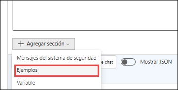

    - **Usuário**: `Quais são os diferentes tipos de inteligência artificial?`
    
    - **Assistente**: `Existem três principais tipos de inteligência artificial: IA Estreita ou Fraca (como assistentes virtuais como Siri ou Alexa, software de reconhecimento de imagem e filtros de spam), IA Geral ou Forte (IA projetada para ser tão inteligente quanto um ser humano. Este tipo de IA não existe atualmente e é puramente teórico), e Superinteligência Artificial (IA que é mais inteligente do que qualquer ser humano e pode realizar tarefas que estão além da compreensão humana. Este tipo de IA também é puramente teórico e ainda não foi desenvolvido).`

    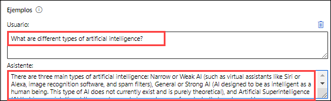

    > **Nota**: Exemplos de poucos-tiros são usados para fornecer ao modelo exemplos dos tipos de respostas esperadas. O modelo tentará refletir o tom e o estilo dos exemplos em suas próprias respostas.
  
5. Clique em **Aplicar alterações** e, em seguida, clique em **Continuar** na aba pop-up **Atualizar mensagem do sistema** para iniciar uma nova sessão e definir o contexto comportamental do sistema de chat.

   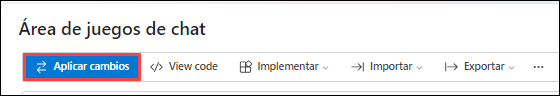

7. Na caixa de consulta na parte inferior da página, insira o texto `O que é inteligência artificial?`

8. Use o botão **Enviar** para submeter a mensagem e visualizar a resposta.

     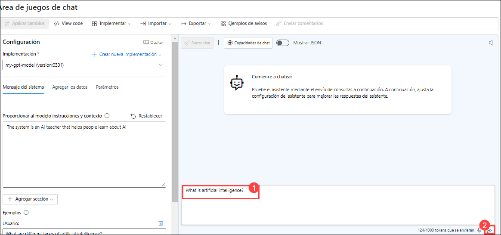

    > **Nota**: Você pode receber uma resposta informando que a implantação da API ainda não está pronta. Caso isso aconteça, aguarde alguns minutos e tente novamente.

9. Revise a resposta e, em seguida, envie a seguinte mensagem para continuar a conversa: `Como isso se relaciona com o aprendizado de máquina?`

10. Revise a resposta, observando que o contexto da interação anterior é mantido (portanto, o modelo entende que "isso" se refere à inteligência artificial).

11. Use o botão **Ver Código** para visualizar o código da interação. O prompt consiste na mensagem *system*, os exemplos de poucos-tiros de mensagens *user* e *assistant*, e a sequência de mensagens *user* e *assistant* na sessão de chat até o momento.

    

## Tarefa 5: Explore prompts e parâmetros

Você pode usar o prompt e os parâmetros para maximizar a probabilidade de gerar a resposta que você precisa.

1. No painel **Configuração**, selecione **Parâmetro**, defina os seguintes valores de parâmetro:
    - **Temperatura**: 0
    - **Máximo de resposta (Número máximo de tokens)**: 500

      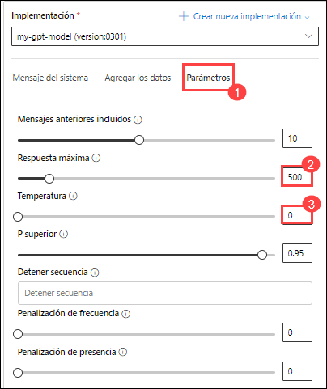

2. Envie a seguinte mensagem na sessão de chat 

    ```
    Escreva três perguntas de múltipla escolha com base no seguinte texto.

    A maioria das soluções de visão computacional é baseada em modelos de aprendizado de máquina que podem ser aplicados a entradas visuais de câmeras, vídeos ou imagens.*

    - A classificação de imagens envolve treinar um modelo de aprendizado de máquina para classificar imagens com base em seu conteúdo. Por exemplo, em uma solução de monitoramento de tráfego, você pode usar um modelo de classificação de imagens para classificar imagens com base no tipo de veículo que contêm, como táxis, ônibus, ciclistas e assim por diante.*

    - Modelos de aprendizado de máquina de detecção de objetos são treinados para classificar objetos individuais dentro de uma imagem e identificar sua localização com uma caixa delimitadora. Por exemplo, uma solução de monitoramento de tráfego pode usar a detecção de objetos para identificar a localização de diferentes classes de veículos.*

    - Segmentação semântica é uma técnica avançada de aprendizado de máquina na qual pixels individuais na imagem são classificados de acordo com o objeto a que pertencem. Por exemplo, uma solução de monitoramento de tráfego pode sobrepor imagens de tráfego com camadas de "máscara" para destacar diferentes veículos usando cores específicas.
    ```

3. Revise os resultados, que devem consistir em perguntas de múltipla escolha que um professor poderia usar para testar os alunos sobre os tópicos de visão computacional no prompt. A resposta total deve ser menor do que o comprimento máximo especificado como parâmetro.

    Observe o seguinte sobre o prompt e os parâmetros que você usou:

    - O prompt especifica que a saída desejada deve ser três perguntas de múltipla escolha.
    
    - Os parâmetros incluem *Temperatura*, que controla o grau em que a geração de resposta inclui um elemento de aleatoriedade. O valor de **0** usado na sua submissão minimiza a aleatoriedade, resultando em respostas estáveis e previsíveis.

     

## Tarefa 6: Explore a geração de código

Além de gerar respostas em linguagem natural, você pode usar modelos GPT para gerar código.

1. No painel **Setup**, selecione o template **Exemplo Vazio** e clique em **Continuar** na aba pop-up **Atualizar mensagem do sistema** para redefinir a mensagem do sistema.
  
   

2. Insira a mensagem do sistema: `Você é um desenvolvedor Python.` e clique em **Aplicar alterações** e, em seguida, clique em **Continuar** na aba pop-up **Atualizar mensagem do sistema**.

3. No painel **Sessão de Chat**, selecione **Limpar chat** e, em seguida, clique em **Limpar** na aba de limpeza de chat para limpar o histórico de chat e iniciar uma nova sessão.

   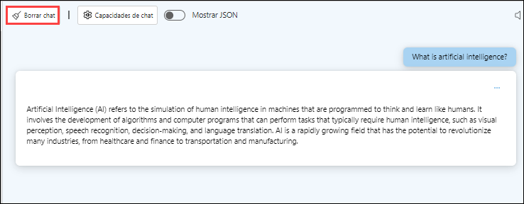

4. Envie a seguinte mensagem do usuário:

    ```
    Escreva uma função Python chamada Multiply que multiplique dois parâmetros numéricos.
    ```
    
5. Revise a resposta, que deve incluir um código Python de exemplo que atenda ao requisito no prompt.

     

## Resumo

Neste laboratório, você completou o seguinte:
- Provisionou um recurso Azure OpenAI
- Implementou um modelo Azure OpenAI dentro do estúdio Azure OpenAI
- Usou o playground de chat para utilizar as funcionalidades de prompts, parâmetros e geração de código

### Você completou com sucesso o laboratório.
