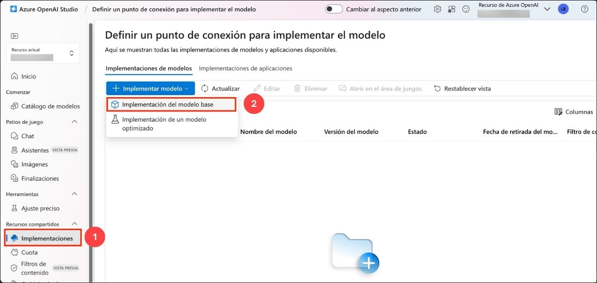
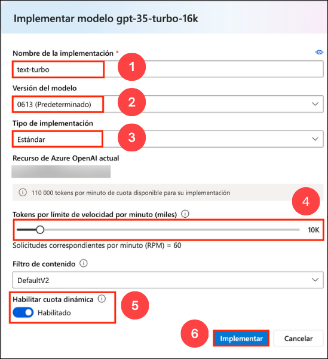

# Laboratório 02: Use SDKs do Azure OpenAI em seu aplicativo

### Duração Estimada: 40 minutos

## Cenário do laboratório
Com o Serviço Azure OpenAI, os desenvolvedores podem criar chatbots, modelos de linguagem e outras aplicações que se destacam na compreensão da linguagem humana natural. O Azure OpenAI fornece acesso a modelos de IA pré-treinados, bem como um conjunto de APIs e ferramentas para personalizar e ajustar esses modelos para atender aos requisitos específicos da sua aplicação. Neste exercício, você aprenderá como implantar um modelo no Azure OpenAI e usá-lo em seu próprio aplicativo.

No cenário deste exercício, você desempenhará o papel de um desenvolvedor de software que foi encarregado de implementar um aplicativo que pode usar IA generativa para ajudar a fornecer recomendações de caminhadas. As técnicas usadas no exercício podem ser aplicadas a qualquer aplicativo que queira usar as APIs do Azure OpenAI.

## Objetivos do laboratório
Neste laboratório, você completará as seguintes tarefas:

- Tarefa 1: Provisionar um recurso Azure OpenAI
- Tarefa 2: Implantar um modelo
- Tarefa 3: Configurar um aplicativo no Cloud Shell
- Tarefa 4: Configurar seu aplicativo
- Tarefa 5: Executar seu aplicativo

## Tarefa 1: Provisionar um recurso Azure OpenAI

Antes de poder usar os modelos Azure OpenAI, você deve provisionar um recurso Azure OpenAI em sua assinatura do Azure.

1. No **portal do Azure**, pesquise por **OpenAI** e selecione **Azure OpenAI**.

   

2. Na lâmina **Azure AI Services | Azure OpenAI**, clique em **+ Criar**.

   

3. Crie um recurso **Azure OpenAI** com as seguintes configurações 

    - **Assinatura**: Default - Assinatura pré-atribuída (1).
    - **Grupo de recursos**: openai-<inject key="DeploymentID" enableCopy="false"></inject> (2)
    - **Região**: Selecione <inject key="Region" enableCopy="false" /> (3)
    - **Nome**: OpenAI-Lab02-<inject key="DeploymentID" enableCopy="false"></inject> (4)
    - **Nível de preços**: Standard S0 (5)
    - Clique em **Próximo** (6)
  
        

4. Clique em **Próximo** duas vezes e subsequentemente clique em **Criar** 

5. Aguarde a conclusão da implantação. Em seguida, vá para o recurso Azure OpenAI implantado no portal do Azure.

6. Para capturar os valores de Chaves e Endpoints, na lâmina **openai-<inject key="DeploymentID" enableCopy="false"></inject>**:
      - Selecione **Chaves e Endpoint (1)** sob **Gerenciamento de Recursos**.
      - Clique em **Mostrar Chaves (2)**.
      - Copie a **Chave 1 (3)** e certifique-se de colá-la em um editor de texto como o Bloco de Notas para referência futura.
      - Finalmente, copie a URL da API do **Endpoint (4)** clicando em copiar para a área de transferência. Cole-a em um editor de texto como o Bloco de Notas para uso posterior.

        

#### Validação

> **Parabéns** por completar a tarefa! Agora, é hora de validá-la. Aqui estão os passos:
> - Clique no botão Validar para a tarefa correspondente. Se você receber uma mensagem de sucesso, pode prosseguir para a próxima tarefa. 
> - Caso contrário, leia atentamente a mensagem de erro e tente novamente o passo, seguindo as instruções no guia do laboratório.
> - Se precisar de alguma assistência, por favor, entre em contato conosco em labs-support@spektrasystems.com. Estamos disponíveis 24/7 para ajudá-lo.

   <validation step="6b7e8754-7031-45fb-a340-762578ad9685" />

## Tarefa 2: Implantar um modelo

Para usar a API do Azure OpenAI, você deve primeiro implantar um modelo para usar através do **Azure OpenAI Studio**. Uma vez implantado, faremos referência a esse modelo em nosso aplicativo.

1. No **portal do Azure**, pesquise por **OpenAI** e selecione **Azure OpenAI**.

   

2. Na lâmina **Azure AI Services | Azure OpenAI**, selecione **OpenAI-Lab02-<inject key="DeploymentID" enableCopy="false"></inject>**

   

3. No painel de recursos do Azure OpenAI, clique em **Ir para o Azure OpenAI Studio** e ele navegará para o **Azure AI Studio**.

   

4. Após navegar para o Azure AI Studio, clique no pop-up **Explore a nova experiência** no topo.

   

5. Clique em **Implantações (1)** no painel de navegação à esquerda, clique em **+ Implantar modelo** , selecione **Implantar modelo base (2)**.  

   

6. Na janela **Selecionar um modelo**, selecione **gpt-35-turbo-16k (1)** e clique em **Confirmar (2)**.

   

7. Na interface pop-up **Implantar modelo**, insira os seguintes detalhes:
    
    - **Nome da implantação**: text-turbo (1) 
    - **Versão do modelo**: 0613(Padrão) (2)
    - **Tipo de implantação**: Padrão (3)
    - **Limite de Taxa de Tokens por Minuto (milhares)**: 10K (4)
    - **Habilitar cota dinâmica**: Habilitado (5)
    - Clique em **Implantar** (6)
  
      

8. Isso implantará um modelo com o qual você brincará à medida que avançar.

   > **Nota**: Você pode ignorar a notificação "Falha ao buscar informações de cota de implantações".
   
   > **Nota**: Cada modelo Azure OpenAI é otimizado para um equilíbrio diferente de capacidades e desempenho. Usaremos a série de modelos **3.5 Turbo** na família de modelos **GPT-3** neste exercício, que é altamente capaz de compreensão de linguagem. Este exercício usa apenas um único modelo, no entanto, a implantação e o uso de outros modelos que você implantar funcionarão da mesma maneira.

#### Validação

> **Parabéns** por completar a tarefa! Agora, é hora de validá-la. Aqui estão os passos:
> - Clique no botão Validar para a tarefa correspondente. Se você receber uma mensagem de sucesso, pode prosseguir para a próxima tarefa. 
> - Caso contrário, leia atentamente a mensagem de erro e tente novamente o passo, seguindo as instruções no guia do laboratório.
> - Se precisar de alguma assistência, por favor, entre em contato conosco em labs-support@spektrasystems.com. Estamos disponíveis 24/7 para ajudá-lo.

   <validation step="4799e712-2f03-4a88-9456-fca39aea25d0" />

## Tarefa 3: Configurar um aplicativo no Cloud Shell

Para mostrar como integrar com um modelo Azure OpenAI, usaremos um aplicativo de linha de comando curto que é executado no Cloud Shell no Azure. Abra uma nova guia do navegador para trabalhar com o Cloud Shell.

1. No [portal do Azure](https://portal.azure.com?azure-portal=true), selecione o botão **[>_]** (*Cloud Shell*) na parte superior da página à direita da caixa de pesquisa. Um painel do Cloud Shell será aberto na parte inferior do portal.

    

2. Na primeira vez que você abrir o Cloud Shell, você pode ser solicitado a escolher o tipo de shell que deseja usar (*Bash* ou *PowerShell*). Selecione **Bash**. Se você não vir esta opção, pule o passo.

3. Dentro do painel Começando, selecione **Montar conta de armazenamento**, selecione sua **Assinatura de conta de armazenamento** no menu suspenso e clique em **Aplicar**.

   

4. Dentro do painel **Montar conta de armazenamento**, selecione **Eu quero criar uma conta de armazenamento** e clique em **Próximo**.

   

5. Dentro do painel **Configurações avançadas**, insira os seguintes detalhes:

    - **Assinatura**: Default- Escolha a única assinatura existente atribuída para este laboratório (1).
    - **Região**: <inject key="Region" enableCopy="false" /> (2)
    - **Grupo de recursos**: Selecione **Usar existente** (3)
      - openai-<inject key="DeploymentID" enableCopy="false"></inject>
    - **Conta de armazenamento**: Selecione **Criar nova** (4)
      - storage<inject key="DeploymentID" enableCopy="false"></inject>
    - **Compartilhamento de arquivo**: Crie um novo compartilhamento de arquivo chamado **none** (5)
    - Clique em **Criar** (6)

        

6. Note que você pode redimensionar o cloud shell arrastando a barra separadora na parte superior da página, ou usando os ícones **&#8212;**, **&#9723;**, e **X** no canto superior direito da página para minimizar, maximizar e fechar o painel. Para mais informações sobre como usar o Azure Cloud Shell, consulte a [documentação do Azure Cloud Shell](https://docs.microsoft.com/azure/cloud-shell/overview). 

7. Uma vez que o terminal inicie, insira o seguinte comando para baixar o aplicativo de amostra e salvá-lo em uma pasta chamada `azure-openai`.

    ```bash
   rm -r azure-openai -f
   git clone https://github.com/MicrosoftLearning/mslearn-openai azure-openai
    ```
  
8. Os arquivos são baixados para uma pasta chamada **azure-openai**. Navegue até os arquivos do laboratório para este exercício usando o seguinte comando.

    ```bash
   cd azure-openai/Labfiles/02-azure-openai-api
    ```

    Aplicativos para C# e Python foram fornecidos, bem como um arquivo de texto de amostra que você usará para testar a sumarização. Ambos os aplicativos apresentam a mesma funcionalidade.

9. Abra o editor de código integrado e observe o arquivo de texto que você estará resumindo com seu modelo localizado em `text-files/sample-text.txt`. Use o seguinte comando para abrir os arquivos do laboratório no editor de código.

    ```bash
    code .
    ```
    > **NOTA:** Se você for solicitado a **Mudar para o Cloud Shell Clássico** após executar o comando **code .**, clique em **Confirmar** e execute os passos 8 e 9 novamente.

    
   
#### Validação

<validation step="2e8dadd1-f827-4597-8d99-c814ec85fbab" />

> **Parabéns** por completar a tarefa! Agora, é hora de validá-la. Aqui estão os passos:
> - Clique no botão Validar para a tarefa correspondente. Se você receber uma mensagem de sucesso, pode prosseguir para a próxima tarefa. 
> - Caso contrário, leia atentamente a mensagem de erro e tente novamente o passo, seguindo as instruções no guia do laboratório.
> - Se precisar de alguma assistência, por favor, entre em contato conosco em labs-support@spektrasystems.com. Estamos disponíveis 24/7 para ajudá-lo.

## Tarefa 4: Configurar seu aplicativo

Para este exercício, você completará algumas partes-chave do aplicativo para permitir o uso do seu recurso Azure OpenAI.

1. No editor de código, expanda a pasta **CSharp** ou **Python**, dependendo da sua preferência de linguagem.

2. Abra o arquivo de configuração para sua linguagem

    - C#: `appsettings.json`
    
    - Python: `.env`
    
3. Atualize os valores de configuração para incluir o **endpoint** e a **chave** do recurso Azure OpenAI que você criou, bem como o nome do modelo que você implantou, `text-turbo`. Em seguida, salve o arquivo clicando com o botão direito no arquivo no painel esquerdo e clicando em **Salvar**

4. Navegue até a pasta da sua linguagem preferida e instale os pacotes necessários

    **C#** : 

    ```bash
    cd CSharp
    dotnet add package Azure.AI.OpenAI --version 1.0.0-beta.14
    ```

    **Python** : 

    ```bash
    cd Python
    pip install python-dotenv
    pip install openai==1.13.3
    ```

5. Navegue até a pasta da sua linguagem preferida, selecione o arquivo de código e adicione as bibliotecas necessárias.

    **C#**: Program.cs

    ```csharp
    // Adicionar pacote Azure OpenAI
    using Azure.AI.OpenAI;
    ```

    **Python**: test-openai-model.py

    ```python
    # Adicionar pacote Azure OpenAI
    from openai import AzureOpenAI
    ```

6. No código do aplicativo para sua linguagem, substitua o comentário ***Inicializar o cliente Azure OpenAI...*** com o seguinte código para inicializar o cliente e definir nossa mensagem do sistema.

    **C#**: Program.cs

    ```csharp
    // Inicializar o cliente Azure OpenAI
    OpenAIClient client = new OpenAIClient(new Uri(oaiEndpoint), new AzureKeyCredential(oaiKey));
    
    // Mensagem do sistema para fornecer contexto ao modelo
    string systemMessage = "Eu sou um entusiasta de caminhadas chamado Forest que ajuda as pessoas a descobrir trilhas em sua área. Se nenhuma área for especificada, usarei como padrão perto do Parque Nacional Rainier. Então, fornecerei três sugestões de trilhas próximas que variam em comprimento. Também compartilharei um fato interessante sobre a natureza local nas trilhas ao fazer uma recomendação.";
    ```

    **Python**: test-openai-model.py

    ```python
    # Inicializar o cliente Azure OpenAI
    client = AzureOpenAI(
            azure_endpoint = azure_oai_endpoint, 
            api_key=azure_oai_key,  
            api_version="2024-02-15-preview"
            )
    
    # Criar uma mensagem do sistema
    system_message = """Eu sou um entusiasta de caminhadas chamado Forest que ajuda as pessoas a descobrir trilhas em sua área. 
        Se nenhuma área for especificada, usarei como padrão perto do Parque Nacional Rainier. 
        Então, fornecerei três sugestões de trilhas próximas que variam em comprimento. 
        Também compartilharei um fato interessante sobre a natureza local nas trilhas ao fazer uma recomendação.
        """
    ```

      >**Nota**: Certifique-se de indentar o código eliminando quaisquer espaços em branco extras após colá-lo no editor de código.

7. Substitua o comentário ***Adicionar código para enviar solicitação...*** com o código necessário para construir a solicitação; especificando os vários parâmetros para o seu modelo, como `messages` e `temperature`.

    **C#**: Program.cs

    ```csharp
    // Adicionar código para enviar solicitação...
    // Construir objeto de opções de conclusão
    ChatCompletionsOptions chatCompletionsOptions = new ChatCompletionsOptions()
    {
        Messages =
        {
            new ChatRequestSystemMessage(systemMessage),
            new ChatRequestUserMessage(inputText),
        },
        MaxTokens = 400,
        Temperature = 0.7f,
        DeploymentName = oaiDeploymentName
    };

    // Enviar solicitação ao modelo Azure OpenAI
    ChatCompletions response = client.GetChatCompletions(chatCompletionsOptions);

    // Imprimir a resposta
    string completion = response.Choices[0].Message.Content;
    Console.WriteLine("Resposta: " + completion + "\n");
    ```

    **Python**: test-openai-model.py

    ```python
    # Adicionar código para enviar solicitação...
    # Enviar solicitação ao modelo Azure OpenAI
    response = client.chat.completions.create(
        model=azure_oai_deployment,
        temperature=0.7,
        max_tokens=400,
        messages=[
            {"role": "system", "content": system_message},
            {"role": "user", "content": input_text}
        ]
    )
    generated_text = response.choices[0].message.content

    # Imprimir a resposta
    print("Resposta: " + generated_text + "\n")
    ```

8. Antes de salvar o arquivo, certifique-se de que seu código se pareça com o código fornecido abaixo.

    **C#**: Program.cs

      ```CSharp
      // Declarações using implícitas são incluídas
      using System.Text;
      using System.Text.Json;
      using Microsoft.Extensions.Configuration;
      using Microsoft.Extensions.Configuration.Json;
      using Azure;
      
      // Adicionar pacote Azure OpenAI
      using Azure.AI.OpenAI;
      
      // Construir um objeto de configuração e recuperar configurações do usuário.
      IConfiguration config = new ConfigurationBuilder()
          .AddJsonFile("appsettings.json")
          .Build();
      string? oaiEndpoint = config["AzureOAIEndpoint"];
      string? oaiKey = config["AzureOAIKey"];
      string? oaiDeploymentName = config["AzureOAIDeploymentName"];
      
      if(string.IsNullOrEmpty(oaiEndpoint) || string.IsNullOrEmpty(oaiKey) || string.IsNullOrEmpty(oaiDeploymentName) )
      {
          Console.WriteLine("Por favor, verifique seu arquivo appsettings.json para valores ausentes ou incorretos.");
          return;
      }
      
      // Inicializar o cliente Azure OpenAI...
      OpenAIClient client = new OpenAIClient(new Uri(oaiEndpoint), new AzureKeyCredential(oaiKey));
      
      // Mensagem do sistema para fornecer contexto ao modelo
      string systemMessage = "Eu sou um entusiasta de caminhadas chamado Forest que ajuda as pessoas a descobrir trilhas em sua área. Se nenhuma área for especificada, usarei como padrão perto do Parque Nacional Rainier. Então, fornecerei três sugestões de trilhas próximas que variam em comprimento. Também compartilharei um fato interessante sobre a natureza local nas trilhas ao fazer uma recomendação.";
      
      do {
          Console.WriteLine("Digite seu texto de prompt (ou digite 'quit' para sair): ");
          string? inputText = Console.ReadLine();
          if (inputText == "quit") break;
      
          // Gerar resumo do Azure OpenAI
          if (inputText == null) {
              Console.WriteLine("Por favor, digite um prompt.");
              continue;
          }
          
          Console.WriteLine("\nEnviando solicitação de resumo para o endpoint Azure OpenAI...\n\n");
      
          // Adicionar código para enviar solicitação...
          // Construir objeto de opções de conclusão
          ChatCompletionsOptions chatCompletionsOptions = new ChatCompletionsOptions()
          {
              Messages =
              {
                  new ChatRequestSystemMessage(systemMessage),
                  new ChatRequestUserMessage(inputText),
              },
              MaxTokens = 400,
              Temperature = 0.7f,
              DeploymentName = oaiDeploymentName
          };
      
          // Enviar solicitação ao modelo Azure OpenAI
          ChatCompletions response = client.GetChatCompletions(chatCompletionsOptions);
      
          // Imprimir a resposta
          string completion = response.Choices[0].Message.Content;
          Console.WriteLine("Resposta: " + completion + "\n");
      
      } while (true);
      ```
    
   **Python**: test-openai-model.py

      ```Python
      import os
      from dotenv import load_dotenv
      
      # Adicionar pacote Azure OpenAI
      from openai import AzureOpenAI
      
      def main(): 
              
          try: 
          
              # Obter configurações 
              load_dotenv()
              azure_oai_endpoint = os.getenv("AZURE_OAI_ENDPOINT")
              azure_oai_key = os.getenv("AZURE_OAI_KEY")
              azure_oai_deployment = os.getenv("AZURE_OAI_DEPLOYMENT")
              
              # Inicializar o cliente Azure OpenAI...
              client = AzureOpenAI(
                      azure_endpoint = azure_oai_endpoint, 
                      api_key=azure_oai_key,  
                      api_version="2024-02-15-preview"
                      )
              
              # Criar uma mensagem do sistema
              system_message = """Eu sou um entusiasta de caminhadas chamado Forest que ajuda as pessoas a descobrir trilhas em sua área. 
                  Se nenhuma área for especificada, usarei como padrão perto do Parque Nacional Rainier. 
                  Então, fornecerei três sugestões de trilhas próximas que variam em comprimento. 
                  Também compartilharei um fato interessante sobre a natureza local nas trilhas ao fazer uma recomendação.
                  """
                    
              while True:
                  # Obter texto de entrada
                  input_text = input("Digite o prompt (ou digite 'quit' para sair): ")
                  if input_text.lower() == "quit":
                      break
                  if len(input_text) == 0:
                      print("Por favor, digite um prompt.")
                      continue
      
                  print("\nEnviando solicitação de resumo para o endpoint Azure OpenAI...\n\n")
                                    
                  # Adicionar código para enviar solicitação...
                  # Enviar solicitação ao modelo Azure OpenAI
                  response = client.chat.completions.create(
                      model=azure_oai_deployment,
                      temperature=0.7,
                      max_tokens=400,
                      messages=[
                          {"role": "system", "content": system_message},
                          {"role": "user", "content": input_text}
                      ]
                  )
                  generated_text = response.choices[0].message.content
      
                  # Imprimir a resposta
                  print("Resposta: " + generated_text + "\n")
                        
          except Exception as ex:
              print(ex)
      
      if __name__ == '__main__': 
          main()
      ```

9. Para salvar as alterações feitas no arquivo, clique com o botão direito no arquivo no painel esquerdo na janela de código e clique em **Salvar**

   >**Nota:** Certifique-se de indentar o código eliminando quaisquer espaços em branco extras após colá-lo no editor de código.

## Tarefa 5: Testar seu aplicativo

Agora que seu aplicativo foi configurado, execute-o para enviar sua solicitação ao seu modelo e observe a resposta.

1. No painel de terminal interativo, certifique-se de que o contexto da pasta seja a pasta da sua linguagem preferida. Em seguida, digite o seguinte comando para executar o aplicativo.

    - **C#**: `dotnet run`
    
    - **Python**: `python test-openai-model.py`

    > **Dica**: Você pode usar o ícone **Maximizar tamanho do painel** (**^**) na barra de ferramentas do terminal para ver mais do texto do console.

2. Quando solicitado, digite o texto `Que trilha devo fazer perto de Rainier?`.

3. Observe a saída, notando que a resposta segue as diretrizes fornecidas na mensagem do sistema que você adicionou ao array *messages*.

4. Forneça o prompt `Onde devo fazer trilha perto de Boise? Estou procurando algo de dificuldade fácil, entre 2 a 3 milhas, com ganho de elevação moderado.` e observe a saída.

5. No arquivo de código da sua linguagem preferida, altere o valor do parâmetro *temperature* na sua solicitação para **1.0** e salve o arquivo.

6. Execute o aplicativo novamente usando os prompts acima e observe a saída.

Aumentar a temperatura geralmente faz com que a resposta varie, mesmo quando fornecido o mesmo texto, devido ao aumento da aleatoriedade. Você pode executá-lo várias vezes para ver como a saída pode mudar. Tente usar valores diferentes para sua temperatura com a mesma entrada.

## Revisão

Neste laboratório, você realizou o seguinte:
- Provisionou um recurso Azure OpenAI
- Implantou um modelo OpenAI dentro do estúdio Azure OpenAI
- Integrou modelos Azure OpenAI em seus aplicativos

### Você completou com sucesso o laboratório.
