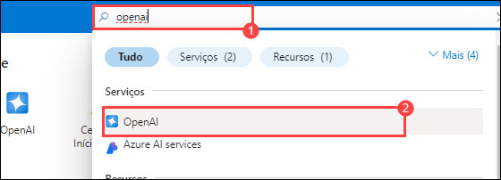
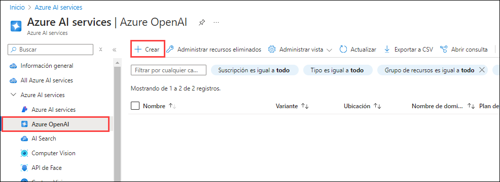
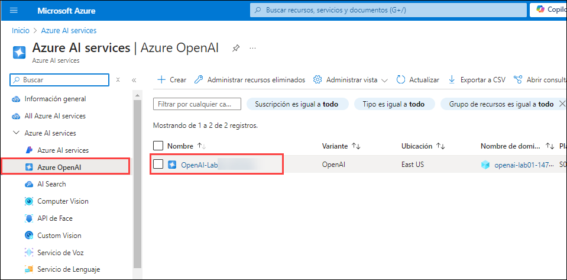
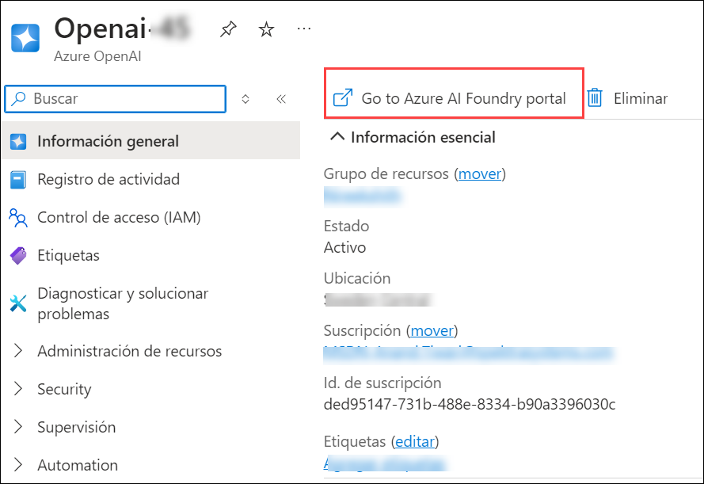
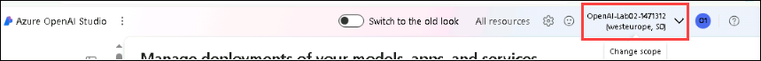
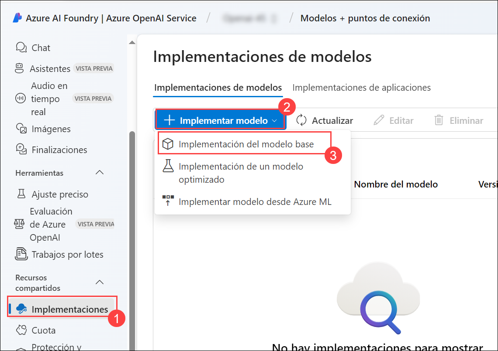
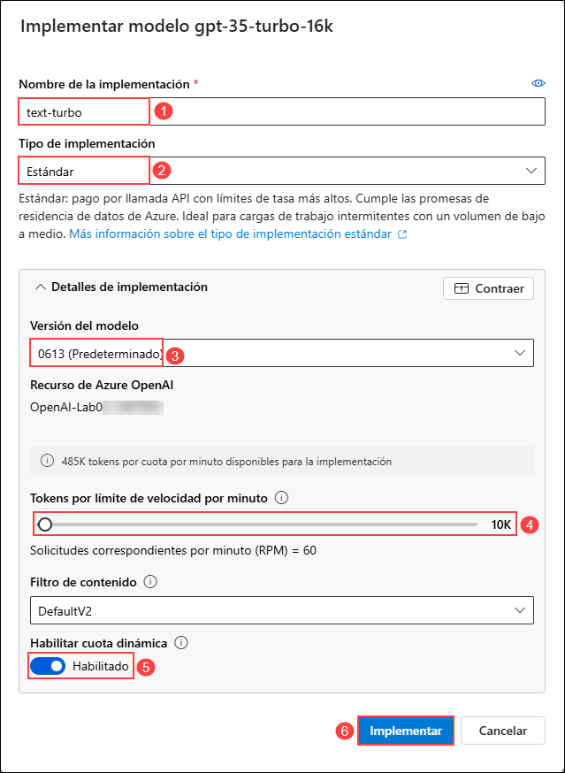

# Laboratorio 02: Utilizar los SDKs de Azure OpenAI en su aplicación

### Duración Estimada: 40 minutos

## Escenario de laboratorio
Con el Servicio Azure OpenAI, los desarrolladores pueden crear chatbots, modelos de lenguaje y otras aplicaciones que se destacan en la comprensión del lenguaje humano natural. Azure OpenAI proporciona acceso a modelos de IA pre-entrenados, así como a un conjunto de APIs y herramientas para personalizar y ajustar estos modelos para cumplir con los requisitos específicos de su aplicación. En este ejercicio, aprenderá a implementar un modelo en Azure OpenAI y a usarlo en su propia aplicación.

En el escenario de este ejercicio, desempeñará el papel de un desarrollador de software al que se le ha encargado implementar una aplicación que pueda usar IA generativa para ayudar a proporcionar recomendaciones de senderismo. Las técnicas utilizadas en el ejercicio se pueden aplicar a cualquier aplicación que desee usar las APIs de Azure OpenAI.

## Objetivos del laboratorio
En este laboratorio, completará las siguientes tareas:

- Tarea 1: Aprovisionar un recurso Azure OpenAI
- Tarea 2: Implementar un modelo
- Tarea 3: Configurar una aplicación en Cloud Shell
- Tarea 4: Configurar su aplicación
- Tarea 5: Ejecutar su aplicación

### Tarea 1: Aprovisionar un recurso de Azure OpenAI

Antes de poder usar modelos de Azure OpenAI, debe aprovisionar un recurso de Azure OpenAI en su suscripción de Azure.

1. En el **Portal de Azure**, busque **OpenAI** y seleccione **Azure OpenAI**.

   

2. En la hoja **Servicios de IA de Azure | Azure OpenAI**, haga clic en **+ Crear**.

   

3. Cree un recurso **Azure OpenAI** con la siguiente configuración:

    - **Suscripción**: Predeterminada - Suscripción preasignada (1).
    - **Grupo de recursos**: openai-<inject key="DeploymentID" enableCopy="false"></inject> (2)
    - **Región**: **UKsouth**(3)
    - **Nombre**: OpenAI-Lab02-<inject key="DeploymentID" enableCopy="false"></inject> (4)
    - **Plan de tarifa**: Standard S0 (5)
    -  Haga clic en **Siguiente** (6)
  
        

4. Haga clic en **Siguiente** dos veces y haga clic en **Crear**.

4. Espere a que se complete la implementación. Luego, vaya al recurso de Azure OpenAI implementado en el Portal de Azure.

6. Para capturar los valores de las Claves y Punto de conexión, en la hoja **openai-<inject key="DeploymentID" enableCopy="false"></inject>**:
      - Seleccione **Claves y puntos de conexión (1)** debajo de **Administración de recursos**.
      - Haga clic en **Mostrar claves (2)**.
      - Copie la **Clave 1 (3)** y asegúrese de pegarla en un editor de texto como el Bloc de notas para referencia futura.
      - Finalmente, copie la URL del **Punto de conexión (4)** de la API haciendo clic en copiar al portapapeles. Péguelo en un editor de texto como el Bloc de notas para usarlo más adelante.

        

#### Validación

> ¡**Felicitaciones** por completar la tarea! Ahora es momento de validarla. Estos son los pasos:
> - Presione el botón Validar para la tarea correspondiente. Si recibe un mensaje de éxito, puede continuar con la siguiente tarea. 
> - De lo contrario, lea atentamente el mensaje de error y vuelva a intentar el paso, siguiendo las instrucciones de la guía de laboratorio.
> - Si necesita ayuda, comuníquese con nosotros a cloudcloudlabs-support@spektrasystems.com. Estamos disponibles las 24 horas del día, los 7 días de la semana para ayudarlo.

   <validation step="8d0ea9cb-8ab4-4fa7-81a6-3642e4534d68" />

### Tarea 2: Implementar un modelo

Para usar la API de Azure OpenAI, primero debe implementar un modelo para usar a través de **Azure OpenAI Studio**. Una vez implementado, haremos referencia a ese modelo en nuestra aplicación.

1. En el **Portal de Azure**, busque **OpenAI** y seleccione **Azure OpenAI**.

   

2. En la hoja **Azure AI Services | Azure OpenAI**, seleccione **OpenAI-Lab02-<inject key="DeploymentID" enableCopy="false"></inject>**

   

3. En el panel de recursos de Azure OpenAI, haga clic en **Go to Azure AI Foundry portal** para navegar a **Azure AI Foundry portal.**.

   

>**Note**: Antes de implementar un modelo, asegúrese de estar en OpenAI-Lab02-<inject key="DeploymentID" enableCopy="false"></inject> marcando la esquina superior derecha. Si no es así, haga clic en el menú desplegable y selecciónelo.

   

5. Haga clic en **Implementaciones (1)** en el panel de navegación izquierdo, haga clic en **+ Implementar modelo** y seleccione **Implementación del modelo base (2)**. 

   

6. En la ventana **Seleccionar un modelo**, seleccione **gpt-35-turbo-16k (1)** y haga clic en **Confirmar (2)**.

   

7. Dentro de la interfaz emergente **Implementar modelo**, ingrese los siguientes detalles:
    
    - **Nombre de implementación**: text-turbo (1) 
    - **Tipo de implementación**: Standard (2)
    - **Versión de modelo**: 0613(Default) (3)
    - **Tokens por límite de velocidad por minuto (miles)**: 10K (4)
    - **Habilitar cuota dinámica**: Habilitado (5)
    - Haga clic en **Implementar** (6)
  
      

8. Esto implementará un modelo con el que podrá experimentar a medida que avanza.

   > **Nota**: Puede ignorar la notificación "No se pudo obtener información de la cuota de implementaciones"
   
   > **Nota**: Cada modelo de Azure OpenAI está optimizado para un equilibrio diferente de capacidades y rendimiento. En este ejercicio, utilizaremos la serie de modelos **3.5 Turbo** de la familia de modelos **GPT-3**, que tiene una gran capacidad de comprensión del lenguaje. Este ejercicio solo utiliza un modelo único; sin embargo, la implementación y el uso de otros modelos que implemente funcionarán de la misma manera.

#### Validación

> ¡**Felicitaciones** por completar la tarea! Ahora es momento de validarla. Estos son los pasos:
> - Presione el botón Validar para la tarea correspondiente. Si recibe un mensaje de éxito, puede continuar con la siguiente tarea. 
> - De lo contrario, lea atentamente el mensaje de error y vuelva a intentar el paso, siguiendo las instrucciones de la guía de laboratorio.
> - Si necesita ayuda, comuníquese con nosotros a cloudcloudlabs-support@spektrasystems.com. Estamos disponibles las 24 horas del día, los 7 días de la semana para ayudarlo.

   <validation step="d1610911-47ae-44ef-a286-4f4961a4b36d" />

### Tarea 3: Configurar una aplicación en Cloud Shell

Para mostrar cómo integrar con un modelo de Azure OpenAI, usaremos una aplicación de línea de comandos breve que se ejecuta en Cloud Shell en Azure. Abra una nueva pestaña del navegador para trabajar con Cloud Shell.

1. En el [portal de Azure](https://portal.azure.com?azure-portal=true), seleccione el botón **[>_]** (*Cloud Shell*) en la parte superior de la página a la derecha del cuadro de búsqueda. Se abrirá un panel de Cloud Shell en la parte inferior del portal.

    

2. La primera vez que abra Cloud Shell, es posible que se le solicite que elija el tipo de shell que desea usar (*Bash* o *PowerShell*). Seleccione **Bash**. Si no ve esta opción, omita el paso.

3. En el panel Comenzar, seleccione **Montar cuenta de almacenamiento**, seleccione su **Suscripción de la cuenta de almacenamiento** en el menú desplegable y haga clic en **Aplicar**.

   

4. En el panel **Montar cuenta de almacenamiento**, seleccione **Quiero crear una cuenta de almacenamiento** y haga clic en **Siguiente**.

   

5. En el panel **Configuración avanzada**, ingrese los siguientes detalles:

    - **Suscripción**: Predeterminada - Elija la única suscripción existente asignada para este laboratorio (1).
    - **Región**: <inject key="Region" enableCopy="false" /> (2)
    - **Grupo de recursos**: Seleccione **Usar existente** (3)
      - openai-<inject key="DeploymentID" enableCopy="false"></inject>
    - **Cuenta de almacenamiento**: Seleccione **Crear nueva** (4)
      - storage<inject key="DeploymentID" enableCopy="false"></inject>
    - **Recurso compartido de archivos**: Cree un nuevo recurso compartido de archivos llamado **none** (5)
    - Haga clic en **Crear** (6)

        

6. Tenga en cuenta que puede cambiar el tamaño del Cloud Shell arrastrando la barra separadora en la parte superior de la página o usando los íconos **&#8212;**, **&#9723;** y **X** en la parte superior derecha de la página para minimizar, maximizar y cerrar el panel. Para obtener más información sobre el uso de Azure Cloud Shell, consulte la [documentación de Azure Cloud Shell](https://docs.microsoft.com/azure/cloud-shell/overview).

7. Una vez que se inicie la terminal, ingrese el siguiente comando para descargar la aplicación de muestra y guárdela en una carpeta llamada `azure-openai`.

    ```bash
   rm -r azure-openai -f
   git clone https://github.com/MicrosoftLearning/mslearn-openai azure-openai
    ```
  
8. Los archivos se descargan en una carpeta llamada **azure-openai**. Navegue hasta los archivos de laboratorio para este ejercicio con el siguiente comando.

    ```bash
   cd azure-openai/Labfiles/02-azure-openai-api
    ```

    Se han proporcionado aplicaciones para C# y Python, así como un archivo de texto de ejemplo que utilizará para probar el resumen. Ambas aplicaciones cuentan con la misma funcionalidad.

9. Abra el editor de código integrado y observe el archivo de texto que resumirá con su modelo ubicado en `text-files/sample-text.txt`. Use el siguiente comando para abrir los archivos de laboratorio en el editor de código.

    ```bash
    code .
    ```
    > **NOTA:** Si se le solicita que **Cambie a la versión clásica de Cloud Shell** después de ejecutar el comando **code .**, haga clic en **Confirmar** y vuelva a realizar los pasos 8 y 9.

    
   
#### Validación

   <validation step="bd2f25c6-d67e-4553-a8ed-32e9f0162e26" />

> ¡**Felicitaciones** por completar la tarea! Ahora es momento de validarla. Estos son los pasos:
> - Presione el botón Validar para la tarea correspondiente. Si recibe un mensaje de éxito, puede continuar con la siguiente tarea. 
> - De lo contrario, lea atentamente el mensaje de error y vuelva a intentar el paso, siguiendo las instrucciones de la guía de laboratorio.
> - Si necesita ayuda, comuníquese con nosotros a cloudcloudlabs-support@spektrasystems.com. Estamos disponibles las 24 horas del día, los 7 días de la semana para ayudarlo.

### Tarea 4: Configurar su aplicación

Para este ejercicio, completará algunas partes clave de la aplicación para habilitar el uso de su recurso de Azure OpenAI.

1. En el editor de código, expanda la carpeta **CSharp** or **Python**, según su lenguaje de preferencia.

2. Abra el archivo de configuración de su lenguaje:

    - C#: `appsettings.json`
    
    - Python: `.env`
    
3. Actualice los valores de configuración para incluir el **punto de conexión** y la **clave** del recurso de Azure OpenAI que creó, así como el nombre del modelo que implementó, `text-turbo`. Luego, guarde el archivo haciendo clic derecho en el archivo desde el panel izquierdo y presione **Guardar**

4. Navegue hasta la carpeta de su lenguaje preferido e instale los paquetes necesarios.

    **C#** : 

    ```bash
    cd CSharp
    dotnet add package Azure.AI.OpenAI --version 1.0.0-beta.14
    ```

    **Python** : 

    ```bash
    cd Python
    pip install python-dotenv
    pip install openai==1.56.2
    ```

5. Navegue hasta la carpeta de su lenguaje preferido, seleccione el archivo de código y agregue las bibliotecas necesarias.

    **C#**: Program.cs

    ```csharp
    // Add Azure OpenAI package
    using Azure.AI.OpenAI;
    ```

    **Python**: test-openai-model.py

    ```python
    # Add Azure OpenAI package
    from openai import AzureOpenAI
    ```

6. En el código de la aplicación para su lenguaje, reemplace el comentario ***Initialize the Azure OpenAI client...*** con el siguiente código para inicializar el cliente y definir nuestro mensaje del sistema.

    **C#**: Program.cs

    ```csharp
    // Initialize the Azure OpenAI client
    OpenAIClient client = new OpenAIClient(new Uri(oaiEndpoint), new AzureKeyCredential(oaiKey));
    
    // System message to provide context to the model
    string systemMessage = "I am a hiking enthusiast named Forest who helps people discover hikes in their area. If no area is specified, I will default to near Rainier National Park. I will then provide three suggestions for nearby hikes that vary in length. I will also share an interesting fact about the local nature on the hikes when making a recommendation.";
    ```

    **Python**: test-openai-model.py

    ```python
    # Initialize the Azure OpenAI client
    client = AzureOpenAI(
            azure_endpoint = azure_oai_endpoint, 
            api_key=azure_oai_key,  
            api_version="2024-02-15-preview"
            )
    
    # Create a system message
    system_message = """I am a hiking enthusiast named Forest who helps people discover hikes in their area. 
        If no area is specified, I will default to near Rainier National Park. 
        I will then provide three suggestions for nearby hikes that vary in length. 
        I will also share an interesting fact about the local nature on the hikes when making a recommendation.
        """
    ```

      >**Nota**: Asegúrese de indentar el código eliminando los espacios en blanco adicionales después de pegarlo en el editor de código.
    
7. Reemplace el comentario ***Add code to build request...*** con el código necesario para generar la solicitud; especificando los distintos parámetros para su modelo, como `prompt` y `temperatura`.

    **C#**: Program.cs

    ```csharp
    // Add code to send request...
    // Build completion options object
    ChatCompletionsOptions chatCompletionsOptions = new ChatCompletionsOptions()
    {
        Messages =
        {
            new ChatRequestSystemMessage(systemMessage),
            new ChatRequestUserMessage(inputText),
        },
        MaxTokens = 400,
        Temperature = 0.7f,
        DeploymentName = oaiDeploymentName
    };

    // Send request to Azure OpenAI model
    ChatCompletions response = client.GetChatCompletions(chatCompletionsOptions);

    // Print the response
    string completion = response.Choices[0].Message.Content;
    Console.WriteLine("Response: " + completion + "\n");
    ```

    **Python**: test-openai-model.py

    ```python
    # Add code to send request...
    # Send request to Azure OpenAI model
    response = client.chat.completions.create(
        model=azure_oai_deployment,
        temperature=0.7,
        max_tokens=400,
        messages=[
            {"role": "system", "content": system_message},
            {"role": "user", "content": input_text}
        ]
    )
    generated_text = response.choices[0].message.content

    # Print the response
    print("Response: " + generated_text + "\n")
    ```

8. Antes de guardar el archivo, asegúrese de que su código se parezca al código que se proporciona a continuación.

    **C#**: Program.cs
      
      ```CSharp
      // Implicit using statements are included
      using System.Text;
      using System.Text.Json;
      using Microsoft.Extensions.Configuration;
      using Microsoft.Extensions.Configuration.Json;
      using Azure;
      
      // Add Azure OpenAI package
      using Azure.AI.OpenAI;
      
      // Build a config object and retrieve user settings.
      IConfiguration config = new ConfigurationBuilder()
          .AddJsonFile("appsettings.json")
          .Build();
      string? oaiEndpoint = config["AzureOAIEndpoint"];
      string? oaiKey = config["AzureOAIKey"];
      string? oaiDeploymentName = config["AzureOAIDeploymentName"];
      
      if(string.IsNullOrEmpty(oaiEndpoint) || string.IsNullOrEmpty(oaiKey) || string.IsNullOrEmpty(oaiDeploymentName) )
      {
          Console.WriteLine("Please check your appsettings.json file for missing or incorrect values.");
          return;
      }
      
      // Initialize the Azure OpenAI client...
      OpenAIClient client = new OpenAIClient(new Uri(oaiEndpoint), new AzureKeyCredential(oaiKey));
      
      // System message to provide context to the model
      string systemMessage = "I am a hiking enthusiast named Forest who helps people discover hikes in their area. If no area is specified, I will default to near Rainier National Park. I will then provide three suggestions for nearby hikes that vary in length. I will also share an interesting fact about the local nature on the hikes when making a recommendation.";
      
      do {
          Console.WriteLine("Enter your prompt text (or type 'quit' to exit): ");
          string? inputText = Console.ReadLine();
          if (inputText == "quit") break;
      
          // Generate summary from Azure OpenAI
          if (inputText == null) {
              Console.WriteLine("Please enter a prompt.");
              continue;
          }
          
          Console.WriteLine("\nSending request for summary to Azure OpenAI endpoint...\n\n");
      
          // Add code to send request...
          // Build completion options object
          ChatCompletionsOptions chatCompletionsOptions = new ChatCompletionsOptions()
          {
              Messages =
              {
                  new ChatRequestSystemMessage(systemMessage),
                  new ChatRequestUserMessage(inputText),
              },
              MaxTokens = 400,
              Temperature = 0.7f,
              DeploymentName = oaiDeploymentName
          };
      
          // Send request to Azure OpenAI model
          ChatCompletions response = client.GetChatCompletions(chatCompletionsOptions);
      
          // Print the response
          string completion = response.Choices[0].Message.Content;
          Console.WriteLine("Response: " + completion + "\n");
      
      } while (true);
      ```
    
   **Python**: test-openai-model.py

      ```Python
      import os
      from dotenv import load_dotenv
      
      # Add Azure OpenAI package
      from openai import AzureOpenAI
      
      def main(): 
              
          try: 
          
              # Get configuration settings 
              load_dotenv()
              azure_oai_endpoint = os.getenv("AZURE_OAI_ENDPOINT")
              azure_oai_key = os.getenv("AZURE_OAI_KEY")
              azure_oai_deployment = os.getenv("AZURE_OAI_DEPLOYMENT")
              
              # Initialize the Azure OpenAI client...
              client = AzureOpenAI(
                      azure_endpoint = azure_oai_endpoint, 
                      api_key=azure_oai_key,  
                      api_version="2024-02-15-preview"
                      )
              
              # Create a system message
              system_message = """I am a hiking enthusiast named Forest who helps people discover hikes in their area. 
                  If no area is specified, I will default to near Rainier National Park. 
                  I will then provide three suggestions for nearby hikes that vary in length. 
                  I will also share an interesting fact about the local nature on the hikes when making a recommendation.
                  """
                    
              while True:
                  # Get input text
                  input_text = input("Enter the prompt (or type 'quit' to exit): ")
                  if input_text.lower() == "quit":
                      break
                  if len(input_text) == 0:
                      print("Please enter a prompt.")
                      continue
      
                  print("\nSending request for summary to Azure OpenAI endpoint...\n\n")
                                    
                  # Add code to send request...
                  # Send request to Azure OpenAI model
                  response = client.chat.completions.create(
                      model=azure_oai_deployment,
                      temperature=0.7,
                      max_tokens=400,
                      messages=[
                          {"role": "system", "content": system_message},
                          {"role": "user", "content": input_text}
                      ]
                  )
                  generated_text = response.choices[0].message.content
      
                  # Print the response
                  print("Response: " + generated_text + "\n")
                        
          except Exception as ex:
              print(ex)
      
      if __name__ == '__main__': 
          main()
      ```
    
9. Para guardar los cambios realizados en el archivo, haga clic derecho en el archivo desde el panel izquierdo en la ventana de código y presione **Guardar**

   >**Nota**: Asegúrese de indentar el código eliminando los espacios en blanco adicionales después de pegarlo en el editor de código.

### Tarea 5: Ejecutar su aplicación

Ahora que su aplicación ha sido configurada, ejecútela para enviar su solicitud a su modelo y observe la respuesta.

1. En el panel de terminal interactivo, asegúrese de que el contexto de la carpeta sea la carpeta de su lenguaje preferido. Luego, ingrese el siguiente comando para ejecutar la aplicación.

    - **C#**: `dotnet run`
    
    - **Python**: `python test-openai-model.py`

    > **Sugerencia**: Puede utilizar el icono **Maximizar tamaño del panel** (**^**) en la barra de herramientas de la terminal para ver más texto de la consola.

2. Cuando se le solicite, ingrese el texto `What hike should I do near Rainier?`.

3. Observe el resultado, teniendo en cuenta que la respuesta sigue las pautas proporcionadas en el mensaje del sistema que agregó al arreglo *messages*.

4. Proporcione el prompt `Where should I hike near Boise? I'm looking for something of easy difficulty, between 2 to 3 miles, with moderate elevation gain.` y observe la salida.

5. En el archivo de código de su lenguaje preferido, cambie el valor del parámetro *temperature* en su solicitud a **1.0** y guarde el archivo.

6. Vuelva a ejecutar la aplicación siguiendo los prompts anteriores y observe el resultado.

Aumentar la temperatura suele provocar que la respuesta varíe, incluso cuando se proporciona el mismo texto, debido al aumento de la aleatoriedad. Puede ejecutarla varias veces para ver cómo puede cambiar el resultado. Intente usar diferentes valores para la temperatura con la misma entrada.

## Revisión

En este laboratorio, logró lo siguiente:
- Aprovisionar un recurso de Azure OpenAI
- Implementar un modelo de OpenAI dentro de Azure OpenAI Studio
- Integrar modelos de Azure OpenAI en sus aplicaciones

### Ha completado con éxito el laboratorio
