# Lab 02: Use Azure OpenAI SDKs in your app

### Estimated Duration: 40 minutes

With the Azure OpenAI Service, developers can create chatbots, language models, and other applications that excel at understanding natural human language. The Azure OpenAI provides access to pre-trained AI models, as well as a suite of APIs and tools for customizing and fine-tuning these models to meet the specific requirements of your application. In this exercise, you'll learn how to deploy a model in Azure OpenAI and use it in your own application.

In the scenario for this exercise, you will perform the role of a software developer who has been tasked to implement an app that can use generative AI to help provide hiking recommendations. The techniques used in the exercise can be applied to any app that wants to use Azure OpenAI APIs.

## Lab objectives
In this lab, you will complete the following tasks:

- Task 1: Provision an Azure OpenAI resource
- Task 2: Deploy a model
- Task 3: Set up an application in Cloud Shell
- Task 4: Configure your application
- Task 5: Run your application

## Task 1: Provision an Azure OpenAI resource

Before you can use Azure OpenAI models, you must provision an Azure OpenAI resource in your Azure subscription.

1. In the **Azure portal**, search for **OpenAI** and select **Azure OpenAI**.

   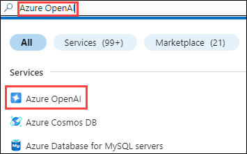

2. On **Azure AI Services | Azure OpenAI** blade, click on **+ Create**.

   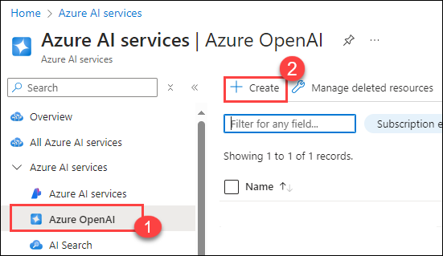

3. Create an **Azure OpenAI** resource with the following settings 

    - **Subscription**: Default - Pre-assigned subscription (1).
    - **Resource group**: openai-<inject key="DeploymentID" enableCopy="false"></inject> (2)
    - **Region**: Select <inject key="Region" enableCopy="false" /> (3)
    - **Name**: OpenAI-Lab02-<inject key="DeploymentID" enableCopy="false"></inject> (4)
    - **Pricing tier**: Standard S0 (5)
    -  Click on **Next** (6)
  
        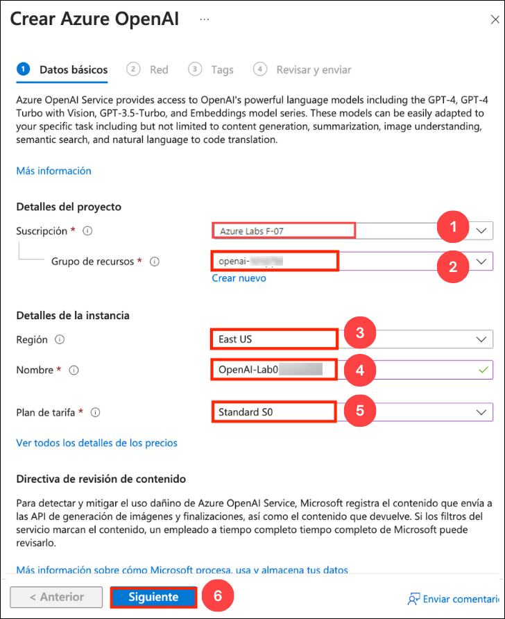

4. Click on **Next** twice and subsequently click on **Create** 

5. Wait for deployment to complete. Then go to the deployed Azure OpenAI resource in the Azure portal.

6. To capture the Keys and Endpoints values, on **openai-<inject key="DeploymentID" enableCopy="false"></inject>** blade:
      - Select **Keys and Endpoint (1)** under **Resource Management**.
      - Click on **Show Keys (2)**.
      - Copy **Key 1 (3)** and ensure to paste it into a text editor such as Notepad for future reference.
      - Finally, copy the **Endpoint (4)** API URL by clicking on copy to clipboard. Paste it in a text editor such as Notepad for later use.

        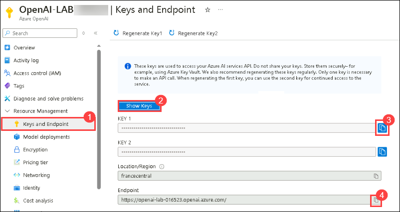


   > **Congratulations** on completing the task! Now, it's time to validate it. Here are the steps:
   > - Hit the Validate button for the corresponding task. If you receive a success message, you can proceed to the next task. 
   > - If not, carefully read the error message and retry the step, following the instructions in the lab guide.
   > - If you need any assistance, please contact us at cloudlabs-support@spektrasystems.com. We are available 24/7 to help you out.

   <validation step="8d0ea9cb-8ab4-4fa7-81a6-3642e4534d68" />

## Task 2: Deploy a model

To use the Azure OpenAI API, you must first deploy a model to use through the **Azure AI Foundry portal**. Once deployed, we will reference that model in our app.

1. In the **Azure portal**, search for **OpenAI** and select **Azure OpenAI**.

    

2. On the **Azure AI Services** page, ensure that **Azure OpenAI (1)** is selected from the left blade. Then, select **OpenAI-Lab02-<inject key="DeploymentID" enableCopy="false"></inject>**

   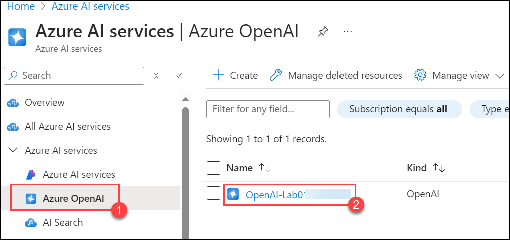

3. In the Azure OpenAI resource pane, click on **Go to Azure AI Foundry Portal** it will navigate you to **Azure AI Foundry Portal**.

   

   >**Note** : With a recent UI update, you may see an option labeled **Go to Azure AI Studio**, which will navigate to the **Azure AI Foundry portal**.

5. On the **Azure AI Foundry portal** page, select **Deployments (1)** under **Shared Resources** from the left pane. Then, click **+ Deploy Model** and choose **Deploy Base Model (2)**.

      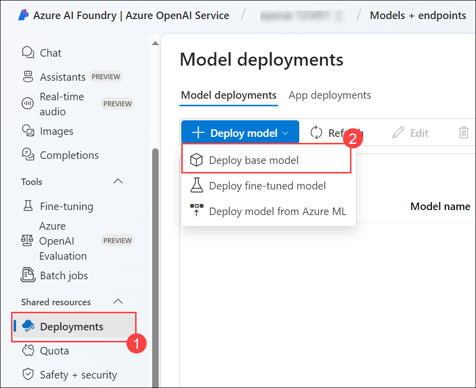

6. In the **Select a model** window, select **gpt-35-turbo-16k (1)** and click on **Confirm (2)**.

   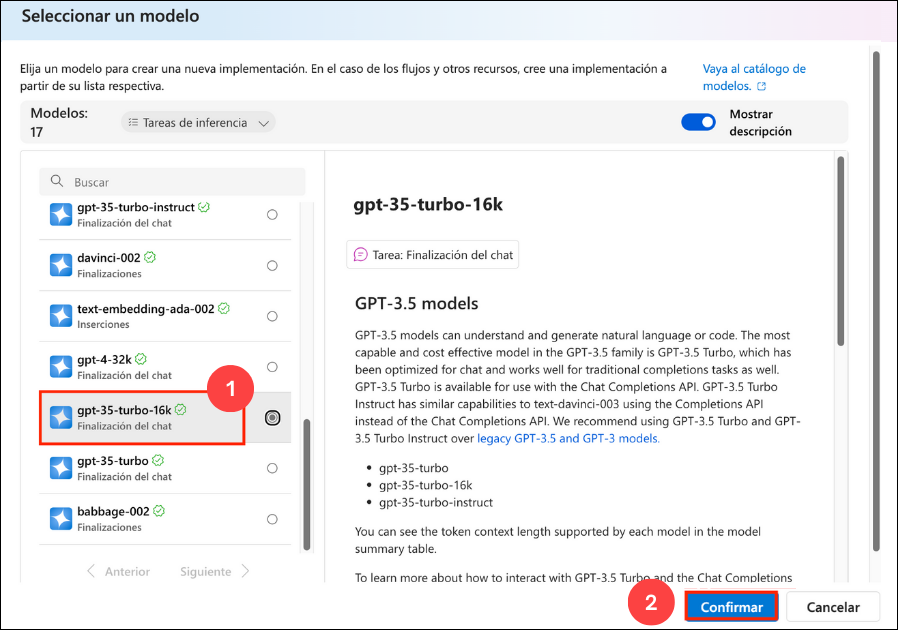

7. Within the Deploy model pop-up interface, enter the following details:
      - Deployment name: text-turbo(1)
      - Deployment type: Standard(2)
      - Click on **Customize**
      - **Model version**: 0613(Default)(3)
      - **Tokens per Minute Rate Limit (thousands)**: 10K (4)
      - **Enable dynamic quota**: Enabled (5)
      - Click on **Deploy** (6)
  
        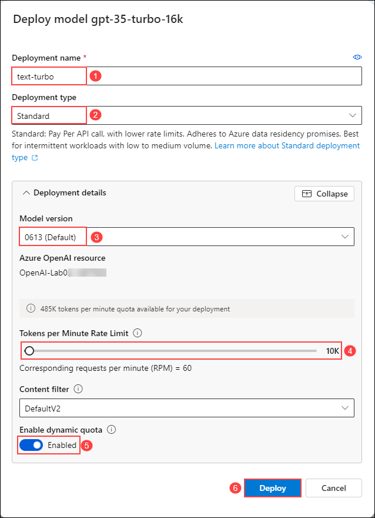

8. This will deploy a model that you will be playing around with as you proceed.

   > **Note**:You can ignore the "Failed to fetch deployments quota information" notification.
   
   > **Note**: Each Azure OpenAI model is optimized for a different balance of capabilities and performance. We'll use the **3.5 Turbo** model series in the **GPT-3** model family in this exercise, which is highly capable of language understanding. This exercise only uses a single model, however, deployment and usage of other models you deploy will work in the same way.


   > **Congratulations** on completing the task! Now, it's time to validate it. Here are the steps:
   > - Hit the Validate button for the corresponding task. If you receive a success message, you can proceed to the next task. 
   > - If not, carefully read the error message and retry the step, following the instructions in the lab guide.
   > - If you need any assistance, please contact us at cloudlabs-support@spektrasystems.com. We are available 24/7 to help you out.

   <validation step="d1610911-47ae-44ef-a286-4f4961a4b36d" />

## Task 3: Set up an application in Cloud Shell

To show how to integrate with an Azure OpenAI model, we'll use a short command-line application that runs in Cloud Shell on Azure. Open up a new browser tab to work with Cloud Shell.

1. In the [Azure portal](https://portal.azure.com?azure-portal=true), select the **[>_]** (*Cloud Shell*) button at the top of the page to the right of the search box. A Cloud Shell pane will open at the bottom of the portal.

    

2. The first time you open the Cloud Shell, you may be prompted to choose the type of shell you want to use (*Bash* or *PowerShell*). Select **Bash**. If you don't see this option, skip the step.

3. Within the Getting Started pane, select **Mount storage account (1)**, select your **Storage account subscription (2)** from the dropdown and click **Apply (3)**.

   

4. Within the **Mount storage account** pane, select **I want to create a storage account (1)** and click **Next (2)**.

   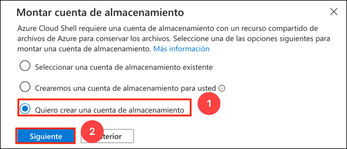

5. Within the **Advanced settings** pane, enter the following details:

    - **Subscription**: Default- Choose the only existing subscription assigned for this lab (1).
    - **Resource group**: Select **Use openai-<inject key="DeploymentID" enableCopy="false"></inject> (2)**
    - **Region**: <inject key="Region" enableCopy="false" /> (3)
    - **Storage account name**: storage<inject key="DeploymentID" enableCopy="false"></inject> (4)
    - **File share**: Create a new file share named **none** (5)
    - Click **Create** (6)

        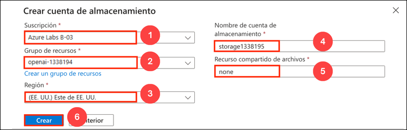

6. Note that you can resize the cloud shell by dragging the separator bar at the top of the page, or by using the **&#8212;**, **&#9723;**, and **X** icons at the top right of the page to minimize, maximize, and close the pane. For more information about using the Azure Cloud Shell, see the [Azure Cloud Shell documentation](https://docs.microsoft.com/azure/cloud-shell/overview). 

7. Once the terminal opens, click on **Settings** and select **Go to Classic Version**.

    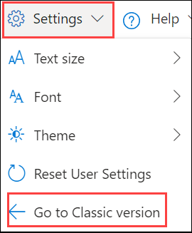

8. Once the terminal starts, enter the following command to download the sample application and save it to a folder called `azure-openai`.

    ```bash
   rm -r azure-openai -f
   git clone https://github.com/MicrosoftLearning/mslearn-openai azure-openai
    ```
  
9. The files are downloaded to a folder named **azure-openai**. Navigate to the lab files for this exercise using the following command.

    ```bash
   cd azure-openai/Labfiles/02-azure-openai-api
    ```

    Applications for both C# and Python have been provided, as well as a sample text file you'll use to test the summarization. Both apps feature the same functionality.

10. Open the built-in code editor, and observe the text file that you'll be summarizing with your model located at `text-files/sample-text.txt`. Use the following command to open the lab files in the code editor.

    ```bash
    code .
    ```
> **Congratulations** on completing the task! Now, it's time to validate it. Here are the steps:
> - Hit the Validate button for the corresponding task. If you receive a success message, you can proceed to the next task. 
> - If not, carefully read the error message and retry the step, following the instructions in the lab guide.
> - If you need any assistance, please contact us at cloudlabs-support@spektrasystems.com. We are available 24/7 to help you out.

<validation step="bd2f25c6-d67e-4553-a8ed-32e9f0162e26" />

## Task 4: Configure your application

For this exercise, you'll complete some key parts of the application to enable using your Azure OpenAI resource.

1. In the code editor, expand the **CSharp** or **Python** folder, depending on your language preference.

2. Open the configuration file for your language

    - C#: `appsettings.json`
    
    - Python: `.env`
    
3. Update the configuration values to include the **endpoint** and **key** from the Azure OpenAI resource you created, as well as the model name that you deployed, `text-turbo`. Then save the file by right-clicking on the blank space in file text editor and hit **Save**

    > **Note**: You can get the Azure OpenAI endpoint and key values from Azure openai resource's **Key and Endpoint** section under **Resource Management**.


4. Navigate to the folder for your preferred language and install the necessary packages

    **C#** : 

    ```bash
    cd CSharp
    dotnet add package Azure.AI.OpenAI --version 1.0.0-beta.14
    ```

    **Python** : 

    ```bash
    cd Python
    pip install python-dotenv
    pip install openai==1.56.2
    ```

5. Navigate to your preferred language folder, select the code file, and add the necessary libraries.

    **C#**: Program.cs

    ```csharp
    // Add Azure OpenAI package
    using Azure.AI.OpenAI;
    ```

    **Python**: test-openai-model.py

    ```python
    # Add Azure OpenAI package
    from openai import AzureOpenAI
    ```

6.  In the application code for your language, replace the comment ***Initialize the Azure OpenAI client...*** with the following code to initialize the client and define our system message.

    **C#**: Program.cs

    ```csharp
    // Initialize the Azure OpenAI client
    OpenAIClient client = new OpenAIClient(new Uri(oaiEndpoint), new AzureKeyCredential(oaiKey));
    
    // System message to provide context to the model
    string systemMessage = "I am a hiking enthusiast named Forest who helps people discover hikes in their area. If no area is specified, I will default to near Rainier National Park. I will then provide three suggestions for nearby hikes that vary in length. I will also share an interesting fact about the local nature on the hikes when making a recommendation.";
    ```

    **Python**: test-openai-model.py

    ```python
    # Initialize the Azure OpenAI client
    client = AzureOpenAI(
            azure_endpoint = azure_oai_endpoint, 
            api_key=azure_oai_key,  
            api_version="2024-02-15-preview"
            )
    
    # Create a system message
    system_message = """I am a hiking enthusiast named Forest who helps people discover hikes in their area. 
        If no area is specified, I will default to near Rainier National Park. 
        I will then provide three suggestions for nearby hikes that vary in length. 
        I will also share an interesting fact about the local nature on the hikes when making a recommendation.
        """
    ```

      >**Note**: Make sure to indent the code by eliminating any extra white spaces after pasting it into the code editor.
    
7. Replace the comment ***Add code to send request...*** with the necessary code for building the request; specifying the various parameters for your model such as `messages` and `temperature`.

    **C#**: Program.cs

    ```csharp
    // Add code to send request...
    // Build completion options object
    ChatCompletionsOptions chatCompletionsOptions = new ChatCompletionsOptions()
    {
        Messages =
        {
            new ChatRequestSystemMessage(systemMessage),
            new ChatRequestUserMessage(inputText),
        },
        MaxTokens = 400,
        Temperature = 0.7f,
        DeploymentName = oaiDeploymentName
    };

    // Send request to Azure OpenAI model
    ChatCompletions response = client.GetChatCompletions(chatCompletionsOptions);

    // Print the response
    string completion = response.Choices[0].Message.Content;
    Console.WriteLine("Response: " + completion + "\n");
    ```

    **Python**: test-openai-model.py

    ```python
    # Add code to send request...
    # Send request to Azure OpenAI model
    response = client.chat.completions.create(
        model=azure_oai_deployment,
        temperature=0.7,
        max_tokens=400,
        messages=[
            {"role": "system", "content": system_message},
            {"role": "user", "content": input_text}
        ]
    )
    generated_text = response.choices[0].message.content

    # Print the response
    print("Response: " + generated_text + "\n")
    ```

8. Before saving the file , please ensure your code looks similar to the code provided below.

    **C#**: Program.cs
      
      ```CSharp
      // Implicit using statements are included
      using System.Text;
      using System.Text.Json;
      using Microsoft.Extensions.Configuration;
      using Microsoft.Extensions.Configuration.Json;
      using Azure;
      
      // Add Azure OpenAI package
      using Azure.AI.OpenAI;
      
      // Build a config object and retrieve user settings.
      IConfiguration config = new ConfigurationBuilder()
          .AddJsonFile("appsettings.json")
          .Build();
      string? oaiEndpoint = config["AzureOAIEndpoint"];
      string? oaiKey = config["AzureOAIKey"];
      string? oaiDeploymentName = config["AzureOAIDeploymentName"];
      
      if(string.IsNullOrEmpty(oaiEndpoint) || string.IsNullOrEmpty(oaiKey) || string.IsNullOrEmpty(oaiDeploymentName) )
      {
          Console.WriteLine("Please check your appsettings.json file for missing or incorrect values.");
          return;
      }
      
      // Initialize the Azure OpenAI client...
      OpenAIClient client = new OpenAIClient(new Uri(oaiEndpoint), new AzureKeyCredential(oaiKey));
      
      // System message to provide context to the model
      string systemMessage = "I am a hiking enthusiast named Forest who helps people discover hikes in their area. If no area is specified, I will default to near Rainier National Park. I will then provide three suggestions for nearby hikes that vary in length. I will also share an interesting fact about the local nature on the hikes when making a recommendation.";
      
      do {
          Console.WriteLine("Enter your prompt text (or type 'quit' to exit): ");
          string? inputText = Console.ReadLine();
          if (inputText == "quit") break;
      
          // Generate summary from Azure OpenAI
          if (inputText == null) {
              Console.WriteLine("Please enter a prompt.");
              continue;
          }
          
          Console.WriteLine("\nSending request for summary to Azure OpenAI endpoint...\n\n");
      
          // Add code to send request...
          // Build completion options object
          ChatCompletionsOptions chatCompletionsOptions = new ChatCompletionsOptions()
          {
              Messages =
              {
                  new ChatRequestSystemMessage(systemMessage),
                  new ChatRequestUserMessage(inputText),
              },
              MaxTokens = 400,
              Temperature = 0.7f,
              DeploymentName = oaiDeploymentName
          };
      
          // Send request to Azure OpenAI model
          ChatCompletions response = client.GetChatCompletions(chatCompletionsOptions);
      
          // Print the response
          string completion = response.Choices[0].Message.Content;
          Console.WriteLine("Response: " + completion + "\n");
      
      } while (true);
      ```
    
   **Python**: test-openai-model.py

      ```Python
      # import modules
      import os
      from dotenv import load_dotenv
      
      # Add Azure OpenAI package
      from openai import AzureOpenAI
      
      def main(): 
              
          try: 
          
              # Get configuration settings 
              load_dotenv()
              azure_oai_endpoint = os.getenv("AZURE_OAI_ENDPOINT")
              azure_oai_key = os.getenv("AZURE_OAI_KEY")
              azure_oai_deployment = os.getenv("AZURE_OAI_DEPLOYMENT")
              
              # Initialize the Azure OpenAI client...
              client = AzureOpenAI(
                      azure_endpoint = azure_oai_endpoint, 
                      api_key=azure_oai_key,  
                      api_version="2024-02-15-preview"
                      )
              
              # Create a system message
              system_message = """I am a hiking enthusiast named Forest who helps people discover hikes in their area. 
                  If no area is specified, I will default to near Rainier National Park. 
                  I will then provide three suggestions for nearby hikes that vary in length. 
                  I will also share an interesting fact about the local nature on the hikes when making a recommendation.
                  """
                    
              while True:
                  # Get input text
                  input_text = input("Enter the prompt (or type 'quit' to exit): ")
                  if input_text.lower() == "quit":
                      break
                  if len(input_text) == 0:
                      print("Please enter a prompt.")
                      continue
      
                  print("\nSending request for summary to Azure OpenAI endpoint...\n\n")
                                    
                  # Add code to send request...
                  # Send request to Azure OpenAI model
                  response = client.chat.completions.create(
                      model=azure_oai_deployment,
                      temperature=0.7,
                      max_tokens=400,
                      messages=[
                          {"role": "system", "content": system_message},
                          {"role": "user", "content": input_text}
                      ]
                  )
                  generated_text = response.choices[0].message.content
      
                  # Print the response
                  print("Response: " + generated_text + "\n")
                        
          except Exception as ex:
              print(ex)
      
      if __name__ == '__main__': 
          main()
      ```
    
9. To save the changes made to the file, right click on the blank space in file text editor and hit **Save**

   >**Note:** Make sure to indent the code by eliminating any extra white spaces after pasting it into the code editor.

## Task 5: Test your application

Now that your app has been configured, run it to send your request to your model and observe the response.

1. If you are using **C#** language kindly open **CSharp.csproj** file and replace it with the following code and save the file.

   ```
   <Project Sdk="Microsoft.NET.Sdk">
   
   <PropertyGroup>
   <OutputType>Exe</OutputType>
   <TargetFramework>net8.0</TargetFramework>
   <ImplicitUsings>enable</ImplicitUsings>
   <Nullable>enable</Nullable>
   </PropertyGroup>
   
    <ItemGroup>
    <PackageReference Include="Azure.AI.OpenAI" Version="1.0.0-beta.14" />
    <PackageReference Include="Microsoft.Extensions.Configuration" Version="8.0.*" />
    <PackageReference Include="Microsoft.Extensions.Configuration.Json" Version="8.0.*" />
    </ItemGroup>
   
    <ItemGroup>
      <None Update="appsettings.json">
        <CopyToOutputDirectory>PreserveNewest</CopyToOutputDirectory>
       </None>
     </ItemGroup>
   
    </Project> 
   ```

1. In the interactive terminal pane, ensure the folder context is the folder for your preferred language. Then enter the following command to run the application.

    - **C#**: `dotnet run`
    
    - **Python**: `python test-openai-model.py`

    > **Tip**: You can use the **Maximize panel size** (**^**) icon in the terminal toolbar to see more of the console text.

2. When prompted, enter the text `What hike should I do near Rainier?`.

3. Observe the output, taking note that the response follows the guidelines provided in the system message you added to the *messages* array.

4. Provide the prompt `Where should I hike near Boise? I'm looking for something of easy difficulty, between 2 to 3 miles, with moderate elevation gain.` and observe the output.

5. In the code file for your preferred language, change the *temperature* parameter value in your request to **1.0** and save the file.

6. Run the application again using the prompts above, and observe the output.

Increasing the temperature often causes the response to vary, even when provided the same text, due to the increased randomness. You can run it several times to see how the output may change. Try using different values for your temperature with the same input.

## Summary

In this lab, you have accomplished the following:
- Provision an Azure OpenAI resource
- Deploy an OpenAI model within the Azure AI Foundry portal
- Integrate Azure OpenAI models into your applications

### You have successfully completed the lab.
