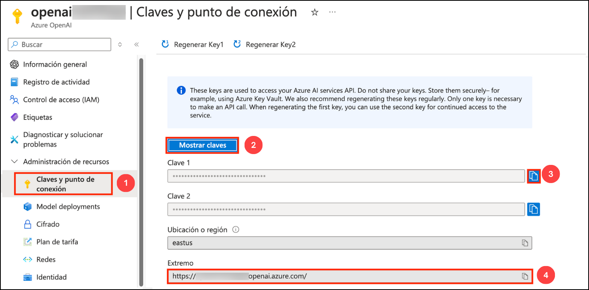
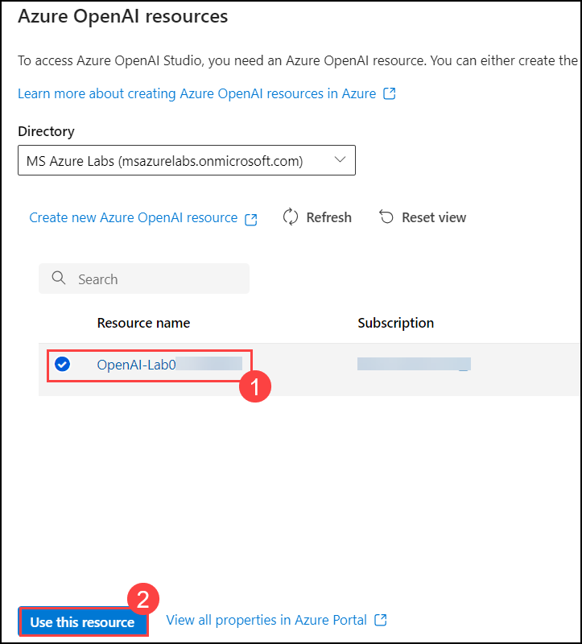
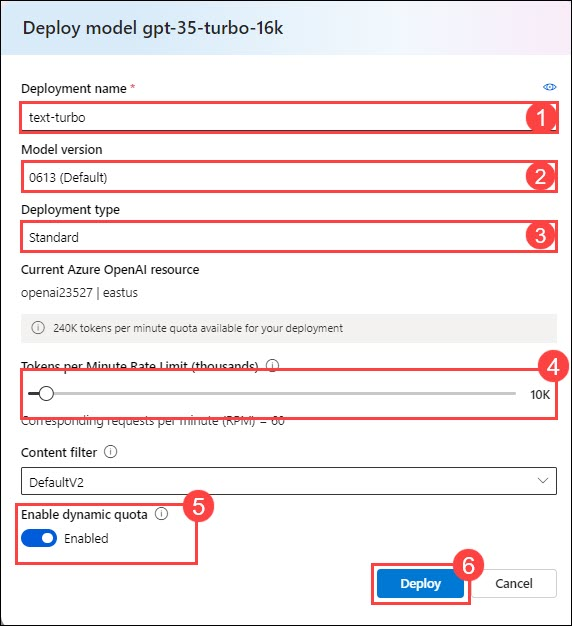
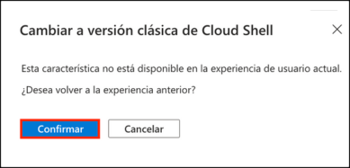

# Lab 02: Use Azure OpenAI SDKs in your app

## Lab scenario
With the Azure OpenAI Service, developers can create chatbots, language models, and other applications that excel at understanding natural human language. The Azure OpenAI provides access to pre-trained AI models, as well as a suite of APIs and tools for customizing and fine-tuning these models to meet the specific requirements of your application. In this exercise, you'll learn how to deploy a model in Azure OpenAI and use it in your own application.

In the scenario for this exercise, you will perform the role of a software developer who has been tasked to implement an app that can use generative AI to help provide hiking recommendations. The techniques used in the exercise can be applied to any app that wants to use Azure OpenAI APIs.

## Lab objectives
In this lab, you will complete the following tasks:

- Task 1: Provision an Azure OpenAI resource
- Task 2: Deploy a model
- Task 3: Set up an application in Cloud Shell
- Task 4: Configure your application
- Task 5: Test your application
- Task 6: Maintain conversation history

## Estimated time: 60 minutes

### Task 1: Provision an Azure OpenAI resource

In this task , you'll create an Azure resource in the Azure portal, selecting the OpenAI service and configuring settings such as region and pricing tier. This setup allows you to integrate OpenAI's advanced language models into your applications.

1. In the **Azure portal**, search for **OpenAI** and select **Azure OpenAI**.

   

2. On **Azure AI Services | Azure OpenAI** blade, click on **Create**.

   

3. Create an **Azure OpenAI** resource with the following settings 

    - **Subscription**: Default - Pre-assigned subscription (1).
    - **Resource group**: openai-<inject key="DeploymentID" enableCopy="false"></inject> (2)
    - **Region**: Select <inject key="Region" enableCopy="false" /> (3)
    - **Name**: OpenAI-Lab02-<inject key="DeploymentID" enableCopy="false"></inject> (4)
    - **Pricing tier**: Standard S0 (5)
    -  Click on **Next** (6)
  
         

4. Click on **Next** again and subsequently click on **Create** 

5. Wait for deployment to complete. Then go to the deployed Azure OpenAI resource in the Azure portal.

6. To capture the Keys and Endpoints values, on **openai-<inject key="DeploymentID" enableCopy="false"></inject>** blade:
      - Select **Keys and Endpoint (1)** under **Resource Management**.
      - Click on **Show Keys (2)**.
      - Copy **Key 1 (3)** and ensure to paste it in a text editor such as notepad for future reference.
      - Finally copy the **Endpoint (4)** API URL by clicking on copy to clipboard. Paste it in a text editor such as notepad for later use.

           

<validation step="b6d08e8e-f2a3-4066-a698-2a324f4493dd" />

> **Congratulations** on completing the task! Now, it's time to validate it. Here are the steps:
> - Hit the Validate button for the corresponding task. If you receive a success message, you can proceed to the next task. 
> - If not, carefully read the error message and retry the step, following the instructions in the lab guide.
> - If you need any assistance, please contact us at labs-support@spektrasystems.com. We are available 24/7 to help you out.

### Task 2: Deploy a model

In this task, you'll deploy a specific AI model instance within your Azure OpenAI resource to integrate advanced language capabilities into your applications.

1. In the **Azure portal**, search for **OpenAI** and select **Azure OpenAI**.

   

2. On **Azure AI Services | Azure OpenAI** blade, select **OpenAI-Lab02-<inject key="DeploymentID" enableCopy="false"></inject>**

   

3. In the Azure OpenAI resource pane, click on **Go to Azure OpenAI Studio** it will navigate to **Azure AI Studio**.

   

4. In the prompt select the **OpenAI-Lab01-<inject key="Deployment-id" enableCopy="false"></inject> (1)** resource that you have created and click on **Use this resource(2)**.

      

5. In the **Deployments (1)** page, click on **+ Deploy model** , Choose **Deploy base Model (2)**.

      


6. Within the **Deploy model** pop-up interface, enter the following details:
    - **Deployment name**: text-turbo (1)
    - **Model version**: Auto-update to default (2)
    - **Deployment type**: Standard (3)
    - **Tokens per Minute Rate Limit (thousands)**: 10K (4)
    - **Enable dynamic quota**: Enabled (5)
    - Click on **Deploy** (6)
  
      

>**Note** : if the **gpt-35-turbo-16k** model isn't available, choose **gpt-35-turbo**

7. This will deploy a model that you will be playing around with as you proceed.

   > **Note**:You can ignore the "Failed to fetch deployments quota information" notification.
   
   > **Note**: Each Azure OpenAI model is optimized for a different balance of capabilities and performance. We'll use the **3.5 Turbo** model series in the **GPT-3** model family in this exercise, which is highly capable of language understanding. This exercise only uses a single model, however, deployment and usage of other models you deploy will work in the same way.

#### Validation

<validation step="69a18560-a442-467a-be09-b5663806dd0a" />

> **Congratulations** on completing the task! Now, it's time to validate it. Here are the steps:
> - Hit the Validate button for the corresponding task. If you receive a success message, you can proceed to the next task. 
> - If not, carefully read the error message and retry the step, following the instructions in the lab guide.
> - If you need any assistance, please contact us at labs-support@spektrasystems.com. We are available 24/7 to help you out.


### Task 3: Set up an application in Cloud Shell

In this task, you will integrate with an Azure OpenAI model by using a short command-line application running in Cloud Shell on Azure. Open a new browser tab to work with Cloud Shell.

1. In the [Azure portal](https://portal.azure.com?azure-portal=true), select the **[>_]** (*Cloud Shell*) button at the top of the page to the right of the search box. A Cloud Shell pane will open at the bottom of the portal.

    

2. The first time you open the Cloud Shell, you may be prompted to choose the type of shell you want to use (*Bash* or *PowerShell*). Select **Bash**. If you don't see this option, skip the step.

3. Within the Getting Started pane, select **Mount storage account**, select your **Storage account subscription** from the dropdown and click **Apply**.

   

4. Within the **Mount storage account** pane, select **I want to create a storage account** and click **Next**.

   

5. Within the **Advanced settings** pane, enter the following details:

    - **Subscription**: Default- Choose the only existing subscription assigned for this lab (1).
    - **CloudShell region**: <inject key="Region" enableCopy="false" /> (2)
    - **Resource group**: Select **Use existing**.(3)
      - openai-<inject key="DeploymentID" enableCopy="false"></inject>
    - **Storage account**: Select **Create new**.(4)
      - storage<inject key="DeploymentID" enableCopy="false"></inject>
    - **File share**: Create a new file share named **none** (5)
    - Click **Create Storage** (6)

    


6. Note that you can resize the cloud shell by dragging the separator bar at the top of the pane, or by using the **&#8212;**, **&#9723;**, and **X** icons at the top right of the pane to minimize, maximize, and close the pane. For more information about using the Azure Cloud Shell, see the [Azure Cloud Shell documentation](https://docs.microsoft.com/azure/cloud-shell/overview). 

7. Once the terminal starts, enter the following command to download the sample application and save it to a folder called `azure-openai`.

    ```bash
   rm -r azure-openai -f
   git clone https://github.com/MicrosoftLearning/mslearn-openai azure-openai
    ```
  
8. The files are downloaded to a folder named **azure-openai**. Navigate to the lab files for this exercise using the following command.

    ```bash
   cd azure-openai/Labfiles/02-azure-openai-api
    ```

   Applications for both C# and Python have been provided, as well as a sample text file you'll use to test the summarization. Both apps feature the same functionality.

9. Open the built-in code editor, and observe the text file that you'll be summarizing with your model located at `text-files/sample-text.txt`. Use the following command to open the lab files in the code editor.

      ```bash
      code .
      ```
 
 > **Note**: If you receive a popup to **Switch to Classic Cloud Shell** while running the **code .** command, click **Confirm**. Re-run commands from **steps 8 and 9** to and make sure you are in the correct project path.

    
   
#### Validation

<validation step="4eb72f2c-5f15-42b7-9637-abdaf9e30be5" />

> **Congratulations** on completing the task! Now, it's time to validate it. Here are the steps:
> - Hit the Validate button for the corresponding task. If you receive a success message, you can proceed to the next task. 
> - If not, carefully read the error message and retry the step, following the instructions in the lab guide.
> - If you need any assistance, please contact us at labs-support@spektrasystems.com. We are available 24/7 to help you out.


### Task 4: Configure your application

In this task, you will complete key parts of the application to enable it to use your Azure OpenAI resource.

1. In the code editor, expand the **CSharp** or **Python** folder, depending on your language preference.

2. Open the configuration file for your language

    - C#: `appsettings.json`
    - Python: `.env`
    
3. Update the configuration values to include the **endpoint** and **key** from the Azure OpenAI resource you created, as well as the model name that you deployed, `text-turbo`. Then save the file by right-clicking on the file from the left pane and hit **Save**

4. Navigate to the folder for your preferred language and install the necessary packages

    **C#** : 

    ```bash
    cd CSharp
    dotnet add package Azure.AI.OpenAI --version 1.0.0-beta.14
    ```

    **Python** : 

    ```bash
    cd Python
    pip install python-dotenv
    pip install openai==1.13.3
    ```

5. Navigate to your preferred language folder, select the code file, and add the necessary libraries.

    **C#**: Program.cs

    ```csharp
    // Add Azure OpenAI package
    using Azure.AI.OpenAI;
    ```

    **Python**: test-openai-model.py

    ```python
    # Add Azure OpenAI package
    from openai import AzureOpenAI
    ```

6.  In the application code for your language, replace the comment ***Initialize the Azure OpenAI client...*** with the following code to initialize the client and define our system message.

    **C#**: Program.cs

    ```csharp
    // Initialize the Azure OpenAI client
    OpenAIClient client = new OpenAIClient(new Uri(oaiEndpoint), new AzureKeyCredential(oaiKey));
    
    // System message to provide context to the model
    string systemMessage = "I am a hiking enthusiast named Forest who helps people discover hikes in their area. If no area is specified, I will default to near Rainier National Park. I will then provide three suggestions for nearby hikes that vary in length. I will also share an interesting fact about the local nature on the hikes when making a recommendation.";
    ```

    **Python**: test-openai-model.py

    ```python
    # Initialize the Azure OpenAI client
    client = AzureOpenAI(
            azure_endpoint = azure_oai_endpoint, 
            api_key=azure_oai_key,  
            api_version="2024-02-15-preview"
            )
    
    # Create a system message
    system_message = """I am a hiking enthusiast named Forest who helps people discover hikes in their area. 
        If no area is specified, I will default to near Rainier National Park. 
        I will then provide three suggestions for nearby hikes that vary in length. 
        I will also share an interesting fact about the local nature on the hikes when making a recommendation.
        """
    ```

      >**Note**: Make sure to indent the code by eliminating any extra white spaces after pasting it into the code editor.
    
7. Replace the comment ***Add code to send request...*** with the necessary code for building the request; specifying the various parameters for your model such as `messages` and `temperature`.

    **C#**: Program.cs

    ```csharp
    // Add code to send request...
    // Build completion options object
    ChatCompletionsOptions chatCompletionsOptions = new ChatCompletionsOptions()
    {
        Messages =
        {
            new ChatRequestSystemMessage(systemMessage),
            new ChatRequestUserMessage(inputText),
        },
        MaxTokens = 400,
        Temperature = 0.7f,
        DeploymentName = oaiDeploymentName
    };

    // Send request to Azure OpenAI model
    ChatCompletions response = client.GetChatCompletions(chatCompletionsOptions);

    // Print the response
    string completion = response.Choices[0].Message.Content;
    Console.WriteLine("Response: " + completion + "\n");
    ```

    **Python**: test-openai-model.py

    ```python
    # Add code to send request...
    # Send request to Azure OpenAI model
    response = client.chat.completions.create(
        model=azure_oai_deployment,
        temperature=0.7,
        max_tokens=400,
        messages=[
            {"role": "system", "content": system_message},
            {"role": "user", "content": input_text}
        ]
    )
    generated_text = response.choices[0].message.content

    # Print the response
    print("Response: " + generated_text + "\n")
    ```

8. To save the changes made to the file, right-click on the file from the left pane in the code window and hit **Save**

   >**Note:** Make sure to indent the code by eliminating any extra white spaces after pasting it into the code editor.

### Task 5: Test your application

In this task, you will run your configured app to send a request to your model and observe the response.

1. In the Cloud Shell bash terminal, navigate to the folder for your preferred language.

2. If your using as **C#** language kindly open **CSharp.csproj** file replace with following code and save the file.

   ```
   <Project Sdk="Microsoft.NET.Sdk">
   
   <PropertyGroup>
   <OutputType>Exe</OutputType>
   <TargetFramework>net8.0</TargetFramework>
   <ImplicitUsings>enable</ImplicitUsings>
   <Nullable>enable</Nullable>
   </PropertyGroup>
   
    <ItemGroup>
    <PackageReference Include="Azure.AI.OpenAI" Version="1.0.0-beta.14" />
    <PackageReference Include="Microsoft.Extensions.Configuration" Version="8.0.*" />
    <PackageReference Include="Microsoft.Extensions.Configuration.Json" Version="8.0.*" />
    </ItemGroup>
   
    <ItemGroup>
      <None Update="appsettings.json">
        <CopyToOutputDirectory>PreserveNewest</CopyToOutputDirectory>
       </None>
     </ItemGroup>
   
    </Project> 

   ```
   
3. In the interactive terminal pane, ensure the folder context is the folder for your preferred language. Then enter the following command to run the application.

    - **C#**: `dotnet run`
    - **Python**: `python test-openai-model.py`

    > **Tip**: You can use the **Maximize panel size** (**^**) icon in the terminal toolbar to see more of the console text.

4. When prompted, enter the text `What hike should I do near Rainier?`.
5. Observe the output, taking note that the response follows the guidelines provided in the system message you added to the *messages* array.
6. Provide the prompt `Where should I hike near Boise? I'm looking for something of easy difficulty, between 2 to 3 miles, with moderate elevation gain.` and observe the output.
7. In the code file for your preferred language, change the *temperature* parameter value in your request to **1.0** and save the file.
8. Run the application again using the prompts above, and observe the output.

Increasing the temperature often causes the response to vary, even when provided the same text, due to the increased randomness. You can run it several times to see how the output may change. Try using different values for your temperature with the same input.

### Task 6: Maintain conversation history

In this task, you will provide a history of the conversation in your prompt to enable the Azure OpenAI model to reference past messages, enhancing the realism of interactions despite the API's stateless design.

1. Run the app again and provide the prompt `Where is a good hike near Boise?`.
2. Observe the output, and then prompt `How difficult is the second hike you suggested?`.
3. The response from the model will likely indicate can't understand the hike you're referring to. To fix that, we can enable the model to have the past conversation messages for reference.
4. In your application, we need to add the previous prompt and response to the future prompt we are sending. Below the definition of the **system message**, add the following code.

    **C#**: Program.cs

    ```csharp
    // Initialize messages list
    var messagesList = new List<ChatRequestMessage>()
    {
        new ChatRequestSystemMessage(systemMessage),
    };
    ```

    **Python**: test-openai-model.py

    ```python
    # Initialize messages array
    messages_array = [{"role": "system", "content": system_message}]
    ```

5. Under the comment ***Add code to send request...***, replace all the code from the comment until the  **while** loop command at the end for C# and until the **except** command in python with the following code then save the file. The code is mostly the same, but now using the messages array to store the conversation history.

    **C#**: Program.cs

    ```csharp
    // Add code to send request...
    // Build completion options object
    messagesList.Add(new ChatRequestUserMessage(inputText));

    ChatCompletionsOptions chatCompletionsOptions = new ChatCompletionsOptions()
    {
        MaxTokens = 1200,
        Temperature = 0.7f,
        DeploymentName = oaiDeploymentName
    };

    // Add messages to the completion options
    foreach (ChatRequestMessage chatMessage in messagesList)
    {
        chatCompletionsOptions.Messages.Add(chatMessage);
    }

    // Send request to Azure OpenAI model
    ChatCompletions response = client.GetChatCompletions(chatCompletionsOptions);

    // Return the response
    string completion = response.Choices[0].Message.Content;

    // Add generated text to messages list
    messagesList.Add(new ChatRequestAssistantMessage(completion));

    Console.WriteLine("Response: " + completion + "\n");
    ```

    **Python**: test-openai-model.py

    ```python
    # Add code to send request...
    # Send request to Azure OpenAI model
    messages_array.append({"role": "user", "content": input_text})

    response = client.chat.completions.create(
        model=azure_oai_deployment,
        temperature=0.7,
        max_tokens=1200,
        messages=messages_array
    )
    generated_text = response.choices[0].message.content
    # Add generated text to messages array
    messages_array.append({"role": "system", "content": generated_text})

    # Print generated text
    print("Summary: " + generated_text + "\n")
    ```

6. The final code should look like as shown below:

   **C#**: Program.cs

   ```csharp
   // Implicit using statements are included
      using System.Text;
      using System.Text.Json;
      using Microsoft.Extensions.Configuration;
      using Microsoft.Extensions.Configuration.Json;
      using Azure;
      
      // Add Azure OpenAI package
      using Azure.AI.OpenAI;
      
      // Build a config object and retrieve user settings.
      IConfiguration config = new ConfigurationBuilder()
          .AddJsonFile("appsettings.json")
          .Build();
      string? oaiEndpoint = config["AzureOAIEndpoint"];
      string? oaiKey = config["AzureOAIKey"];
      string? oaiDeploymentName = config["AzureOAIDeploymentName"];
      
      if(string.IsNullOrEmpty(oaiEndpoint) || string.IsNullOrEmpty(oaiKey) || string.IsNullOrEmpty(oaiDeploymentName) )
      {
          Console.WriteLine("Please check your appsettings.json file for missing or incorrect values.");
          return;
      }
      
      // Initialize the Azure OpenAI client...
      // Initialize the Azure OpenAI client
         OpenAIClient client = new OpenAIClient(new Uri(oaiEndpoint), new AzureKeyCredential(oaiKey));
      
      // System message to provide context to the model
      string systemMessage = "I am a hiking enthusiast named Forest who helps people discover hikes in their area. If no area is specified, I will default to near Rainier National Park. I will then provide three suggestions for nearby hikes that vary in length. I will also share an interesting fact about the local nature on the hikes when making a recommendation.";
      
      // Initialize messages list
      var messagesList = new List<ChatRequestMessage>()
      {
          new ChatRequestSystemMessage(systemMessage),
      };
      
      
      do {
          Console.WriteLine("Enter your prompt text (or type 'quit' to exit): ");
          string? inputText = Console.ReadLine();
          if (inputText == "quit") break;
      
          // Generate summary from Azure OpenAI
          if (inputText == null) {
              Console.WriteLine("Please enter a prompt.");
              continue;
          }
          
          Console.WriteLine("\nSending request for summary to Azure OpenAI endpoint...\n\n");
      
          // Add code to send request...
         // Add code to send request...
          // Build completion options object
          messagesList.Add(new ChatRequestUserMessage(inputText));
      
          ChatCompletionsOptions chatCompletionsOptions = new ChatCompletionsOptions()
          {
              MaxTokens = 1200,
              Temperature = 0.7f,
              DeploymentName = oaiDeploymentName
          };
      
          // Add messages to the completion options
          foreach (ChatRequestMessage chatMessage in messagesList)
          {
              chatCompletionsOptions.Messages.Add(chatMessage);
          }
      
          // Send request to Azure OpenAI model
          ChatCompletions response = client.GetChatCompletions(chatCompletionsOptions);
      
          // Return the response
          string completion = response.Choices[0].Message.Content;
      
          // Add generated text to messages list
          messagesList.Add(new ChatRequestAssistantMessage(completion));
      
          Console.WriteLine("Response: " + completion + "\n");
      
      
      } while (true);
      ```

    **Python**: test-openai-model.py

   ```python
    import os
    from dotenv import load_dotenv
   
   # Add Azure OpenAI package
   from openai import AzureOpenAI
   
   def main(): 
           
       try: 
       
           # Get configuration settings 
           load_dotenv()
           azure_oai_endpoint = os.getenv("AZURE_OAI_ENDPOINT")
           azure_oai_key = os.getenv("AZURE_OAI_KEY")
           azure_oai_deployment = os.getenv("AZURE_OAI_DEPLOYMENT")
           
           # Initialize the Azure OpenAI client...
           # Initialize the Azure OpenAI client
           client = AzureOpenAI(
               azure_endpoint=azure_oai_endpoint, 
               api_key=azure_oai_key,  
               api_version="2024-02-15-preview"
           )
       
           # Create a system message
           system_message = """I am a hiking enthusiast named Forest who helps people discover hikes in their area. 
           If no area is specified, I will default to near Rainier National Park. 
           I will then provide three suggestions for nearby hikes that vary in length. 
           I will also share an interesting fact about the local nature on the hikes when making a recommendation.
           """
           # Initialize messages array
           messages_array = [{"role": "system", "content": system_message}]
           
           while True:
               # Get input text
               input_text = input("Enter the prompt (or type 'quit' to exit): ")
               if input_text.lower() == "quit":
                   break
               if len(input_text) == 0:
                   print("Please enter a prompt.")
                   continue
   
               print("\nSending request for summary to Azure OpenAI endpoint...\n\n")
               
               # Add code to send request...
               # Add code to send request...
               # Send request to Azure OpenAI model
               messages_array.append({"role": "user", "content": input_text})
   
               response = client.chat.completions.create(
                   model=azure_oai_deployment,
                   temperature=0.7,
                   max_tokens=1200,
                   messages=messages_array
               )
               generated_text = response.choices[0].message.content
               # Add generated text to messages array
               messages_array.append({"role": "system", "content": generated_text})
   
               # Print generated text
               print("Summary: " + generated_text + "\n")
               
   
       except Exception as ex:
           print(ex)
   
   if __name__ == '__main__': 
       main()
   ```

7. Save the file. In the code you added, notice we now append the previous input and response to the prompt array which allows the model to understand the history of our conversation.
8. In the terminal pane, enter the following command to run the application.

    - **C#**: `dotnet run`
    - **Python**: `python test-openai-model.py`

9. Run the app again and provide the prompt `Where is a good hike near Boise?`.
10. Observe the output, and then prompt `How difficult is the second hike you suggested?`.
11. You'll likely get a response about the second hike the model suggested, which provides a much more realistic conversation. You can ask additional follow up questions referencing previous answers, and each time the history provides context for the model to answer.

    > **Tip**: The token count is only set to 1200, so if the conversation continues too long the application will run out of available tokens, resulting in an incomplete prompt. In production uses, limiting the length of the history to the most recent inputs and responses will help control the number of required tokens.

## Summary

In this lab, you have accomplished the following:
-   Provision an Azure OpenAI resource
-   Deploy an OpenAI model within the Azure OpenAI studio
-   Integrate Azure OpenAI models into your applications

### You have successfully completed the lab.
