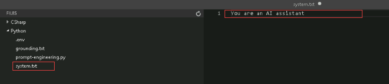
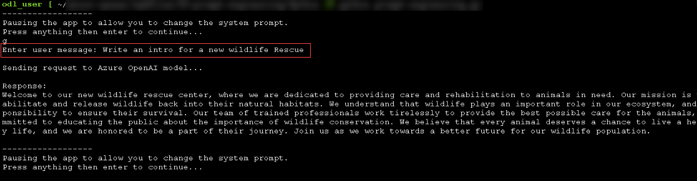

# Lab 03: Utilize prompt engineering in your app

## Lab scenario

When working with the Azure OpenAI Service, how developers shape their prompt greatly impacts how the generative AI model will respond. Azure OpenAI models are able to tailor and format content, if requested in a clear and concise way. In this exercise, you'll learn how different prompts for similar content help shape the AI model's response to better satisfy your requirements.

In scenario for this exercise, you will perform the role of a software developer working on a wildlife marketing campaign. You are exploring how to use generative AI to improve advertising emails and categorize articles that might apply to your team. The prompt engineering techniques used in the exercise can be applied similarly for a variety of use cases.

## Lab objectives
In this lab, you will complete the following tasks:

- Task 1: Apply prompt engineering in chat playground
- Task 2: Set up an application in Cloud Shell
- Task 3: Configure your application
- Task 4: Run your application

## Estimated time: 30 minutes

### Task 1: Deploy a model

To use the Azure OpenAI API, you must first deploy a model to use through the **Azure OpenAI Studio**. Once deployed, we will reference that model in our app.

1. In the **Azure portal**, search for **OpenAI** and select **Azure OpenAI**.

   

2. On **Azure AI Services | Azure OpenAI** blade, select **OpenAI-Lab03-<inject key="DeploymentID" enableCopy="false"></inject>**

   

3. To capture the Keys and Endpoints values, on **openai-<inject key="DeploymentID" enableCopy="false"></inject>** blade:
      - Select **Keys and Endpoint (1)** under **Resource Management**.
      - Click on **Show Keys (2)**.
      - Copy **Key 1 (3)** and ensure to paste it in a text editor such as Notepad for future reference.
      - Finally copy the **Endpoint (4)** API URL by clicking on copy to clipboard. Paste it in a text editor such as Notepad for later use.

   

4. In the **Overview** pane, click on **Go to Azure OpenAI Studio** it will navigate to **Azure AI Studio**.

   
   
5. In **Welcome to Azure OpenAI Service** page, click on **Create new deployment**.

   

6. In the **Deployments** page, click on **+ Create new deployment**.

   

7. Within the **Deploy model** pop-up interface, enter the following details:
    - **Select a Model**: gpt-35-turbo-16k (1)
   
      > **Note**: if the 16k model isn't available, choose **gpt-35-turbo**
      
    - **Model version**: Auto-update to default (2)
    - - **Deployment type**: Standard (3)
    - **Deployment name**: text-turbo (4)
    - Click on **Advanced Settings** (5)
    - **Tokens per Minute Rate Limit (thousands)**: 10K (6)
    - **Enable dynamic quota**: Enabled (7)
    - Click on **Create** (8)
  
      

8. Click on the **Create** button to deploy a model which you will be playing around with as you proceed.

   > **Note**:You can ignore the "Failed to fetch deployments quota information" notification.
   
   > **Note**: Each Azure OpenAI model is optimized for a different balance of capabilities and performance. We'll use the **3.5 Turbo** model series in the **GPT-3** model family in this exercise, which is highly capable for language understanding. This exercise only uses a single model, however, deployment and usage of other models you deploy will work in the same way.
   
#### Validation

<validation step="7e110ef6-8a1d-4bbd-b1e4-20c09d85fd56" />

> **Congratulations** on completing the task! Now, it's time to validate it. Here are the steps:
> - Hit the Validate button for the corresponding task. If you receive a success message, you can proceed to the next task. 
> - If not, carefully read the error message and retry the step, following the instructions in the lab guide.
> - If you need any assistance, please contact us at labs-support@spektrasystems.com. We are available 24/7 to help you out.


### Task 1: Apply prompt engineering in chat playground

Before using your app, examine how prompt engineering improves the model response in the playground. In this first example, imagine you are trying to write a Python app of animals with fun names.

1. In [Azure OpenAI Studio](https://oai.azure.com/?azure-portal=true), navigate to the **Chat** playground in the left pane.
1. In the **Setup** section at the top, enter `You are a helpful AI assistant` as the system message and click on **Apply changes** and subsequently click on **Continue**.
1. Scroll down and in the **Chat session** section, enter the following prompt and press *Enter*.

    ```code
   1. Create a list of animals
   2. Create a list of whimsical names for those animals
   3. Combine them randomly into a list of 25 animal and name pairs
    ```
    >**Note:** Kindly refresh the screen incase you encounter any error message and perform the above step again.

1. The model will likely respond with an answer to satisfy the prompt, split into a numbered list. This is a good response, but not what we're looking for.
1. Next, update the system message to include instructions `You are an AI assistant helping write python code. Complete the app based on provided comments`. Click **Apply changes** and subsequently click on **Continue**.
1. Format the instructions as python comments. Send the following prompt to the model.

    ```code
   # 1. Create a list of animals
   # 2. Create a list of whimsical names for those animals
   # 3. Combine them randomly into a list of 25 animal and name pairs
    ```

1. The model should correctly respond with complete python code doing what the comments requested.
1. Next we'll see the impact of few shot prompting when attempting to classify articles. Return to the system message, and enter `You are a helpful AI assistant` again, and apply your changes and subsequently click on **Continue**. This will create a new chat session.
1. Send the following prompt to the model.

    ```code
   Severe drought likely in California

   Millions of California residents are bracing for less water and dry lawns as drought threatens to leave a large swath of the region with a growing water shortage.
   
   In a remarkable indication of drought severity, officials in Southern California have declared a first-of-its-kind action limiting outdoor water use to one day a week for nearly 8 million residents.
   
   Much remains to be determined about how daily life will change as people adjust to a drier normal. But officials are warning the situation is dire and could lead to even more severe limits later in the year.
    ```

1. The response will likely be some information about drought in California. While not a bad response, it's not the classification we're looking for.
1. In the **Setup** section near the system message, select the **Add an example** button. Add the following example.

    **User:**

    ```code
   New York Baseballers Wins Big Against Chicago
   
   New York Baseballers mounted a big 5-0 shutout against the Chicago Cyclones last night, solidifying their win with a 3 run homerun late in the bottom of the 7th inning.
   
   Pitcher Mario Rogers threw 96 pitches with only two hits for New York, marking his best performance this year.
   
   The Chicago Cyclones' two hits came in the 2nd and the 5th innings, but were unable to get the runner home to score.
    ```

    **Assistant:**

    ```code
   Sports
    ```

1. Add another example with the following text.

    **User:**

    ```code
   Joyous moments at the Oscars

   The Oscars this past week where quite something!
   
   Though a certain scandal might have stolen the show, this year's Academy Awards were full of moments that filled us with joy and even moved us to tears.
   These actors and actresses delivered some truly emotional performances, along with some great laughs, to get us through the winter.
   
   From Robin Kline's history-making win to a full performance by none other than Casey Jensen herself, don't miss tomorrows rerun of all the festivities.
    ```

    **Assistant:**

    ```code
   Entertainment
    ```

1. Save those changes to the assistant setup, click continue, and send the same prompt about California drought, provided here again for convenience.

    ```code
   Severe drought likely in California

   Millions of California residents are bracing for less water and dry lawns as drought threatens to leave a large swath of the region with a growing water shortage.
   
   In a remarkable indication of drought severity, officials in Southern California have declared a first-of-its-kind action limiting outdoor water use to one day a week for nearly 8 million residents.
   
   Much remains to be determined about how daily life will change as people adjust to a drier normal. But officials are warning the situation is dire and could lead to even more severe limits later in the year.
    ```

1. This time the model should respond with an appropriate classification, even without instructions.

### Task 2: Set up an application in Cloud Shell

To show how to integrate with an Azure OpenAI model, we'll use a short command-line application that runs in Cloud Shell on Azure. Open up a new browser tab to work with Cloud Shell.

1. In the [Azure portal](https://portal.azure.com?azure-portal=true), select the **[>_]** (*Cloud Shell*) button at the top of the page to the right of the search box. A Cloud Shell pane will open at the bottom of the portal.

    

2. The first time you open the Cloud Shell, you may be prompted to choose the type of shell you want to use (*Bash* or *PowerShell*). Select **Bash**. If you don't see this option, skip the step.  

   

3. Within the Getting Started pane, select **Mount storage account**, select your **Storage account subscription** from the dropdown and click **Apply**.

   

4. Within the **Mount storage account** pane, select **I want to create a storage account** and click **Next**.

   

5. Within the **Advanced settings** pane, enter the following details:

    - **Subscription**: Default- Choose the only existing subscription assigned for this lab (1).
    - **CloudShell region**: <inject key="Region" enableCopy="false" /> (2)
    - **Resource group**: Select **Use existing**.(3)
      - openai-<inject key="DeploymentID" enableCopy="false"></inject>
    - **Storage account**: Select **Create new**.(4)
      - storage<inject key="DeploymentID" enableCopy="false"></inject>
    - **File share**: Create a new file share named **none** (5)
    - Click **Create Storage** (6)

    

6. Make sure the type of shell indicated on the top left of the Cloud Shell pane is switched to *Bash*. If it's *PowerShell*, switch to *Bash* by using the drop-down menu.

7. Note that you can resize the cloud shell by dragging the separator bar at the top of the pane, or by using the **&#8212;**, **&#9723;**, and **X** icons at the top right of the pane to minimize, maximize, and close the pane. For more information about using the Azure Cloud Shell, see the [Azure Cloud Shell documentation](https://docs.microsoft.com/azure/cloud-shell/overview).

8. Once the terminal starts, enter the following command to download the sample application and save it to a folder called `azure-openai`.

    ```bash
   rm -r azure-openai -f
   git clone https://github.com/MicrosoftLearning/mslearn-openai azure-openai
    ```

9. The files are downloaded to a folder named **azure-openai**. Navigate to the lab files for this exercise using the following command.

    ```bash
   cd azure-openai/Labfiles/03-prompt-engineering
    ```

    Applications for both C# and Python have been provided, as well as a text files that provide the prompts. Both apps feature the same functionality.

    Open the built-in code editor, and you can observe the prompt files that you'll be using in `prompts`. Use the following command to open the lab files in the code editor.

    ```bash
   code .
    ```

   > **NOTE:** If you're prompted to **Switch to Classic Cloud Shell** after running the **code .** command, click on **Confirm**.

   

   <validation step="32649cba-2942-41b8-8af9-48119c7c9640" />

### Task 3: Configure your application

Applications for both C# and Python have been provided, and both apps feature the same functionality. First, you'll complete some key parts of the application to enable using your Azure OpenAI resource with asynchronous API calls.

1. In the code editor, expand the **CSharp** or **Python** folder, depending on your language preference.Each folder contains the language-specific files for an app into which you're you're going to integrate Azure OpenAI functionality.

2. Open the configuration file for your language.

    - C#: `appsettings.json`
    - Python: `.env`
    
3. Update the configuration values to include the **endpoint** and **key** from the Azure OpenAI resource you created, as well as the model name that you deployed, `text-turbo`. Then save the file by right-clicking on the file from the left pane and hit **Save**

4. Navigate to the folder for your preferred language and install the necessary packages.

    **C#**

    ```bash
   cd CSharp
   dotnet add package Azure.AI.OpenAI --version 1.0.0-beta.14
    ```

    **Python**
   
    ```bash
    cd Python
    pip install python-dotenv
    pip install openai==1.13.3
    ```

6. Navigate to your preferred language folder, select the code file, and add the necessary libraries.

    **C#**: Program.cs

    ```csharp
   // Add Azure OpenAI package
   using Azure.AI.OpenAI;
    ```

    **Python**: prompt-engineering.py

    ```python
    # Add Azure OpenAI package
    from openai import AsyncAzureOpenAI
    ```

7. Open up the application code for your language and add the necessary code for configuring the client.

    **C#**: Program.cs

    ```csharp
   // Initialize the Azure OpenAI client
   OpenAIClient client = new OpenAIClient(new Uri(oaiEndpoint), new AzureKeyCredential(oaiKey));
    ```

    **Python**: prompt-engineering.py

   ```python
    # Configure the Azure OpenAI client
    client = AsyncAzureOpenAI(
        azure_endpoint = azure_oai_endpoint, 
        api_key=azure_oai_key,  
        api_version="2024-02-15-preview"
        )
    ```

8. In the function that calls the Azure OpenAI model, add the code to format and send the request to the model.

    **C#**: Program.cs

    ```csharp
           // Format and send the request to the model
         var chatCompletionsOptions = new ChatCompletionsOptions()
         {
             Messages =
             {
                 new ChatRequestSystemMessage(systemMessage),
                 new ChatRequestUserMessage(userMessage)
             },
             Temperature = 0.7f,
             MaxTokens = 800,
             DeploymentName = oaiDeploymentName
         };
         
         // Get response from Azure OpenAI
         Response<ChatCompletions> response = await client.GetChatCompletionsAsync(chatCompletionsOptions);
    ```

    **Python**: prompt-engineering.py

   ```python
    # Format and send the request to the model
    messages =[
        {"role": "system", "content": system_message},
        {"role": "user", "content": user_message},
    ]
    
    print("\nSending request to Azure OpenAI model...\n")

    # Call the Azure OpenAI model
    response = await client.chat.completions.create(
        model=model,
        messages=messages,
        temperature=0.7,
        max_tokens=800
    )
    ```

9. The  modified code should look like as shown below:

    **C#**
      
      ```csharp
        // Implicit using statements are included
         using System.Text;
         using System.Text.Json;
         using Microsoft.Extensions.Configuration;
         using Microsoft.Extensions.Configuration.Json;
         using Azure;
         
         // Add Azure OpenAI package
         // Add Azure OpenAI package
         using Azure.AI.OpenAI;
         
         // Build a config object and retrieve user settings.
         IConfiguration config = new ConfigurationBuilder()
             .AddJsonFile("appsettings.json")
             .Build();
         string? oaiEndpoint = config["AzureOAIEndpoint"];
         string? oaiKey = config["AzureOAIKey"];
         string? oaiDeploymentName = config["AzureOAIDeploymentName"];
         
         bool printFullResponse = false;
         
         do {
             // Pause for system message update
             Console.WriteLine("-----------\nPausing the app to allow you to change the system prompt.\nPress any key to continue...");
             Console.ReadKey();
             
             Console.WriteLine("\nUsing system message from system.txt");
             string systemMessage = System.IO.File.ReadAllText("system.txt"); 
             systemMessage = systemMessage.Trim();
         
             Console.WriteLine("\nEnter user message or type 'quit' to exit:");
             string userMessage = Console.ReadLine() ?? "";
             userMessage = userMessage.Trim();
             
             if (systemMessage.ToLower() == "quit" || userMessage.ToLower() == "quit")
             {
                 break;
             }
             else if (string.IsNullOrEmpty(systemMessage) || string.IsNullOrEmpty(userMessage))
             {
                 Console.WriteLine("Please enter a system and user message.");
                 continue;
             }
             else
             {
                 await GetResponseFromOpenAI(systemMessage, userMessage);
             }
         } while (true);
         
         async Task GetResponseFromOpenAI(string systemMessage, string userMessage)  
         {   
             Console.WriteLine("\nSending prompt to Azure OpenAI endpoint...\n\n");
         
             if(string.IsNullOrEmpty(oaiEndpoint) || string.IsNullOrEmpty(oaiKey) || string.IsNullOrEmpty(oaiDeploymentName) )
             {
                 Console.WriteLine("Please check your appsettings.json file for missing or incorrect values.");
                 return;
             }
             
             // Configure the Azure OpenAI client
             // Initialize the Azure OpenAI client
             OpenAIClient client = new OpenAIClient(new Uri(oaiEndpoint), new AzureKeyCredential(oaiKey));
         
             // Format and send the request to the model
             // Format and send the request to the model
             var chatCompletionsOptions = new ChatCompletionsOptions()
             {
                 Messages =
                 {
                     new ChatRequestSystemMessage(systemMessage),
                     new ChatRequestUserMessage(userMessage)
                 },
                 Temperature = 0.7f,
                 MaxTokens = 800,
                 DeploymentName = oaiDeploymentName
             };
         
         // Get response from Azure OpenAI
         Response<ChatCompletions> response = await client.GetChatCompletionsAsync(chatCompletionsOptions);
             
             ChatCompletions completions = response.Value;
             string completion = completions.Choices[0].Message.Content;
             
             // Write response full response to console, if requested
             if (printFullResponse)
             {
                 Console.WriteLine($"\nFull response: {JsonSerializer.Serialize(completions, new JsonSerializerOptions { WriteIndented = true })}\n\n");
             }
         
             // Write response to console
             Console.WriteLine($"\nResponse:\n{completion}\n\n");
         }  
            
      ```
   
     **Python**
   
      ```python
    import os
   import asyncio
   from dotenv import load_dotenv
   
   # Add Azure OpenAI package
   # Add Azure OpenAI package
   from openai import AsyncAzureOpenAI
   
   # Set to True to print the full response from OpenAI for each call
   printFullResponse = False
   
   async def main(): 
           
       try: 
       
           # Get configuration settings 
           load_dotenv()
           azure_oai_endpoint = os.getenv("AZURE_OAI_ENDPOINT")
           azure_oai_key = os.getenv("AZURE_OAI_KEY")
           azure_oai_deployment = os.getenv("AZURE_OAI_DEPLOYMENT")
           
           # Configure the Azure OpenAI client
           # Configure the Azure OpenAI client
           client = AsyncAzureOpenAI(
               azure_endpoint = azure_oai_endpoint, 
               api_key=azure_oai_key,  
               api_version="2024-02-15-preview"
               )
   
           while True:
               # Pause the app to allow the user to enter the system prompt
               print("------------------\nPausing the app to allow you to change the system prompt.\nPress anything then enter to continue...")
               input()
   
               # Read in system message and prompt for user message
               system_text = open(file="system.txt", encoding="utf8").read().strip()
               user_text = input("Enter user message: ")
               if user_text.lower() == 'quit' or system_text.lower() == 'quit':
                   print('Exiting program...')
                   break
               
               await call_openai_model(system_message = system_text, 
                                       user_message = user_text, 
                                       model=azure_oai_deployment, 
                                       client=client
                                       )
   
       except Exception as ex:
           print(ex)
   
   async def call_openai_model(system_message, user_message, model, client):
       # Format and send the request to the model
       # Format and send the request to the model
       messages =[
           {"role": "system", "content": system_message},
           {"role": "user", "content": user_message},
       ]
   
       print("\nSending request to Azure OpenAI model...\n")
   
       # Call the Azure OpenAI model
       response = await client.chat.completions.create(
           model=model,
           messages=messages,
           temperature=0.7,
           max_tokens=800
       )
   
   
       if printFullResponse:
           print(response)
   
       print("Response:\n" + response.choices[0].message.content + "\n")
   
   if __name__ == '__main__': 
       asyncio.run(main())
      ```

9. To save the changes made to the file, right-click on the file from the left pane and hit **Save**

### Task 4: Run your application

Now that your app has been configured, run it to send your request to your model and observe the response. You'll notice the only difference between the different options is the content of the prompt, all other parameters (such as token count and temperature) remain the same for each request.

1. In the folder of your preferred language, open `system.txt` in Visual Studio Code. For each of the interations, you'll enter the **System message** in this file and save it. Each iteration will pause first for you to change the system message.
1. In the interactive terminal pane, ensure the folder context is the folder for your preferred language. Then enter the following command to run the application.

    - **C#**: `dotnet run`
    - **Python**: `python prompt-engineering.py`

    > **Tip**: You can use the **Maximize panel size** (**^**) icon in the terminal toolbar to see more of the console text.

1. For the first iteration, enter the following prompts:

    **System message**

    ```prompt
    You are an AI assistant
    ```
     

    **User message:**

    ```prompt
    Write an intro for a new wildlife Rescue
    ```
     

1. Observe the output. The AI model will likely produce a good generic introduction to a wildlife rescue.
1. Next, enter the following prompts which specify a format for the response:

    **System message**

    ```prompt
    You are an AI assistant helping to write emails
    ```
    **User message:**

    ```prompt
    Write a promotional email for a new wildlife rescue, including the following: 
       - Rescue name is Contoso 
       - It specializes in elephants 
       - Call for donations to be given at our website
    ```
1. Observe the output. This time, you'll likely see the format of an email with the specific animals included, as well as the call for donations.
1. Next, enter the following prompts that additionally specify the content:

    **System message**

    ```prompt
    You are an AI assistant helping to write emails
    ```

    **User message:**

    ```prompt
    Write a promotional email for a new wildlife rescue, including the following: 
    - Rescue name is Contoso 
    - It specializes in elephants, as well as zebras and giraffes 
    - Call for donations to be given at our website 
    \n Include a list of the current animals we have at our rescue after the signature, in the form of a table. These animals include elephants, zebras, gorillas, lizards, and jackrabbits.
    ```

1. Observe the output, and see how the email has changed based on your clear instructions.
1. Next, enter the following prompts where we add details about tone to the system message:

    **System message**

    ```prompt
    You are an AI assistant that helps write promotional emails to generate interest in a new business. Your tone is light, chit-chat oriented and you always include at least two jokes.
    ```

    **User message:**

    ```prompt
    Write a promotional email for a new wildlife rescue, including the following: 
    - Rescue name is Contoso 
    - It specializes in elephants, as well as zebras and giraffes 
    - Call for donations to be given at our website 
    \n Include a list of the current animals we have at our rescue after the signature, in the form of a table. These animals include elephants, zebras, gorillas, lizards, and jackrabbits.
    ```

1. Observe the output. This time you'll likely see the email in a similar format, but with a much more informal tone. You'll likely even see jokes included!
1. For the final iteration, we're deviating from email generation and exploring *grounding context*. Here you provide a simple system message, and change the app to provide the grounding context as the beginning of the user prompt. The app will then append the user input, and extract information from the grounding context to answer our user prompt.
1. Open the file `grounding.txt` and briefly read the grounding context you'll be inserting.
1. In your app immediately after the comment ***Format and send the request to the model*** and before any existing code, add the following code snippet to read text in from `grounding.txt` to augment the user prompt with the grounding context.

    **C#**: Program.cs

    ```csharp
    // Format and send the request to the model
    Console.WriteLine("\nAdding grounding context from grounding.txt");
    string groundingText = System.IO.File.ReadAllText("grounding.txt");
    userMessage = groundingText + userMessage;
    ```

    **Python**: prompt-engineering.py

    ```python
    # Format and send the request to the model
    print("\nAdding grounding context from grounding.txt")
    grounding_text = open(file="grounding.txt", encoding="utf8").read().strip()
    user_message = grounding_text + user_message
    ```

1. Save the file and rerun your app.
1. Enter the following prompts (with the **system message** still being entered and saved in `system.txt`).

    **System message**

    ```prompt
    You're an AI assistant who helps people find information. You'll provide answers from the text provided in the prompt, and respond concisely.
    ```

    **User message:**

    ```prompt
    What animal is the favorite of children at Contoso?
    ```

   
## Review

In this lab, you have accomplished the following:
-   Provision an Azure OpenAI resource
-   Deploy an OpenAI model within the Azure OpenAI studio
-   Apply prompt engineering in your applications

### You have successfully completed the lab.
