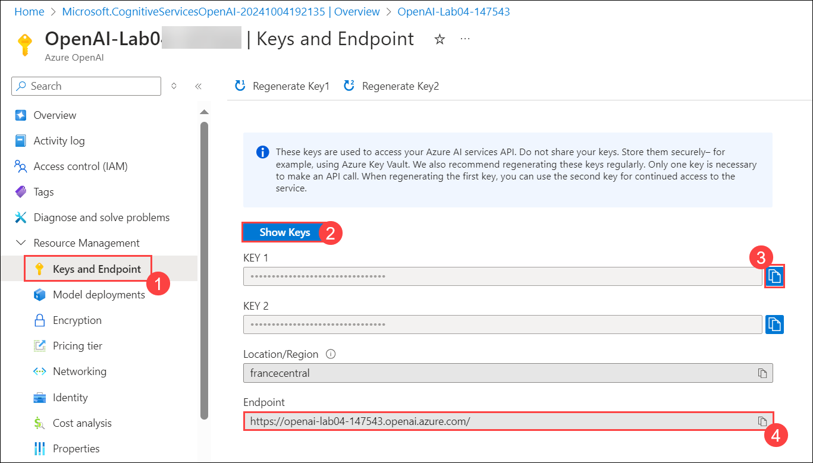
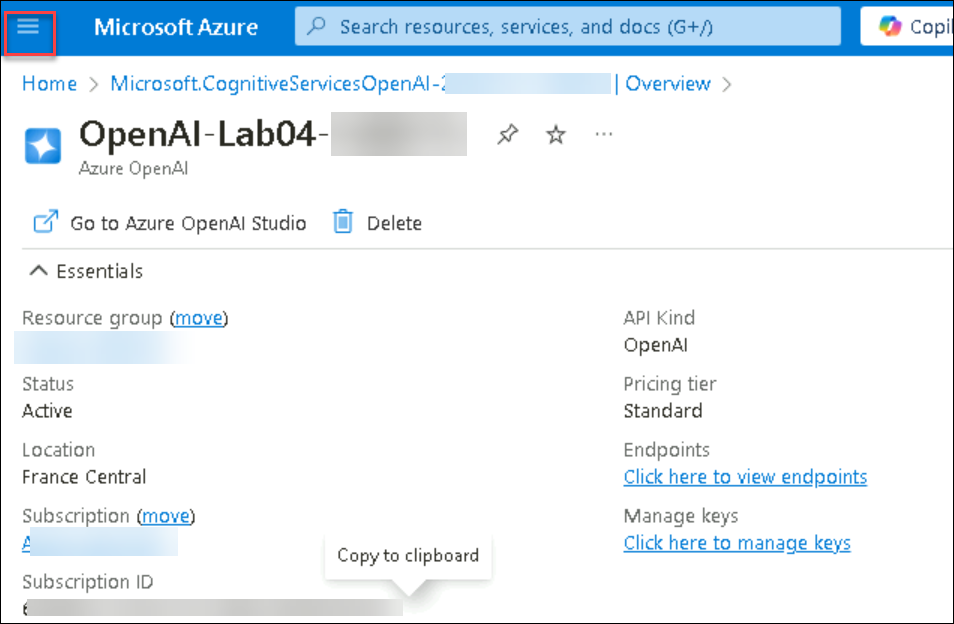
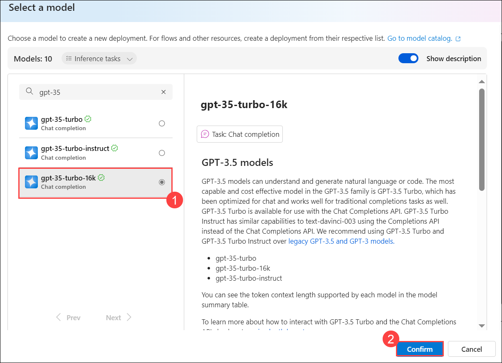
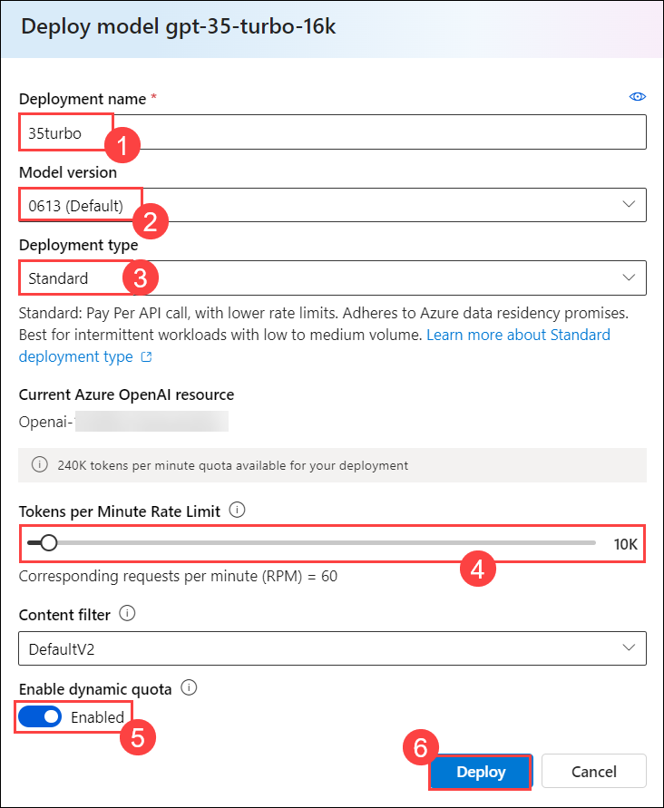
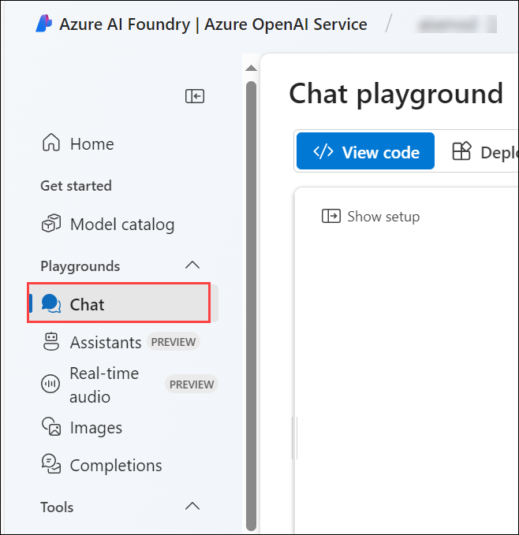
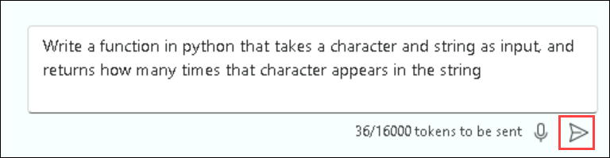
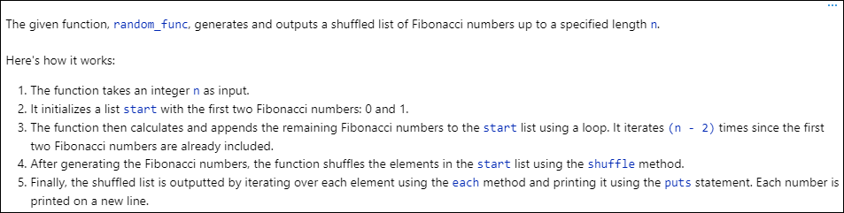
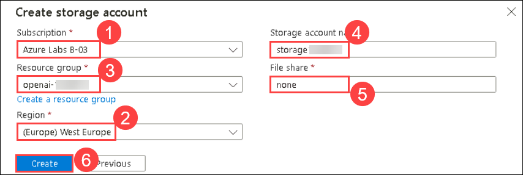

# Lab 04: Generate and improve code with Azure OpenAI Service

## Lab scenario
The Azure OpenAI Service models can generate code for you using natural language prompts, fixing bugs in completed code, and providing code comments. These models can also explain and simplify existing code to help you understand what it does and how to improve it.

## Lab objectives
In this lab, you will complete the following tasks:

- Task 1: Provision an Azure OpenAI resource
- Task 2: Deploy a model
- Task 3: Generate code in chat playground
- Task 4: Set up an application in Cloud Shell
- Task 5: Configure your application
- Task 6: Run your application

## Estimated time: 60 minutes

### Task 1: Provision an Azure OpenAI resource

In this task , you'll create an Azure resource in the Azure portal, selecting the OpenAI service and configuring settings such as region and pricing tier. This setup allows you to integrate OpenAI's advanced language models into your applications.

1. In the **Azure portal**, search for **OpenAI** and select **Azure OpenAI**.

   

2. On **Azure AI Services | Azure OpenAI** blade, click on **Create**.

   

3. Create an **Azure OpenAI** resource with the following settings 

    - **Subscription**: Default - Pre-assigned subscription (1).
    - **Resource group**: openai-<inject key="Deployment-ID" enableCopy="false"></inject> (2)
    - **Region**: Select **France Central** (3)
    - **Name**: OpenAI-Lab04-<inject key="Deployment-ID" enableCopy="false"></inject> (4)
    - **Pricing tier**: Standard S0 (5)
    -  Click on **Next** 
  
         

4. Click on **Next** again and subsequently click on **Create** 

5. Wait for deployment to complete. Then go to the deployed Azure OpenAI resource in the Azure portal.

6. To capture the Keys and Endpoints values, on **openai-<inject key="Deployment-ID" enableCopy="false"></inject>** blade:
      - Select **Keys and Endpoint (1)** under **Resource Management**.
      - Click on **Show Keys (2)**.
      - Copy **Key 1 (3)** and ensure to paste it in a text editor such as notepad for future reference.
      - Finally copy the **Endpoint (4)** API URL by clicking on copy to clipboard. Paste it in a text editor such as notepad for later use.

           

   > **Note**: If you dont see the Left side Navigation pane, click on the three horizontal line in the top left corner.

              

<validation step="b2bea034-1f21-46f4-9d53-c1def354425e" />

> **Congratulations** on completing the task! Now, it's time to validate it. Here are the steps:
> - Hit the Validate button for the corresponding task. If you receive a success message, you can proceed to the next task. 
> - If not, carefully read the error message and retry the step, following the instructions in the lab guide.
> - If you need any assistance, please contact us at cloudlabs-support@spektrasystems.com. We are available 24/7 to help you out.


### Task 2: Deploy a model

In this task, you'll deploy a specific AI model instance within your Azure OpenAI resource to integrate advanced language capabilities into your applications.

1. In the **Azure portal**, search for **OpenAI** and select **Azure OpenAI**.

   

1. On **Azure AI Services | Azure OpenAI** blade, select **OpenAI-Lab04-<inject key="Deployment-ID" enableCopy="false"></inject>**

   

1. In the Azure OpenAI resource pane, click on **Go to Azure OpenAI Studio** it will navigate to **Azure AI Studio**.

   
   

1. In the **Deployments (1)** page, click on **+ Deploy model** , Choose **Deploy base Model (2)**.

      

   > **Note**: Click on the **Expand** button, if you dont see the left side navigation pane.

              
   

1. Search for **GPT-35-TURBO-16K (1)**, click on **Confirm (2)**

      

1. Within the Deploy model pop-up interface, enter the following details:
      - Deployment name: **35turbo (1)**
      - Model version: **0613(Default) (2)**
      - Deployment type: **Standard (3)**
      - Tokens per Minute Rate Limit (thousands): **10K (4)**
      - Enable dynamic quota: **Enabled (5)**
      - Click on Deploy **(6)**
  
           

   > **Note**: If you see the interface like the below screenshot, Click on **Customize** and provide the details.

              
        

   > **Note**: if the **GPT-35-TURBO-16K** model isn't available, choose **gpt-35-turbo**

   > **Note**:You can ignore the "Failed to fetch deployments quota information" notification.

   > **Note**: Each Azure OpenAI model is optimized for a different balance of capabilities and performance. We'll use the **35 Turbo** model series in the **GPT-3** model family in this exercise, which is highly capable for both language and code understanding.

<validation step="f0a7d271-5b5c-40c2-80a0-9e7889b96f1f" />

> **Congratulations** on completing the task! Now, it's time to validate it. Here are the steps:
> - Hit the Validate button for the corresponding task. If you receive a success message, you can proceed to the next task. 
> - If not, carefully read the error message and retry the step, following the instructions in the lab guide.
> - If you need any assistance, please contact us at cloudlabs-support@spektrasystems.com. We are available 24/7 to help you out.


### Task 3: Generate code in chat playground

In this task, you will examine how Azure OpenAI can generate and explain code in the Chat playground before using it in your app.

1. In [Azure OpenAI Studio](https://oai.azure.com/?azure-portal=true), navigate to the **Chat** playground in the left pane.

   
   
1. Scroll down and in the **Chat session** section, enter the following prompt and press *Enter*.

    ```code
   Write a function in python that takes a character and string as input, and returns how many times that character appears in the string
    ```
   
    
1. The model will likely respond with a function, with some explanation of what the function does and how to call it.
1. Next, send the prompt `Do the same thing, but this time write it in C#`.
1. Observe the output. The model likely responded very similarly as the first time, but this time coding in C#. You can ask it again for a different language of your choice, or a function to complete a different task such as reversing the input string.
1. Next, let's explore using AI to understand code with this example of a random function you saw written in Ruby. Send the following prompt as the user message.

    ```code
    What does the following function do?  
    ---  
    def random_func(n)
      start = [0, 1]
      (n - 2).times do
        start << start[-1] + start[-2]
      end
      start.shuffle.each do |num|
        puts num
      end
    end
    ```
    
1. Observe the output, which explains what the function does in natural language.

   

1. Submit the prompt `Can you simplify the function?`. The model should write a simpler version of the function.

1. Submit the prompt: `Add some comments to the function.` The model adds comments to the code.
    
### Task 4: Set up an application in Cloud Shell

In this task, you will use a short command-line application running in Cloud Shell on Azure to demonstrate how to integrate with an Azure OpenAI model. Open a new browser tab to access Cloud Shell.

1. In the [Azure portal](https://portal.azure.com?azure-portal=true), select the **[>_]** (*Cloud Shell*) button at the top of the page to the right of the search box. A Cloud Shell pane will open at the bottom of the portal.

    

   > **Note**: If you dont see the **[>_]** (*Cloud Shell*) button, click on three dots **(...)(1)** and select **Cloud Shell(2) (2)**

             

1. The first time you open the Cloud Shell, you may be prompted to choose the type of shell you want to use (*Bash* or *PowerShell*). Select **Bash**. If you don't see this option, skip the step.  

1. If you're prompted as Getting Started click on **Mount storage account (1)** select the available subscription **(2)** and click on **Apply (3)**.

   

1. Select **I want to create a storage account (2)** and click on **Next (2)**.

   

1. Within the **Create storage account** pane, enter the following details:
    - **Subscription**: Default- Choose the only existing subscription assigned for this lab (1).
    - **CloudShell region**: East US (2)
    - **Resource group**: Select openai-<inject key="Deployment-ID" enableCopy="false"></inject>(3)
    - **Storage Account Name**: Enter storage<inject key="Deployment-ID" enableCopy="false"></inject>(4)
    - **File share**: Enter **none** (5)
    - Click **Create** (6)

       

1. Make sure the type of shell indicated on the top left of the Cloud Shell pane is switched to *Bash*. If it's *PowerShell*, switch to *Bash* by using the drop-down menu.

1. Once the terminal starts, enter the following command to download the sample application and save it to a folder called `azure-openai`.

    ```bash
   rm -r azure-openai -f
   git clone https://github.com/MicrosoftLearning/mslearn-openai azure-openai
    ```

1. The files are downloaded to a folder named **azure-openai**. Navigate to the lab files for this exercise using the following command.

    ```bash
   cd azure-openai/Labfiles/04-code-generation
    ```

   > **Note**: Applications for both C# and Python have been provided, as well as sample code we'll be using in this lab.

1. Open the built-in code editor, and you can observe the code files we'll be using in `sample-code`. Use the following command to open the lab files in the code editor.

    ```bash
   code .
    ```

      > **Note**: If you receive a popup to **Switch to Classic Cloud Shell** while running the **code .** command, click **Confirm**. Re-run commands from **steps 8 and 9** to and make sure you are in the correct project path.

      

<validation step="8cfc3b23-a18d-413a-a749-b7a1e70de45a" />

> **Congratulations** on completing the task! Now, it's time to validate it. Here are the steps:
> - Hit the Validate button for the corresponding task. If you receive a success message, you can proceed to the next task. 
> - If not, carefully read the error message and retry the step, following the instructions in the lab guide.
> - If you need any assistance, please contact us at cloudlabs-support@spektrasystems.com. We are available 24/7 to help you out.


### Task 5: Configure your application

In this task, you will complete key parts of the application to enable it to use your Azure OpenAI resource.

1. In the code editor, expand the language folder for your preferred language.

2. Open the configuration file for your language.

    - **C#**: `appsettings.json`
    - **Python**: `.env`

3. Update the configuration values to include the **endpoint** and **key** from the Azure OpenAI resource you created, as well as the name of your deployment, `35turbo`. Then save the file by right-clicking on the file from the left pane and hit **Save**.

4. Navigate to the folder for your preferred language and install the necessary packages.

    **C#**

    ```bash
   cd CSharp
   dotnet add package Azure.AI.OpenAI --version 1.0.0-beta.14
    ```

    **Python**

      ```bash
    cd Python
    pip install python-dotenv
    pip install openai==1.13.3
    ```

5. Add the necessary code for configuring the client.

    **C#**
    `Program.cs`

   ```csharp
     // Format and send the request to the model
       var chatCompletionsOptions = new ChatCompletionsOptions()
       {
           Messages =
           {
               new ChatRequestSystemMessage(systemPrompt),
               new ChatRequestUserMessage(userPrompt)
           },
           Temperature = 0.7f,
           MaxTokens = 1000,
           DeploymentName = oaiDeploymentName
       };
   
       // Get response from Azure OpenAI
       Response<ChatCompletions> response = await client.GetChatCompletionsAsync(chatCompletionsOptions);
   
       ChatCompletions completions = response.Value;
       string completion = completions.Choices[0].Message.Content;
    ```

    **Python**
     `code-generation.py`

      ```python
    # Format and send the request to the model
    messages =[
        {"role": "system", "content": system_message},
        {"role": "user", "content": user_message},
    ]
    
    # Call the Azure OpenAI model
    response = client.chat.completions.create(
        model=model,
        messages=messages,
        temperature=0.7,
        max_tokens=1000
    )
    ```
   > **Note**: Ensure that the indentation is correct when copying and pasting the Python code.
 

6. To save the changes made to the file, right-click on the file from the left pane, and hit **Save**

### Task 6: Run your application

In this task, you will run your configured app to generate code for each use case, which is numbered in the app and can be executed in any order.

> **Note**: Some users may experience rate limiting if calling the model too frequently. If you hit an error about a token rate limit, wait for a minute then try again.

1. In the code editor, expand the `sample-code` folder and briefly observe the function and the app for your language. These files will be used for the tasks in the app.
   
2. In the Cloud Shell bash terminal, navigate to the folder for your preferred language.

3. If your using as **C#** language kindly open **CSharp.csproj** file replace with following code and save the file.

    ```
   <Project Sdk="Microsoft.NET.Sdk">
   
   <PropertyGroup>
   <OutputType>Exe</OutputType>
   <TargetFramework>net8.0</TargetFramework>
   <ImplicitUsings>enable</ImplicitUsings>
   <Nullable>enable</Nullable>
   </PropertyGroup>
   
    <ItemGroup>
    <PackageReference Include="Azure.AI.OpenAI" Version="1.0.0-beta.14" />
    <PackageReference Include="Microsoft.Extensions.Configuration" Version="8.0.*" />
    <PackageReference Include="Microsoft.Extensions.Configuration.Json" Version="8.0.*" />
    </ItemGroup>
   
    <ItemGroup>
      <None Update="appsettings.json">
        <CopyToOutputDirectory>PreserveNewest</CopyToOutputDirectory>
       </None>
     </ItemGroup>
   
    </Project>
    ```  
4. Run the application.

    - **C#**: `dotnet run`
    - **Python**: `python code-generation.py`

5. Choose option **1** to add comments to your code and enter the following prompt. Note, the response might take a few seconds for each of these tasks.

    ```prompt
    Add comments to the following function. Return only the commented code.\n---\n
    ```
6. Next, choose option **2** to write unit tests for that same function and enter the following prompt.

    ```prompt
    Write four unit tests for the following function.\n---\n
    ```

7. Next, choose option **3** to fix bugs in an app for playing Go Fish. Enter the following prompt.

    ```prompt
    Fix the code below for an app to play Go Fish with the user. Return only the corrected code.\n---\n
    ```
8. The results will replace what was in `result/app.txt`, and should have very similar code with a few things corrected.

    - **C#**: Fixes are made on line 30 and 59
    - **Python**: Fixes are made on line 18 and 31

9. To check the results paste the following code in the terminal:

    ```
   cd result
    ```

10. Copy the below command in the terminal to see the contents of the app.txt file.

    ```
   cat app.txt
    ```

The app for Go Fish in `sample-code` can be run, if you replace the lines with bugs with the response from Azure OpenAI. If you run it without the fixes, it will not work correctly.

It's important to note that even though the code for this Go Fish app was corrected for some syntax, it's not a strictly accurate representation of the game. If you look closely, there are issues with not checking if the deck is empty when drawing cards, not removing pairs from the players hand when they get a pair, and a few other bugs that require understanding of card games to realize. This is a great example of how useful generative AI models can be to assist with code generation, but can't be trusted as correct and need to be verified by the developer.

If you would like to see the full response from Azure OpenAI, you can set the `printFullResponse` variable to `True`, and rerun the app.

## Summary

In this lab, you have accomplished the following:
-   Provision an Azure OpenAI resource
-   Deploy an OpenAI model within the Azure OpenAI studio
-   Use the functionalites of the Azure OpenAI to generate and improvise code for your production applications.

### You have successfully completed the lab.
