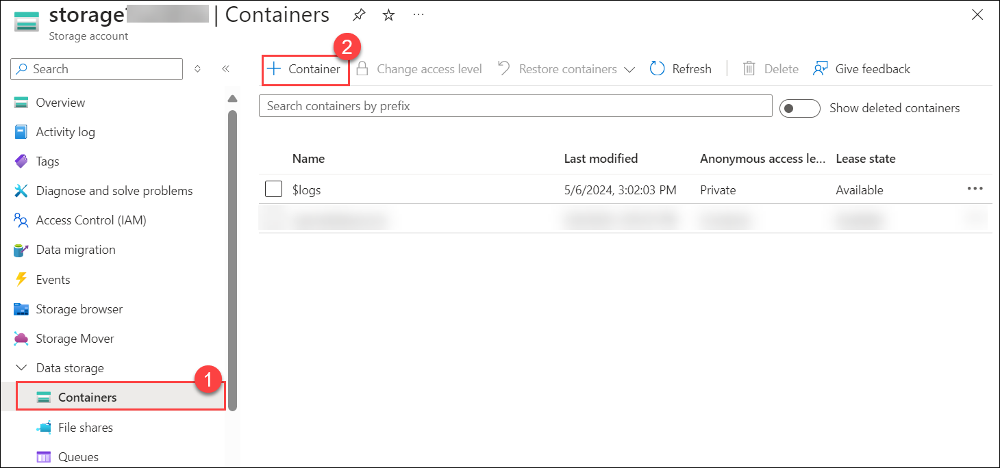
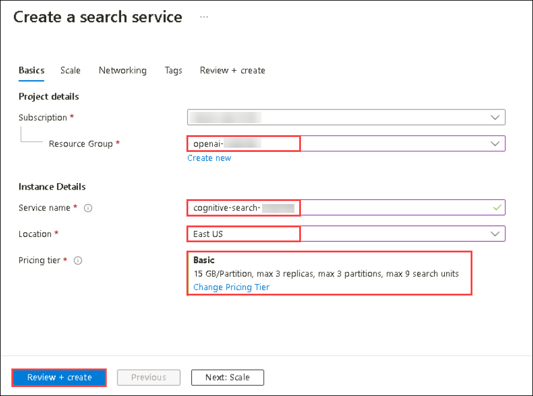
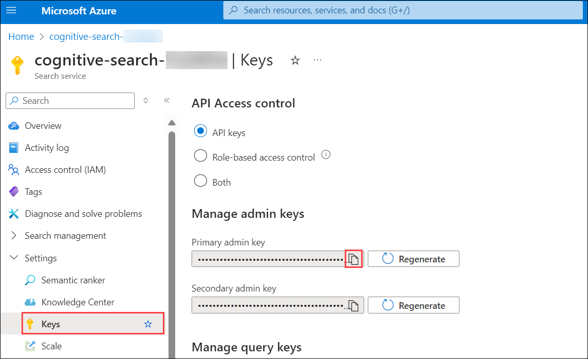

# Lab 06: Use your own data with Azure OpenAI

## Lab scenario
The Azure OpenAI Service enables you to use your own data with the intelligence of the underlying LLM. You can limit the model to only use your data for pertinent topics, or blend it with results from the pre-trained model.

## Lab objectives
In this lab, you will complete the following tasks:

- Task 1: Observe normal chat behavior without adding your own data
- Task 2: Connect your data in the chat playground
- Task 3: Chat with a model grounded in your data
- Task 4: Set up an application in Cloud Shell
- Task 5: Configure your application
- Task 6: Run your application

## Estimated time: 45 minutes

### Task 1: Observe normal chat behavior without adding your own data

Before connecting Azure OpenAI to your data, first observe how the base model responds to queries without any grounding data.

1. In the **Playground** section, select the **Chat** page. The **Chat** playground page consists of three main sections:

     - **Setup** - used to set the context for the model's responses.
    - **Chat session** - used to submit chat messages and view responses.
    - **Configuration** - used to configure settings for the model deployment.

3. In the **Configuration** section, ensure that your model deployment `text-turbo` is selected.
4. In the **Setup** area, select the default system message template to set the context for the chat session. The default system message is *You are an AI assistant that helps people find information*.
5. In the **Chat session**, submit the following queries, and review the responses:

    ```
    I'd like to take a trip to New York. Where should I stay?
    ```

    ```
    What are some facts about New York?
    ```

    Try similar questions about tourism and places to stay for other locations that will be included in our grounding data, such as London, or San Francisco. You'll likely get complete responses about areas or neighborhoods, and some general facts about the city.


### Task 2: Connect your data in the chat playground

Next, add your data in the chat playground to see how it responds with your data as grounding

1. Copy the URL (https://aka.ms/own-data-brochures) and paste it in the browser. Extract the PDFs in the `.zip` that get downloaded.
   
1. In the **Azure portal**, search for **Storage Account** and select **Storage Account**.

   

2. On **Storage Account** page, click on **Create**.

   

3. Create a **Storage Account** resource with the following settings:

    - **Subscription**: Default - Pre-assigned subscription
    - **Resource group**: openai-<inject key="DeploymentID	" enableCopy="false"></inject>
    - **Storage account name**: storage<inject key="DeploymentID	" enableCopy="false"></inject>
    - **Region**: Select <inject key="Region" enableCopy="false" />
    - **Redundancy**: Locally-redundant storage (LRS)

    - Select **Next**
  
      

    - **Allow enable anonymous access on individual containers**: check in the box to enable under advance section. Click on **Review + Create**  and subsequently click on **Create**

      

1. Wait until the storage account is created before you proceed to the next task. This should take about a minute.

1. On the deployment blade, click **Go to resource**.

    

1. On the **Storage Account** blade, from the left navigation, select **Containers (1)**.

1. On **Storage Account | Containers** blade, click on **+ Container (2)**.

     

1. Create a container with the name "**openaidatasource**" and enable Anonymous access level for container.

      

1. Select the **openaidatasource** container, and select **Upload**.

1. Upload all the files into the container which are downlaoded and extracted during the first step of Task 4.

      

1. In the **Azure portal**, search for **AI search** and select **AI search**.

2.  On **Azure AI services | AI search** blade, click on **+ Create**.

     

3. Create an **AI Search** resource with the following settings and click on **Review + create** and subsequenly click on **Create**

    - **Subscription**: Default - Pre-assigned subscription
    - **Resource group**: **openai-<inject key="DeploymentID	" enableCopy="false"></inject>**
    - **Service name**: **cognitive-search-<inject key="DeploymentID	" enableCopy="false"></inject>**
    - **Location**: Select **<inject key="Region" enableCopy="false" />**
    - **Pricing tier**: Basic

      

1. Wait until your search resource has been deployed. Select **Go to resources**.

1. Navigate to the **cognitive-search-<inject key="DeploymentID	" enableCopy="false"></inject>** and in the overview page copy the URL and paste it in a text editor such as notepad for later use.

   

1. From the left navigation pane, under **Settings**, click on **Keys** and copy the primary admin key or secondary admin key and paste it in a notepad file for later use.

   

1. Navigate to the **Chat** playground followed by select *Add your data* in the setup pane and click on **+ Add a data source**.

   
   
1. In the **Add data**, enter the following values for your data source and then click on **Next**.

    - **Select data source (1)**: Azure Blob Storage (preview)
    - **Select Azure Blob storage resouce (2)**: *Choose the storage resource you created*
    - **Select storage container (3)**: *Choose the storage container you created*
    - **Select Azure AI Search resource (4)**: *Choose the search resource you created*
    - **Enter the index name (5)**: margiestravel
    - **Indexer schedule (6)**: Once

1. Click on **Next (7)** to proceed with "**Data Management**".

    
   
1. On the **Data management** page select the **Keyword** search type from the drop-down, and then select **Next**.

   
   
1. On the **Review and finish** page select **Save and close**, which will add your data. This may take a few minutes, during which you need to leave your window open. Once completed, verify if the data source, search resource, and index specified **margiestravel** is present under the **Add your data** tab in **Setup** pane.

#### Validation

<validation step="f6630936-2440-4068-8b5e-3d93f1443da0" />
   
> **Congratulations** on completing the task! Now, it's time to validate it. Here are the steps:
> - Navigate to the Lab Validation Page, from the upper right corner in the lab guide section.
> - Hit the Validate button for the corresponding task. If you receive a success message, you can proceed to the next task. 
> - If not, carefully read the error message and retry the step, following the instructions in the lab guide.
> - If you need any assistance, please contact us at labs-support@spektrasystems.com. We are available 24/7 to help you out.

### Task 3: Chat with a model grounded in your data

Now that you've added your data, ask the same questions as you did previously, and see how the response differs.

   ```
   I'd like to take a trip to New York. Where should I stay?
   ```

   ```
   What are some facts about New York?
   ```

You'll notice a very different response this time, with specifics about certain hotels and a mention of Margie's Travel, as well as references to where the information provided came from. If you open the PDF reference listed in the response, you'll see the same hotels as the model provided.

Try asking it about other cities included in the grounding data, which are Dubai, Las Vegas, London, and San Francisco.

> **Note**: **Add your data** is still in preview and might not always behave as expected for this feature, such as giving the incorrect reference for a city not included in the grounding data.

### Task 4: Set up an application in Cloud Shell

To show how to integrate with an Azure OpenAI model, we'll use a short command-line application that runs in Cloud Shell on Azure. Open up a new browser tab to work with Cloud Shell.

1. In the [Azure portal](https://portal.azure.com?azure-portal=true), select the **[>_]** (*Cloud Shell*) button at the top of the page to the right of the search box. A Cloud Shell pane will open at the bottom of the portal.

    

2. The first time you open the Cloud Shell, you may be prompted to choose the type of shell you want to use (*Bash* or *PowerShell*). Select **Bash**.


   

3. Within the Getting Started pane, select **Mount storage account**, select your **Storage account subscription** from the dropdown and click **Apply**.

   

4. Within the **Mount storage account** pane, select **I want to create a storage account** and click **Next**.

   

5. Within the **Advanced settings** pane, enter the following details:

    - **Subscription**: Default- Choose the only existing subscription assigned for this lab (1).
    - **Region**: Select <inject key="Region" enableCopy="false" /> (2)
    - **Resource group**: 
      - openai-<inject key="DeploymentID" enableCopy="false"></inject> (3)
    - **Storage account name**:
      - str<inject key="DeploymentID" enableCopy="false"></inject> (4)
    - **File share**: Create a new file share named **none** (5)
    - Click **Create** (6)

        

6. Make sure the type of shell indicated on the top left of the Cloud Shell pane is switched to *Bash*. If it's *PowerShell*, switch to *Bash* by using the drop-down menu.

7. Once the terminal starts, enter the following command to download the sample application and save it to a folder called `azure-openai`.

    ```bash
   rm -r azure-openai -f
   git clone https://github.com/MicrosoftLearning/mslearn-openai azure-openai
    ```

8. The files are downloaded to a folder named **azure-openai**. Navigate to the lab files for this exercise using the following command.

    ```bash
   cd azure-openai/Labfiles/06-use-own-data
    ```

    Applications for both C# and Python have been provided, as well as sample code we'll be using in this lab.

9. Open the built-in code editor, and you can observe the code files we'll be using in `sample-code`. Use the following command to open the lab files in the code editor.

    ```bash
   code .
    ```
   > **NOTE:** If you're prompted to **Switch to Classic Cloud Shell** after running the **code .** command, click on **Confirm**.

    

### Task 5: Configure your application

For this exercise, you'll complete some key parts of the application to enable using your Azure OpenAI resource.

1. In the code editor, expand the language folder for your preferred language.

2. Open the configuration file for your language.

    - **C#**: `appsettings.json`
    - **Python**: `.env`

3. Navigate to the folder for your preferred language and install the necessary packages.

     **C#**:

    ```
    cd CSharp
    dotnet add package Azure.AI.OpenAI --version 1.0.0-beta.14
    ```

    **Python**:

    ```
    cd Python
    pip install python-dotenv
    pip install openai==1.13.3
    ```

4. In the code editor from the left navigation pane, in the **CSharp** or **Python** folder, open the configuration file for your preferred language

    - **C#**: appsettings.json
    - **Python**: .env

5. Update the configuration values to include:
    - The  **endpoint** and a **key** from the Azure OpenAI resource you created (Which you copied in the previous task alternatively it is available on the **Keys and Endpoint** page for your Azure OpenAI resource in the Azure portal)
    
    - The **deployment name** you specified for your model deployment (available in the **Deployments** page in Azure OpenAI Studio that is **text-turbo**).
    
    - The endpoint for your AI search service (Which you copied in the previous task alternatively it is available in the **Url** value on the overview page for your AI search resource in the Azure portal).
    
    - A **key** for your search resource (available in the **Keys** page for your AI search resource in the Azure portal - you can use either of the admin keys)
    - The name of the search index (which should be `margiestravel`).

    - Press **Ctrl + S** on your keyboard to save the file.

      

6. Open the code file for your preferred language, and replace the comment ***Configure your data source*** with code to add the Azure OpenAI SDK library:

    **C#**: OwnData.cs

    ```csharp
    // Configure your data source
    AzureSearchChatExtensionConfiguration ownDataConfig = new()
    {
            SearchEndpoint = new Uri(azureSearchEndpoint),
            Authentication = new OnYourDataApiKeyAuthenticationOptions(azureSearchKey),
            IndexName = azureSearchIndex
    };
    ```

    **Python**: ownData.py

    ```python
    # Configure your data source
    extension_config = dict(dataSources = [  
            { 
                "type": "AzureCognitiveSearch", 
                "parameters": { 
                    "endpoint":azure_search_endpoint, 
                    "key": azure_search_key, 
                    "indexName": azure_search_index,
                }
            }]
        )
    ```

7. Review the rest of the code, noting the use of the *extensions* in the request body that is used to provide information about the data source settings.

8. Press **Ctrl + S** on your keyboard to save the file.


## Task 6: Run your application

Now that your app has been configured, run it to send your request to your model and observe the response. You'll notice the only difference between the different options is the content of the prompt, all other parameters (such as token count and temperature) remain the same for each request.

1. In the interactive terminal pane, ensure the folder context is the folder for your preferred language. Then enter the following command to run the application.

    - **C#**: `dotnet run`
    - **Python**: `python ownData.py`

    > **Tip**: You can use the **Maximize panel size** (**^**) icon in the terminal toolbar to see more of the console text.

2. Review the response to the prompt `Tell me about London`, which should include an answer as well as some details of the data used to ground the prompt, which was obtained from your search service.

## Review

In this lab, you have accomplished the following:
-   Provisioned an Azure OpenAI resource
-   Deployed an OpenAI model within the Azure OpenAI studio
-   Used the power of OpenAI models to generate responses limited to a custom ingested data.

### You have successfully completed the lab.
