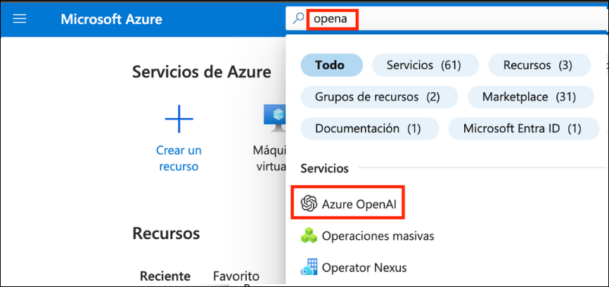
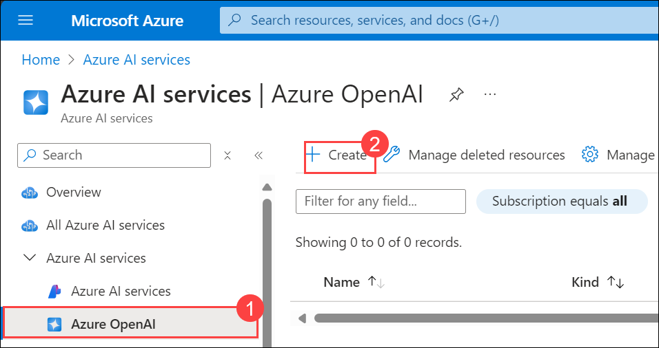
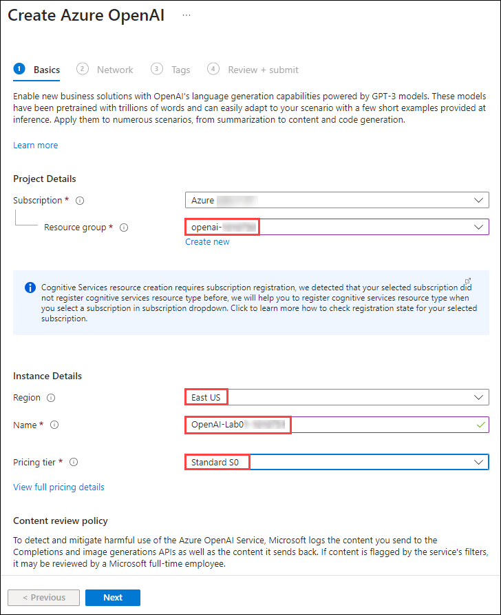
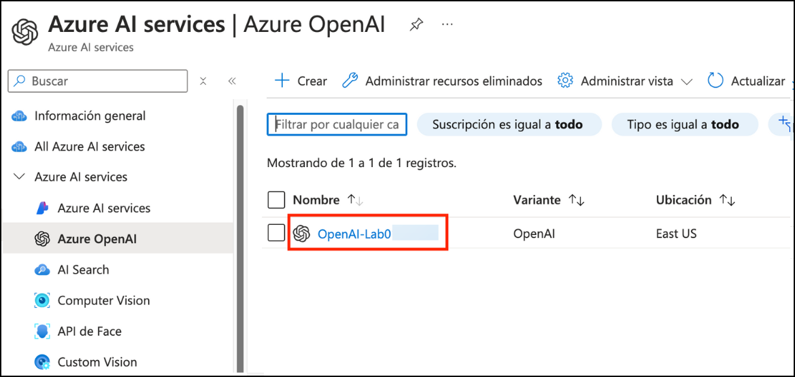
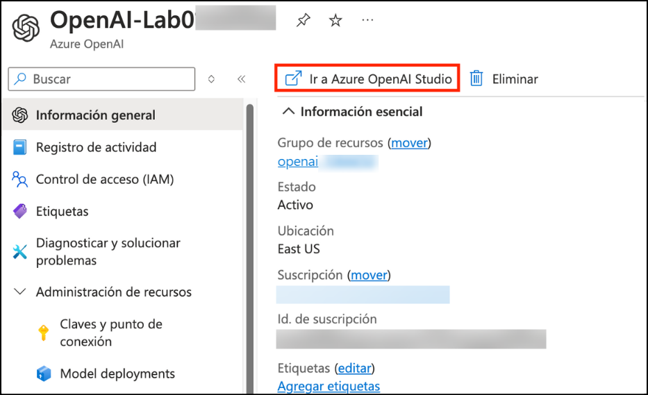
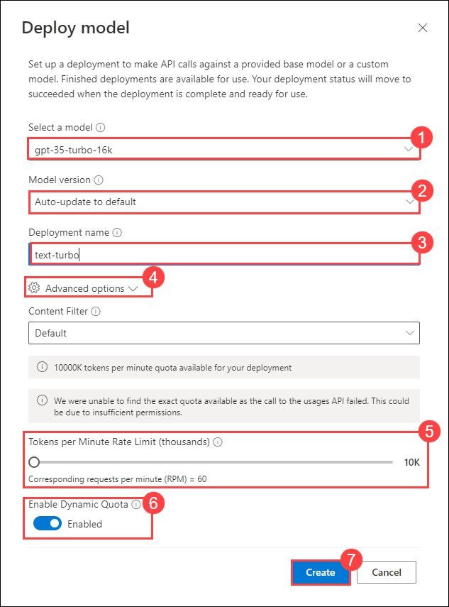
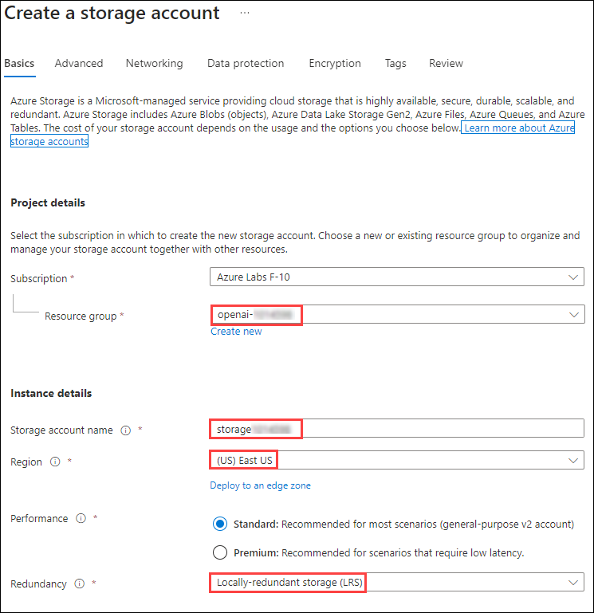
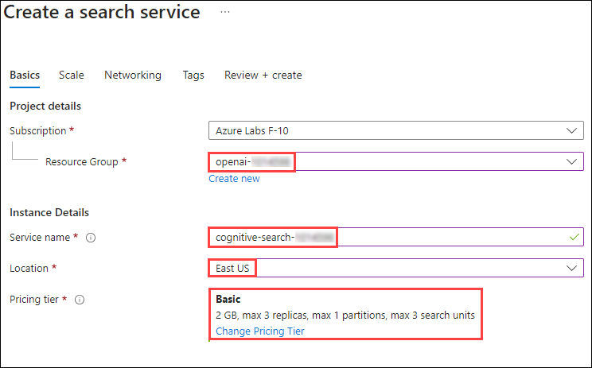

# Lab 06: Use your own data with Azure OpenAI

## Lab scenario
The Azure OpenAI Service enables you to use your own data with the intelligence of the underlying LLM. You can limit the model to only use your data for pertinent topics, or blend it with results from the pre-trained model.

## Lab objectives
In this lab, you will complete the following tasks:

- Task 1: Provision an Azure OpenAI resource
- Task 2: Deploy a model
- Task 3: Observe normal chat behavior without adding your own data
- Task 4: Connect your data in the chat playground
- Task 5: Chat with a model grounded in your data

## Estimated time: 20 minutes

### Task 1: Provision an Azure OpenAI resource

Before you can use Azure OpenAI models, you must provision an Azure OpenAI resource in your Azure subscription.

1. In the **Azure portal**, search for **OpenAI** and select **Azure OpenAI**.

   

2. On **Azure OpenAI services | Azure OpenAI** blade, click on **Create**.

   

3. create an **Azure OpenAI** resource with the following settings:
   
    - **Subscription**: Default - Pre-assigned subscription.
    - **Resource group**: openai-<inject key="Deployment-id" enableCopy="false"></inject>
    - **Region**: Select <inject key="Region" enableCopy="false" />
    - **Name**: OpenAI-Lab06-<inject key="Deployment-id" enableCopy="false"></inject>
    - **Pricing tier**: Standard S0
  
   
    
4. Wait for deployment to complete. Then go to the deployed Azure OpenAI resource in the Azure portal.

  **Congratulations** on completing the task! Now, it's time to validate it. Here are the steps:

  > - Navigate to the Lab Validation tab, from the upper right corner in the lab guide section.
  > - Hit the Validate button for the corresponding task. If you receive a success message, you can proceed to the next task. 
  > - If not, carefully read the error message and retry the step, following the instructions in the lab guide.
  > - If you need any assistance, please contact us at labs-support@spektrasystems.com.

### Task 2: Deploy a model

To chat with the Azure OpenAI, you must first deploy a model to use through the **Azure OpenAI Studio**. Once deployed, we will use the model with the playground and use our data to ground its responses.

1. In the **Azure portal**, search for **OpenAI** and select **Azure OpenAI**.

   

2. On **Azure AI Services | Azure OpenAI** blade, select **OpenAI-Lab06-<inject key="Deployment-id" enableCopy="false"></inject>**

   

3. In the Azure OpenAI resource pane, click on **Go to Azure OpenAI Studio** it will navaigate to **Azure AI Studio**.

   

4. In **Welcome to Azure OpenAI Service** page, click on **Create new deployment**.

   

5. In the **Deployments** page, click on **+ Create new deployment**.

     

6. 7. Within the **Deploy model** pop-up interface, enter the following details:
    - **Select a Model**: gpt-35-turbo-16k (1)
      
      > **Note**: if the 16k model isn't available, choose **gpt-35-turbo**
      
    - **Model version**: Auto-update to default (2)
    - **Deployment name**: text-turbo (3)
    - Click on **Advanced Settings** (4)
    - **Tokens per Minute Rate Limit (thousands)**: 10K (5)
    - **Enable dynamic quota**: Enabled (6)
    - Click on **Create** (7)
  
   

   >**Note:** Ensure to set the **Tokens per Minute Rate Limit** to atleast **5K**. Select the Rate Limit scroll bar, and use your keyboard's arrow keys to pinpoint specific token limits.

8. Click on the **Create** button to deploy a model which you will be playing around with as you proceed.

  **Congratulations** on completing the task! Now, it's time to validate it. Here are the steps:

  > - Navigate to the Lab Validation tab, from the upper right corner in the lab guide section.
  > - Hit the Validate button for the corresponding task. If you receive a success message, you can proceed to the next task. 
  > - If not, carefully read the error message and retry the step, following the instructions in the lab guide.
  > - If you need any assistance, please contact us at labs-support@spektrasystems.com.

### Task 3: Observe normal chat behavior without adding your own data

Before connecting Azure OpenAI to your data, first observe how the base model responds to queries without any grounding data.

1. Navigate to the **Chat** playground, and make sure the `gpt-35-turbo-16k` model you deployed is selected in the **Configuration** pane (this should be the default, if you only have one deployed model).

1. In the Chat session enter the following prompts, and observe the output.

    ```
    I'd like to take a trip to New York. Where should I stay?
    ```
    ```
    What are some facts about New York?
    ```
    
1. Try similar questions about tourism and places to stay for other locations that will be included in our grounding data, such as London, or San Francisco. You'll likely get complete responses about areas or neighborhoods, and some general facts about the city.

### Task 4: Connect your data in the chat playground

Next, add your data in the chat playground to see how it responds with your data as grounding

1. [Download the data](https://aka.ms/own-data-brochures) that you will use from GitHub. Extract the PDFs in the `.zip` provided.
1. Navigate to the **Chat** playground, and select *Add your data* in the Assistant setup pane.
1. Select **+ Add a data source** and choose *Upload files* from the dropdown.

1. You'll need to create a storage account and Azure Cognitive Search resource. Under the dropdown for the storage resource, select **Create a new Azure Blob storage resource**, and create a storage account with the following settings. Anything not specified leave as the default.

    - **Subscription**: Default - Pre-assigned subscription
    - **Resource group**: openai-<inject key="Deployment-id" enableCopy="false"></inject>
    - **Storage account name**: storage<inject key="Deployment-id" enableCopy="false"></inject>
    - **Region**: Select <inject key="Region" enableCopy="false" />
    - **Redundancy**: Locally-redundant storage (LRS)
  
    

1. Once the resource is being created, come back to Azure OpenAI Studio and select **Create a new Azure Cognitive Search resource** with the following settings. Anything not specified leave as the default.

    - **Subscription**: Default - Pre-assigned subscription
    - **Resource group**: openai-<inject key="Deployment-id" enableCopy="false"></inject>
    - **Service name**: cognitive-search-<inject key="Deployment-id" enableCopy="false"></inject>
    - **Location**:Select <inject key="Region" enableCopy="false" />
    - **Pricing tier**: Basic

    

1. Wait until your search resource has been deployed, then switch back to the Azure AI Studio and refresh the page.
1. In the **Add data**, enter the following values for your data source and then click on **Next**.

    - **Select data source**: Upload files
    - **Select Azure Blob storage resouce**: *Choose the storage resource you created*
        - Turn on CORS when prompted
    - **Select Azure AI Search resource**: *Choose the search resource you created*
    - **Enter the index name**: margiestravel
    - **Add vector search to this search resource**: unchecked
    - **I acknowledge that connecting to an Azure Cognitive Search account will incur usage to my account** : checked

    

1. On the **Upload files** page, select **Browse for a file** and upload the PDFs you downloaded, and then select **Upload files** and 
    **Next**.
      
    

1. On the **Data management** page select the **Keyword** search type from the drop-down, and then select **Next**.
1. On the **Review and finish** page select **Save and close**, which will add your data. This may take a few minutes, during which you need to leave your window open. Once completed, verify if the data source, search resource, and index specified **margiestravel** is present under the **Add your data(preview)** tab in **Assistant setup** pane.
   
  **Congratulations** on completing the task! Now, it's time to validate it. Here are the steps:

  > - Navigate to the Lab Validation tab, from the upper right corner in the lab guide section.
  > - Hit the Validate button for the corresponding task. If you receive a success message, you can proceed to the next task. 
  > - If not, carefully read the error message and retry the step, following the instructions in the lab guide.
  > - If you need any assistance, please contact us at labs-support@spektrasystems.com.

### Task 5: Chat with a model grounded in your data

Now that you've added your data, ask the same questions as you did previously, and see how the response differs.

```
I'd like to take a trip to New York. Where should I stay?
```

```
What are some facts about New York?
```

You'll notice a very different response this time, with specifics about certain hotels and a mention of Margie's Travel, as well as references to where the information provided came from. If you open the PDF reference listed in the response, you'll see the same hotels as the model provided.

Try asking it about other cities included in the grounding data, which are Dubai, Las Vegas, London, and San Francisco.

> **Note**: **Add your data** is still in preview and might not always behave as expected for this feature, such as giving the incorrect reference for a city not included in the grounding data.

## Review

In this lab, you have accomplished the following:
-   Provision an Azure OpenAI resource
-   Deploy an OpenAI model within the Azure OpenAI studio
-   Use the power of OpenAI models to generate responses limited to a custom ingested data.

### You have successfully completed the lab.
