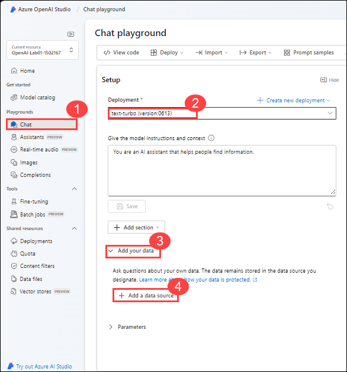
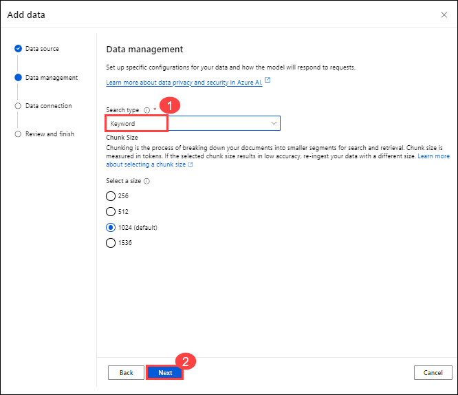
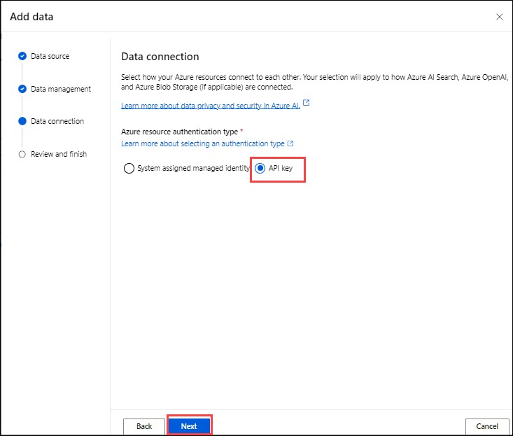
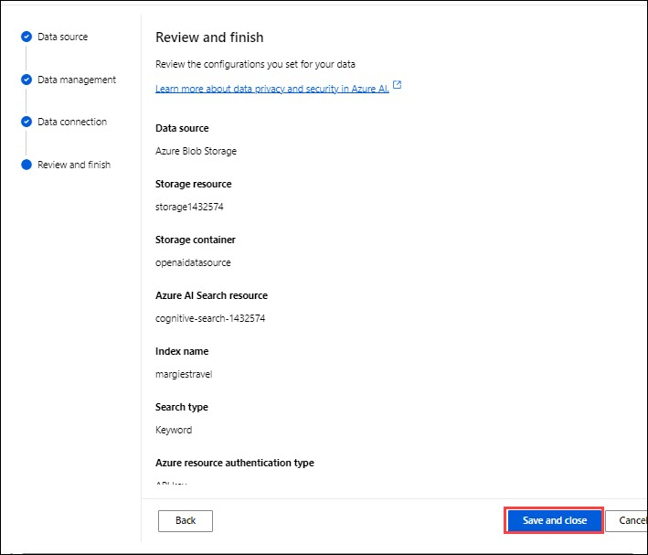

# Lab 06:  Add your data for RAG with Azure OpenAI Service

## Lab scenario
The Azure OpenAI Service enables you to use your own data with the intelligence of the underlying LLM. You can limit the model to only use your data for pertinent topics, or blend it with results from the pre-trained model.

## Lab objectives
In this lab, you will complete the following tasks:

- Task 1: Observe normal chat behavior without adding your own data
- Task 2: Connect your data in the chat playground
- Task 3: Chat with a model grounded in your data
- Task 4: Set up an application in Cloud Shell
- Task 5: Configure your application
- Task 6: Run your application

## Estimated time: 60 minutes


### Task 1: Observe normal chat behavior without adding your own data

Before connecting Azure OpenAI to your data, first observe how the base model responds to queries without any grounding data.

1. In the **Playground** section, select the **Chat** page. The **Chat** playground page consists of three main sections:

     - **Setup** - used to set the context for the model's responses.
     - **Chat session** - used to submit chat messages and view responses.

2. In the **deployment** section, ensure that your model deployment **text-turbo** is selected.

3. In the **Setup** area, The default system message is set to *You are an AI assistant that helps people find information*.

4. In the **Chat session**, submit the following queries, and review the responses:

    ```
    I'd like to take a trip to New York. Where should I stay?
    ```

    ```
    What are some facts about New York?
    ```

    Try similar questions about tourism and places to stay for other locations that will be included in our grounding data, such as London, or San Francisco. You'll likely get complete responses about areas or neighborhoods, and some general facts about the city.


### Task 2: Connect your data in the chat playground

In this task, you will observe how the base model responds to queries without any grounding data before connecting Azure OpenAI to your data.

1. Copy the URL (https://aka.ms/own-data-brochures) and paste it in the browser. Extract the PDFs in the `.zip` that get downloaded.
   
2. In the **Azure portal**, search for **Storage Account** and select **Storage Account**.

   

3. On **Storage Account** page, click on **Create**.

   

4. Create a **Storage Account** resource with the following settings:

    - **Subscription**: Default - Pre-assigned subscription
    - **Resource group**: openai-<inject key="DeploymentID" enableCopy="false"></inject>
    - **Storage account name**: storage1<inject key="DeploymentID" enableCopy="false"></inject>
    - **Region**: Select <inject key="Region" enableCopy="false" />
    - **Redundancy**: Locally-redundant storage (LRS)
  
      

    - **Allow enable anonymous access on individual containers**: check in the box to enable under advance section. Click on **Review + Create**  and subsequently click on **Create**

      

5. Wait until the storage account is created before you proceed to the next task. This should take about a minute.

6. On the deployment blade, click Go to resource.

    

7. On **Storage Account | Container** blade, click on **Create**.

     

8. Create a container with the name "openaidatasource" and enable Anonymous access level for container.

      

9. Upload all the files into the container which are downlaoded and extracted during the first step of Task 4.

      

10. In the **Azure portal**, search for **Azure AI search** and select **Azure Ai search**.

11.  On **Azure AI services | AI search** blade, click on **Create**.

     

12. Create an **AI Search** resource with the following settings and click on **Review + Create** and subsequenly click on **Create**

    - **Subscription**: Default - Pre-assigned subscription
    - **Resource group**: openai-<inject key="DeploymentID" enableCopy="false"></inject>
    - **Service name**: cognitive-search-<inject key="DeploymentID" enableCopy="false"></inject>
    - **Location**:Select <inject key="Region" enableCopy="false" />
    - **Pricing tier**: Change the Pricing tier to **Basic**

      

13. Wait until your search resource has been deployed.

14. Navigate to the **cognitive-search-<inject key="DeploymentID	" enableCopy="false"></inject>** and in the overview page copy the URL and paste it in a text editor such as notepad for later use.

       

15. From the left navigation pane,click on **Keys** and copy the primary key or secondary key and paste it in a notepad file for later use.

      

16. In **Azure OpenAI Studio**, Navigate to the **Chat** playground followed by select *Add your data* in the setup pane and click on **+ Add a data source**.

      
   
17. In the **Add data**, enter the following values for your data source and then click on **Next**.

    - **Select data source**: Azure Blob Storage
    - **Select Azure Blob storage resouce**: *Choose the storage resource you created*
    - **Select Storage container**: openaidatasource
    - **Select Azure AI Search resource**: *Choose the search resource you created*
    - **Enter the index name**: margiestravel
    - **Indexer schedule**: Once
   
       

18. Click on next to proceed with "Data Management"
   
19. On the **Data management** page select the **Keyword** search type from the drop-down, and then select **Next**.

      

20. On the **Data connection** page select the **API key** , Click on the **Next**

       
   
22. On the **Review and finish** page select **Save and close**, which will add your data. This may take a few minutes, during which you need to leave your window open. Once completed, verify if the data source, search resource, and index specified **margiestravel** is present under the **Add your data(preview)** tab in **Assistant setup** pane.

       

### Task 3: Chat with a model grounded in your data

In this task, you will ask the same questions as before after adding your data, and observe how the responses differ.

   ```
   I'd like to take a trip to New York. Where should I stay?
   ```

   ```
   What are some facts about New York?
   ```

You'll notice a very different response this time, with specifics about certain hotels and a mention of Margie's Travel, as well as references to where the information provided came from. If you open the PDF reference listed in the response, you'll see the same hotels as the model provided.

Try asking it about other cities included in the grounding data, which are Dubai, Las Vegas, London, and San Francisco.

> **Note**: **Add your data** is still in preview and might not always behave as expected for this feature, such as giving the incorrect reference for a city not included in the grounding data.

### Task 4: Set up an application in Cloud Shell

In this task, you will use a short command-line application running in Cloud Shell on Azure to demonstrate integration with an Azure OpenAI model. Open a new browser tab to access Cloud Shell.

1. In the [Azure portal](https://portal.azure.com?azure-portal=true), select the **[>_]** (*Cloud Shell*) button at the top of the page to the right of the search box. A Cloud Shell pane will open at the bottom of the portal.

      

2. Make sure the type of shell indicated on the top left of the Cloud Shell pane is switched to *Bash*. If it's *PowerShell*, switch to *Bash* by using the drop-down menu.

3. Once the terminal starts, enter the following command to download the sample application and save it to a folder called `azure-openai`.

    ```bash
   rm -r azure-openai -f
   git clone https://github.com/MicrosoftLearning/mslearn-openai azure-openai
    ```

4. The files are downloaded to a folder named **azure-openai**. Navigate to the lab files for this exercise using the following command.

    ```bash
   cd azure-openai/Labfiles/06-use-own-data
    ```

    Applications for both C# and Python have been provided, as well as sample code we'll be using in this lab.

5. Open the built-in code editor, and you can observe the code files we'll be using in `sample-code`. Use the following command to open the lab files in the code editor.

    ```bash
   code .
    ```

      > **Note**: If you receive a popup to **Switch to Classic Cloud Shell** while running the **code .** command, click **Confirm**. Re-run commands from **steps 3 and 4** to and make sure you are in the correct project path.

       

### Task 5: Configure your application

In this task, you will complete key parts of the application to enable it to use your Azure OpenAI resource.

1. In the code editor, expand the language folder for your preferred language.

2. Open the configuration file for your language.

    - **C#**: `appsettings.json`
    - **Python**: `.env`

3. Update the configuration values to include:
    - The  **endpoint** and a **key** from the Azure OpenAI resource you created (Which you copied in the previous task alternatively it is available on the **Keys and Endpoint** page for your Azure OpenAI resource in the Azure portal)
    - The **deployment name** you specified for your model deployment (available in the **Deployments** page in Azure OpenAI Studio that is **text-turbo**).
    - The endpoint for your AI search service (Which you copied in the previous task alternatively it is available in the **Url** value on the overview page for your AI search resource in the Azure portal).
    - A **key** for your search resource (available in the **Keys** page for your AI search resource in the Azure portal - you can use either of the admin keys)
    - The name of the search index (which should be `margiestravel`).

         

4. Navigate to the folder for your preferred language and install the necessary packages.

     **C#**:

    ```
    cd CSharp
    dotnet add package Azure.AI.OpenAI --version 1.0.0-beta.14
    ```

    **Python**:

    ```
    cd Python
    pip install python-dotenv
    pip install openai==1.13.3
    ```

5. Open the code file for your preferred language, and replace the comment ***Configure your data source*** with code to add the Azure OpenAI SDK library:

    **C#**: ownData.cs

    ```csharp
    // Configure your data source
    AzureSearchChatExtensionConfiguration ownDataConfig = new()
    {
            SearchEndpoint = new Uri(azureSearchEndpoint),
            Authentication = new OnYourDataApiKeyAuthenticationOptions(azureSearchKey),
            IndexName = azureSearchIndex
    };
    ```

    **Python**: ownData.py

    ```python
    # Configure your data source
    extension_config = dict(dataSources = [  
            { 
                "type": "AzureCognitiveSearch", 
                "parameters": { 
                    "endpoint":azure_search_endpoint, 
                    "key": azure_search_key, 
                    "indexName": azure_search_index,
                }
            }]
        )
    ```

6. Review the rest of the code, noting the use of the *extensions* in the request body that is used to provide information about the data source settings.

7. Save the changes to the code file.

## Task 6: Run your application

In this task, you will run your configured app to send a request to your model and observe the response, noting that the only difference between options is the prompt content while all other parameters (such as token count and temperature) remain consistent.

In this task, you will run the reviewed code to generate some images.

1. In the Cloud Shell bash terminal, navigate to the folder for your preferred language.

2. If your using as **C#** language kindly open **CSharp.csproj** file replace with following code and save the file.

   ```
      <Project Sdk="Microsoft.NET.Sdk">
      
      <PropertyGroup>
      <OutputType>Exe</OutputType>
      <TargetFramework>net8.0</TargetFramework>
      <ImplicitUsings>enable</ImplicitUsings>
      <Nullable>enable</Nullable>
      </PropertyGroup>
      
       <ItemGroup>
       <PackageReference Include="Azure.AI.OpenAI" Version="1.0.0-beta.14" />
       <PackageReference Include="Microsoft.Extensions.Configuration" Version="8.0.*" />
       <PackageReference Include="Microsoft.Extensions.Configuration.Json" Version="8.0.*" />
       </ItemGroup>
      
       <ItemGroup>
         <None Update="appsettings.json">
           <CopyToOutputDirectory>PreserveNewest</CopyToOutputDirectory>
          </None>
        </ItemGroup>
      
       </Project>
      ```

2. In the interactive terminal pane, ensure the folder context is the folder for your preferred language. Then enter the following command to run the application.

    - **C#**: `dotnet run`
    - **Python**: `python ownData.py`

    > **Tip**: You can use the **Maximize panel size** (**^**) icon in the terminal toolbar to see more of the console text.

3. Review the response to the prompt `Tell me about London`, which should include an answer as well as some details of the data used to ground the prompt, which was obtained from your search service.

## Summary

In this lab, you have accomplished the following:

-   Used the power of OpenAI models to generate responses limited to a custom ingested data.

### You have successfully completed the lab.
