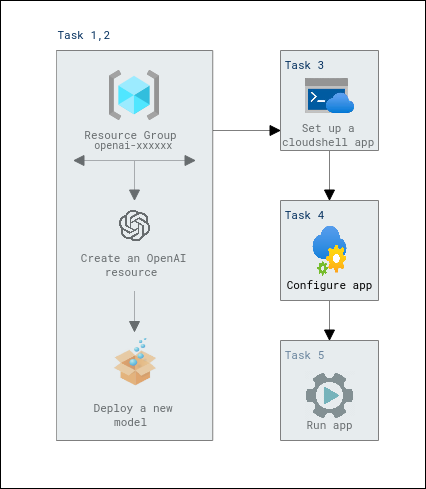

# Lab Scenario Preview: Build natural language solutions with Azure OpenAI Service

## Lab 02: Integrate Azure OpenAI into your app

### Lab overview

With the Azure OpenAI Service, developers can create chatbots, language models, and other applications that excel at understanding natural human language. The Azure OpenAI provides access to pre-trained AI models, as well as a suite of APIs and tools for customizing and fine-tuning these models to meet the specific requirements of your application. 

In this exercise, you'll learn how to deploy a model in Azure OpenAI and use it in your own application to summarize text.

### Objectives

After you complete this lab, you will be able to:

-   Provision an Azure OpenAI resource
-   Deploy an OpenAI model within the Azure OpenAI studio
-   Integrate Azure OpenAI models into your applications

### Architecture Diagram

  

Now that you know what the lab is going to be all about, you can launch next item **Hands-on Lab** which includes lab environment and lab guide. You can also preview the full lab guide [here](https://experience.cloudlabs.ai/#/labguidepreview/e10c8142-46a1-4961-84e3-239658358f43) if you want to go through detailed guide prior to launching lab environment. 
