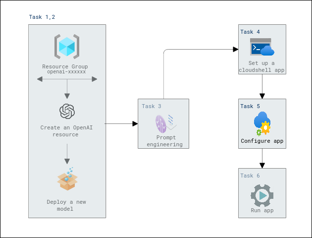

# Lab Scenario Preview: Apply prompt engineering with Azure OpenAI Service

## Lab 03: Utilize prompt engineering in your app

## Lab overview

In this exercise, you`ll learn how to deploy a model in Azure OpenAI and use it in your own application to summarize text.
When working with the Azure OpenAI Service, how developers shape their prompt greatly impacts how the generative AI model will respond.
Thus, you'll also learn how different prompts for similar content help shape the AI model's response to better satisfy your requirements.

## Lab objectives

After you complete this lab, you will be able to:

-   Provision an Azure OpenAI resource
-   Deploy an OpenAI model within the Azure OpenAI studio
-   Apply prompt engineering in your applications

## Architecture Diagram

  

>**Note**: Once you understand the lab's content, you can start the Hands-on Lab by clicking the **Launch** button located at the top right corner which leads you to the lab environment and lab guide interface. You can also have a detailed preview of the full lab guide [here](https://experience.cloudlabs.ai/#/labguidepreview/5d6179f4-1d3a-4402-969e-f97000faad2b), prior to launching your environment.
