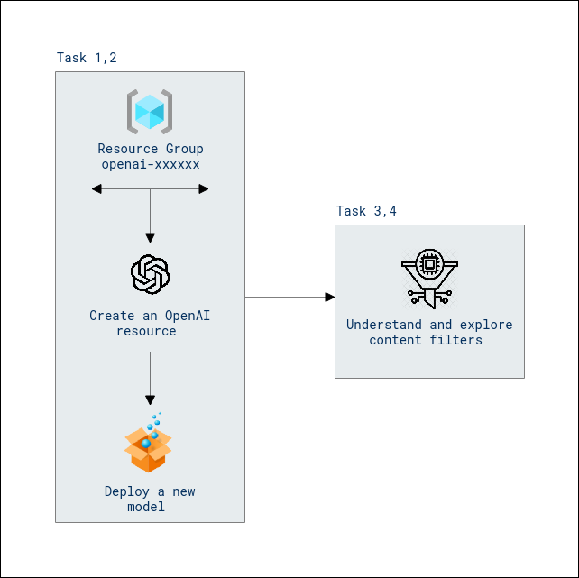

# Lab Scenario Preview: Responsible Generative AI

## Lab 07: Explore content filters in Azure OpenAI Service

## Lab overview

Generative AI is a powerful technological advance enabling developers to create applications that produce human-like content. However, it also poses risks, necessitating a responsible approach from data scientists and developers to identify and mitigate potential dangers.

In this lab, you deploy an Azure OpenAI model and observe the effect of content filters on the responses it returns.

## Lab objectives

After you complete this lab, you will be able to:

-   Provision an Azure OpenAI resource.
-   Deploy an OpenAI model within the Azure OpenAI studio.
-   Use the power of OpenAI models to generate responses to generate natural language output.
-   Explore content filters.

## Architecture Diagram

  

>**Note**: Once you understand the lab's content, you can start the Hands-on Lab by clicking the **Launch** button located at the top right corner which leads you to the lab environment and lab guide interface. You can also have a detailed preview of the full lab guide [here](https://experience.cloudlabs.ai/#/labguidepreview/6b7db805-dd1c-4444-ab48-8d0bd7231543), prior to launching your environment.
