# Hands-On Lab Get started with Azure OpenAI Service

## Estimated time: 60 minutes

Azure OpenAI Service brings the generative AI models developed by OpenAI to the Azure platform, enabling you to develop powerful AI solutions that benefit from the security, scalability, and integration of services provided by the Azure cloud platform. In this exercise, you'll learn how to get started with Azure OpenAI by provisioning the service as an Azure resource and using Azure OpenAI Studio to deploy and explore OpenAI models.

## Lab objectives
In this lab, you will complete the following tasks:

- Task 1: Provision an Azure OpenAI resource
- Task 2: Deploy a model
- Task 3: Explore a model in the Completions playground
- Task 4: Use the Chat playground
- Task 5: Explore prompts and parameters 
- Task 6: Explore code-generation

## Task 1: Provision an Azure OpenAI resource

In this task, you'll create an Azure resource in the Azure portal, selecting the OpenAI service and configuring settings such as region and pricing tier. This setup allows you to integrate OpenAI's advanced language models into your applications.

1. In the **Azure portal**, search for **Azure OpenAI** and select **Azure OpenAI**.

   

2. On **Azure AI Services | Azure OpenAI** blade, click on **Create**.

   

3. Create an **Azure OpenAI** resource with the following settings:
    
    - **Subscription**: Default - Pre-assigned subscription.
    - **Resource group**: openai-<inject key="DeploymentID" enableCopy="false"></inject>
    - **Region**: Select **East US**
    - **Name**: OpenAI-Lab01-<inject key="DeploymentID" enableCopy="false"></inject>
    - **Pricing tier**: Standard S0
  
      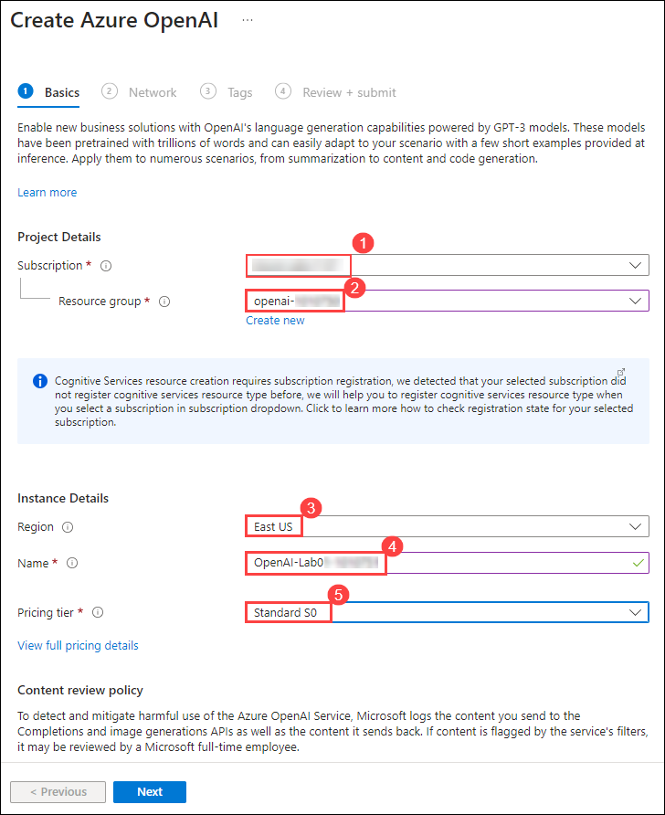

4. Click on **Next** thrice by keeping others default and click on **Create**.

5. Wait for deployment to complete. Then go to the deployed Azure OpenAI resource in the Azure portal.

   > **Congratulations** on completing the task! Now, it's time to validate it. Here are the steps:
   - If you receive a success message, you can proceed to the next task.
   - If not, carefully read the error message and retry the step, following the instructions in the lab guide.
   - If you need any assistance, please contact us at cloudlabs-support@spektrasystems.com. We are available 24/7 to help you out.

<validation step="8aae5f66-b7a9-4963-bf1f-8db101bab3db" />

## Task 2: Deploy a model

In this task, you'll deploy a specific AI model instance within your Azure OpenAI resource to integrate advanced language capabilities into your applications.

1. In the **Azure portal**, search for **Azure OpenAI** and select **Azure OpenAI**.

    

1. On **Azure AI Services | Azure OpenAI** blade, select **OpenAI-Lab01-<inject key="Deployment-id" enableCopy="false"></inject>**

    

1. In the Azure OpenAI resource pane, click on **Go to Azure OpenAI Studio** it will navigate to **Azure AI Studio**.

    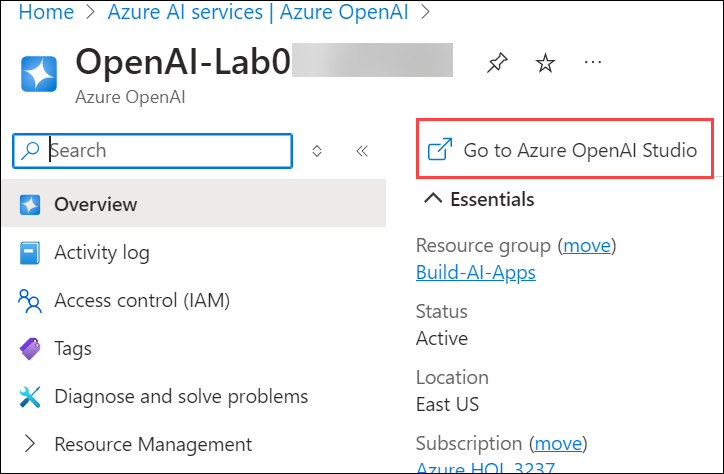

1. In the **Deployments (1)** page, click on **+ Deploy model**, Choose **Deploy base Model (2)**.

    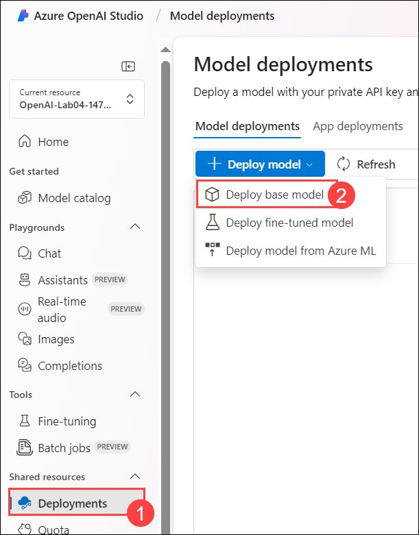

1. Search for **GPT-35-TURBO**, click on **Confirm**

   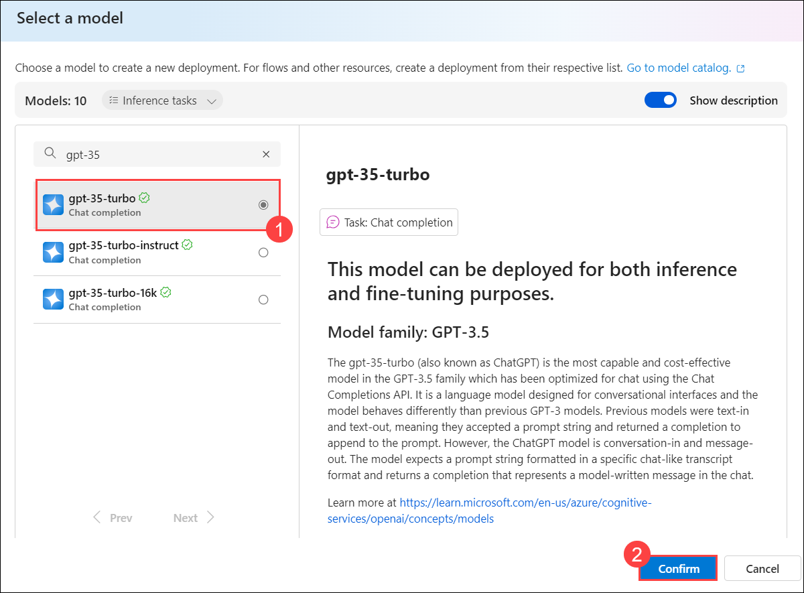
   
1. Within the **Deploy model** pop-up interface, enter the following details:
      - **Deployment name**: my-gpt-model (1)
      - **Deployment type**: Standard(2)
      - **Model version**: 0301(Default)(3)
      - **Tokens per Minute Rate Limit (thousands)**: 10K (4)
      - **Enable dynamic quota**: Enabled (5)
      - Click on **Deploy** (6)
  
           

           >**Note** : gpt-35-turbo-16k is supported only for chat completions and it is not supported for completions API.

1. This will deploy a model which you will be playing around with as you proceed.

    > **Note**: You can ignore any error related to the assignment of roles to view the quota limits.
   
    > **Note**: Azure OpenAI includes multiple models, each optimized for a different balance of capabilities and performance. In this exercise, you'll use the **GPT-35-Turbo** model, which is a good general model for summarizing and generating natural language and code. For more information about the available models in Azure OpenAI, see [Models](https://learn.microsoft.com/azure/cognitive-services/openai/concepts/models) in the Azure OpenAI documentation.

   > **Congratulations** on completing the task! Now, it's time to validate it. Here are the steps:
   - If you receive a success message, you can proceed to the next task.
   - If not, carefully read the error message and retry the step, following the instructions in the lab guide.
   - If you need any assistance, please contact us at cloudlabs-support@spektrasystems.com. We are available 24/7 to help you out.

  <validation step="29d502af-cb10-4d86-80b8-e1d97420284f" />
   

## Task 3: Explore a model in the Completions playground

In this task, you'll Explore a model in the Completions playground that involves interacting with the AI model to test and refine its responses using real-time input and output examples.

1. In Azure OpenAI Studio, in the left pane under **Playground**, select **Completions**.

2. In the **Completions** page, ensure your **my-gpt-model** deployment is selected , Type `Generate a quiz of 5 questions  For each question, provide me the answer options and the correct answer` in the prompt.

      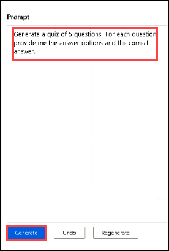

      >**Note:** The summarised text sample consists of a *prompt* that provides some text to tell the model what kind of response is required and includes some contextual information.

3. At the bottom of the page, note the number of *tokens* detected in the text. Tokens are the basic units of a prompt - essentially words or word parts in the text.

4. Use the **Generate** button to submit the prompt to the model and retrieve a response (you may need to scroll down). The response consists of a quiz based on the example in the prompt.

      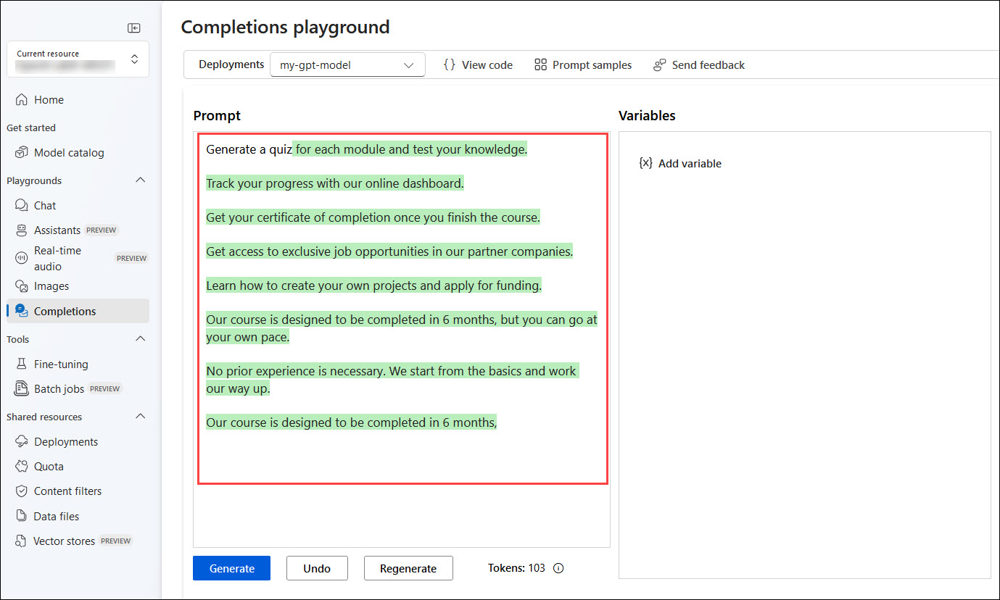
       >**Note**: If you don't receive the expected output in the new experience, please follow the steps below:

5. From the right top corner toggle bar to switch to old experience.
    
    

6. In the old experience, go to the completion page and select "Generate a Quiz" from the examples, then click on generate
    
    
   
      >**Note**: You can click on generate again , if the response is incomplete .

      >**Note**: You can use the **Regenerate** button to resubmit the prompt(new changes have been made), and note that the response may vary from the original one. A generative AI model can produce new language each time it's called.

7. Use the **View Code** button to view the code that a client application would use to submit the prompt. You can select your preferred programming language. The prompt contains the text you submitted to the model. The request is submitted to the *Completions* API for your Azure OpenAI service.

      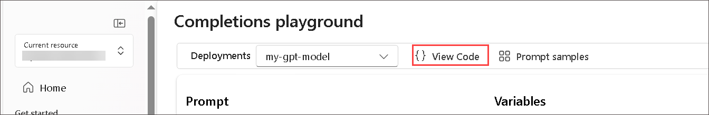

      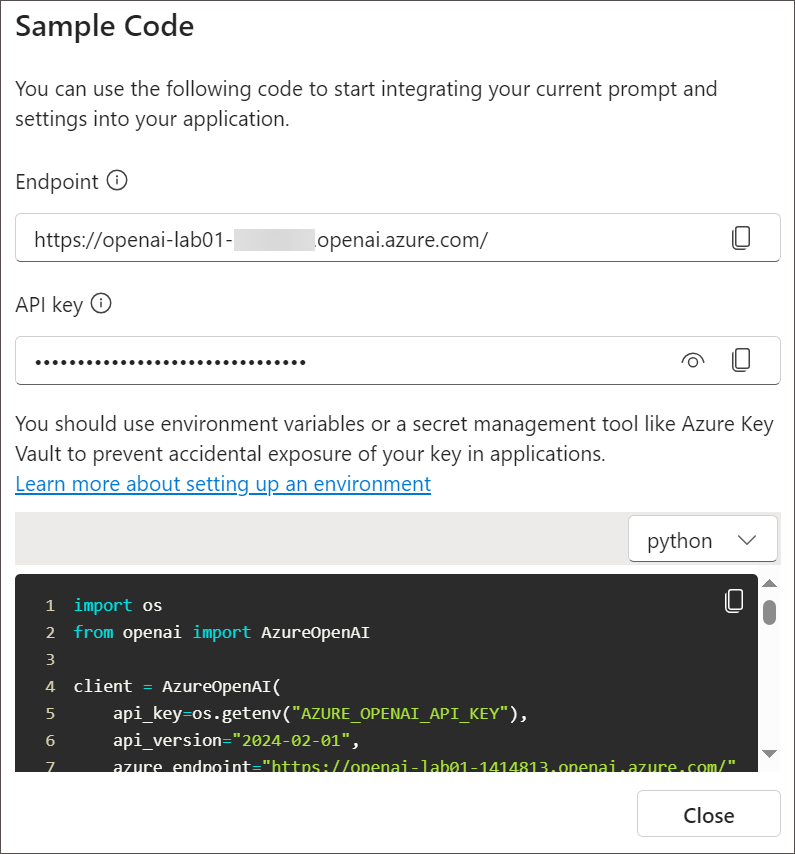
    
8. Close the **Sample Code**.

## Task 4: Use the Chat playground

In this task, you'll use the Chat playground to interact with and test the AI model's conversational abilities through a simulated chat interface.

1. In the **Playground** section, select the **Chat** page, and ensure that the **my-gpt-model** model is selected in the configuration pane.

2. In the **Setup** section, in the **System message** box, replace the current text with the following statement: `The system is an AI teacher that helps people learn about AI`.

3. Below the **Below add section** box, click on **Examples**. enter the following message and response in the designated boxes:

      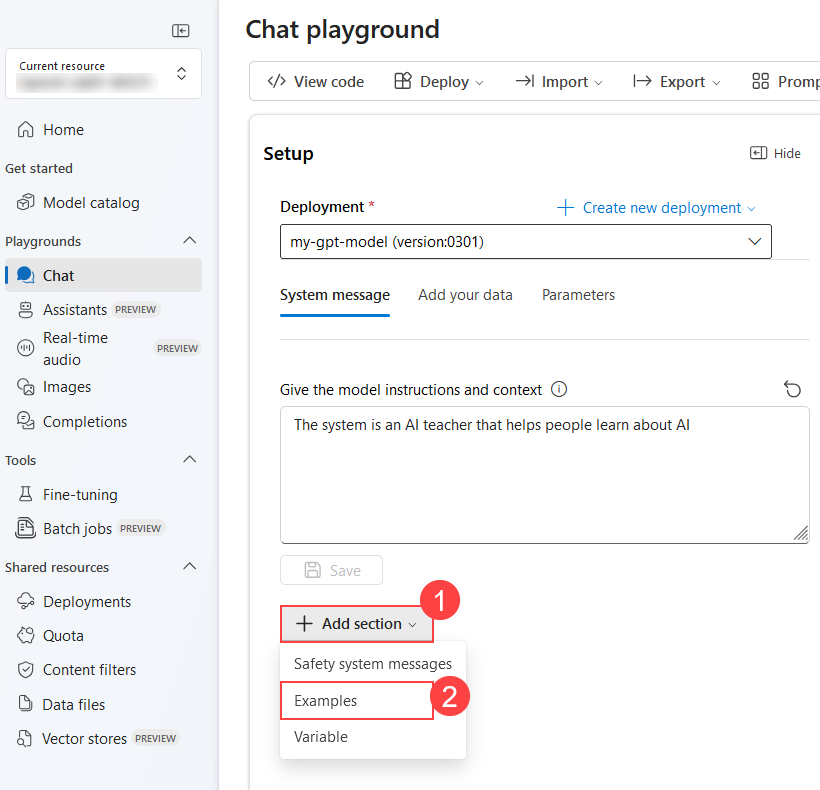

4. Enter the following message and response in the designated boxes:

      - **User**: `What are different types of artificial intelligence?`
    
      - **Assistant**: `There are three main types of artificial intelligence: Narrow or Weak AI (such as virtual assistants like Siri or Alexa, image recognition software, and spam filters), General or Strong AI (AI designed to be as intelligent as a human being. This type of AI does not currently exist and is purely theoretical), and Artificial Superintelligence (AI that is more intelligent than any human being and can perform tasks that are beyond human comprehension. This type of AI is also purely theoretical and has not yet been developed).`

         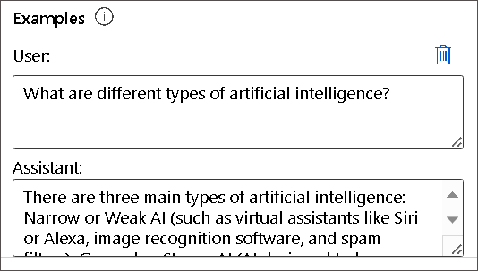
   
         > **Note**: Few-shot examples are used to provide the model with examples of the types of responses that are expected. The model will attempt to reflect the tone and style of the examples in its own responses.

5. Save the changes by clicking on **Apply Changes** and subsequently click on **Continue** to start a new session and set the behavioural context of the chat system.

      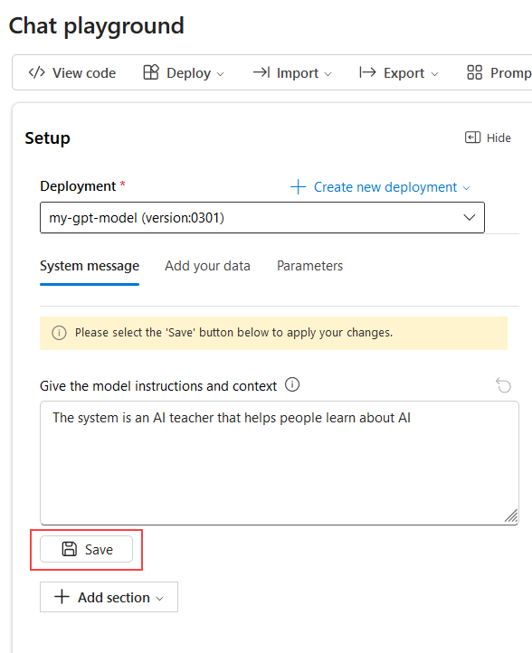
   
6. In the query box at the bottom of the page, enter the text `What is artificial intelligence?`. Use the **Send** button to submit the message and view the response.

      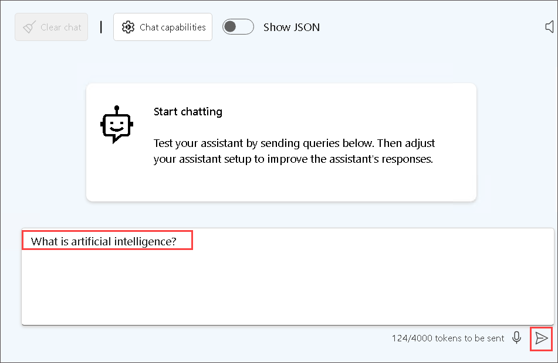
   
      > **Note**: You may receive a response that the API deployment is not yet ready. If so, wait for a few minutes and try again.

7. Review the response and then submit the following message to continue the conversation: `How is it related to machine learning?`

8. Review the response, noting that context from the previous interaction is retained (so the model understands that "it" refers to artificial intelligence).

9. Use the **View Code** button to view the code for the interaction. The prompt consists of the *system* message, the few-shot examples of *user* and *assistant* messages, and the sequence of *user* and *assistant* messages in the chat session so far.

      

### Task 5: Explore prompts and parameters

In this task, you'll explore prompts and parameters by experimenting with different inputs and settings to fine-tune the AI model's responses and behavior.

1. In the **Configuration** pane select **Parameter** , set the following parameter values:
      
      - **Max response**: 500
     
      - **Temperature**: 0
   
          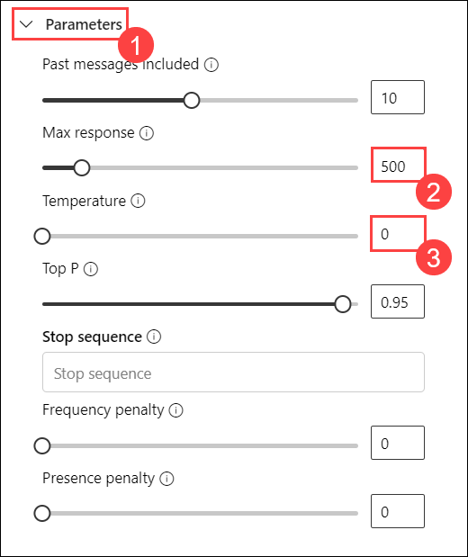
      
2. Submit the following message in a chat session

      ```
      Write three multiple choice questions based on the following text.

      Most computer vision solutions are based on machine learning models that can be applied to visual input from cameras, videos, or images.*

      - Image classification involves training a machine learning model to classify images based on their contents. For example, in a traffic monitoring solution you might use an image classification model to classify images based on the type of vehicle they contain, such as taxis, buses, cyclists, and so on.*

      - Object detection machine learning models are trained to classify individual objects within an image, and identify their location with a bounding box. For example, a traffic monitoring solution might use object detection to identify the location of different classes of vehicle.*

      - Semantic segmentation is an advanced machine learning technique in which individual pixels in the image are classified according to the object to which they belong. For example, a traffic monitoring solution might overlay traffic images with "mask" layers to highlight different vehicles using specific colors.
      
      ```

3. Review the results, which should consist of multiple-choice questions that a teacher could use to test students on the computer vision topics in the prompt. The total response should be smaller than the maximum length you specified as a parameter.

      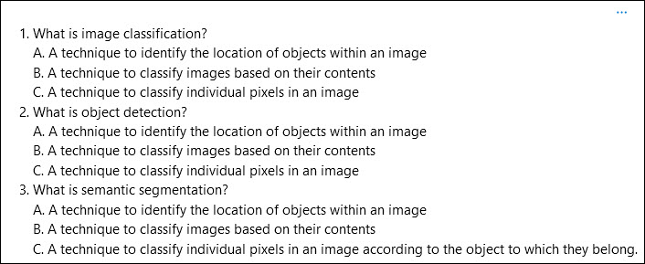
   
4. Observe the following about the prompt and parameters you used:

      - The prompt specifically states that the desired output should be three multiple choice questions.
       
      - The parameters include *Temperature*, which controls the degree to which response generation includes an element of randomness. The value of **0** used in your submission minimizes randomness, resulting in stable, predictable responses.

### Task 6: Explore code-generation

In this task, you'll explore code generation by testing the AI model’s ability to generate and suggest code snippets based on various programming prompts and requirements.

1. In the **Setup** pane, select the **Example** under **+ Add Section** section to reset the message if prompted click on **Continue**. Enter `You are a Python developer.` for Give the model instructions and context and save the changes by clicking on **Apply Changes** when prompted click on **Continue**.


      

2. In the **Chat session** pane, select **Clear chat** to clear the chat history and start a new session.

      

3. Submit the following user message:

      ```
      Write a Python function named Multiply that multiplies two numeric parameters.
      ```

4. Review the response, which should include sample Python code that meets the requirement in the prompt.

      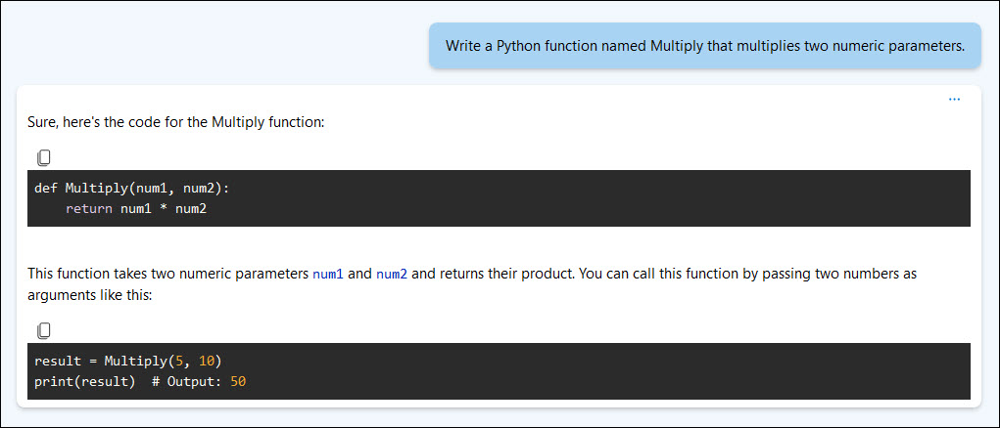

## Summary

In this lab, you have accomplished the following:
- Provisioned an Azure OpenAI resource
- Deployed an Azure OpenAI model within the Azure OpenAI studio
- Used the chat playground to utilise the functionalities of prompts, parameters, and code generation

## You have successfully completed the lab.
