# Lab 01: Generate images with a DALL-E model

## Estimated time: 60 minutes

The Azure OpenAI Service includes an image-generation model named DALL-E. You can use this model to submit natural language prompts that describe a desired image, and the model will generate an original image based on the description you provide.

In this exercise, you'll use a DALL-E version 3 model to generate images based on natural language prompts.

## Lab objectives
In this lab, you will complete the following tasks:

- Task 1: Provision an Azure OpenAI resource
- Task 2: Explore image generation in the DALL-E playground
- Task 3: Use the REST API to generate images
- Task 3.1: Prepare the app environment
- Task 3.2: Configure your application
- Task 3.3: View application code
- Task 4: Run the app

### Task 1:  Provision an Azure OpenAI resource

In this task, you'll create an Azure resource in the Azure portal, selecting the OpenAI service and configuring settings such as region and pricing tier. This setup allows you to integrate OpenAI's advanced language models into your applications.

1. In the **Azure portal**, search for **OpenAI** and select **Azure OpenAI**.

   

2. On **Azure AI Services | Azure OpenAI** blade, click on **Create**.

   

3. Create an **Azure OpenAI** resource with the following settings click on **Next** twice and subsequently click on **Create**:
   
    - **Subscription**: Default - Pre-assigned subscription.
    - **Resource group**: openai-<inject key="Deployment-ID" enableCopy="false"></inject>
    - **Region**: Select <inject key="Region" enableCopy="false" />
    - **Name**: OpenAI-Lab05-<inject key="Deployment-ID" enableCopy="false"></inject>
    - **Pricing tier**: Standard S0

   

   >**Note:** DALL-E 3 models are only available in Azure OpenAI service resources in the **East US** region.

4. Once the deployment is complete, click on **Go to resource** to access the deployed Azure OpenAI resource in the Azure portal.

5. To capture the Keys and Endpoints values, on **OpenAI-Lab05-<inject key="Deployment-ID" enableCopy="false"></inject>** blade:
      - Select **Keys and Endpoint (1)** under **Resource Management**.
      - Click on **Show Keys (2)**.
      - Copy **Key 1 (3)** and ensure to paste it into a text editor such as Notepad for future reference.
      - Finally, copy the **Endpoint (4)** API URL by clicking on copy to clipboard. Paste it in a text editor such as Notepad for later use.

         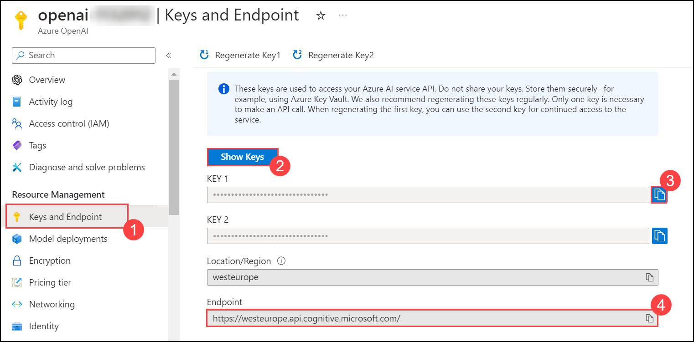

#### Validation

<validation step="d1fdf614-83d8-4c1a-b9c7-c9adf003d03f" />

> **Congratulations** on completing the task! Now, it's time to validate it. Here are the steps:
> - Hit the Validate button for the corresponding task. If you receive a success message, you can proceed to the next task. 
> - If not, carefully read the error message and retry the step, following the instructions in the lab guide.
> - If you need any assistance, please contact us at labs-support@spektrasystems.com. We are available 24/7 to help you out.


### Task 2: Explore image generation in the DALL-E playground

In this task, you will use the DALL-E playground in Azure OpenAI Studio to experiment with image generation.

1. In the **Azure portal**, search for **OpenAI** and select **Azure OpenAI**.

   

2. On **Azure AI Services | Azure OpenAI** blade, select **OpenAI-Lab05-<inject key="Deployment-ID" enableCopy="false"></inject>**

   

3. In the Azure OpenAI resource pane, click on **Go to Azure OpenAI Studio** it will navigate to **Azure AI Studio**.
   
     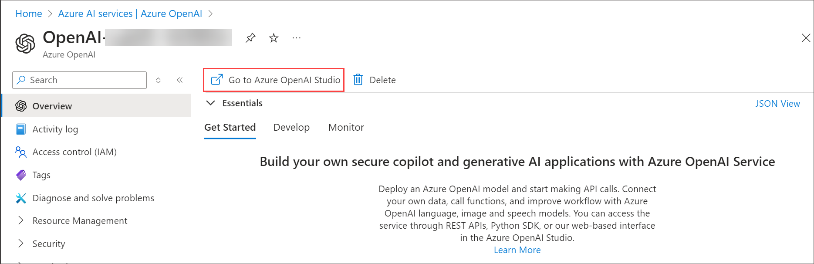

4. In the prompt select **Explore the new experience** .

      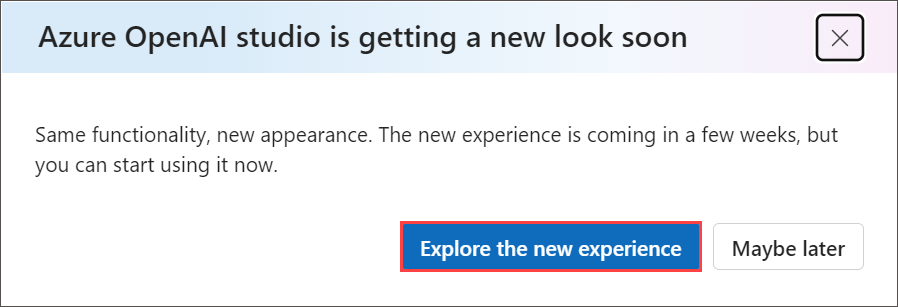
   
5. From the left navigation pane, select **Images (1)**, enter a description of an image you'd like to generate in the **Prompt (2)** box (for example, *An elephant on a skateboard*), and then select **Generate (3)** to view the resulting image.
   
     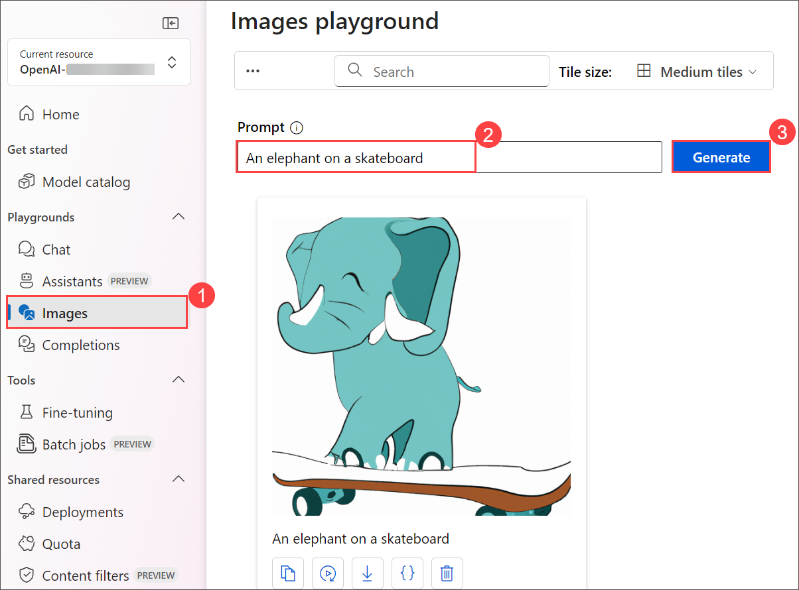

6. Modify the prompt to provide a more specific description. For example *An elephant on a skateboard in the style of Picasso*. Then generate the new image and review the results.

    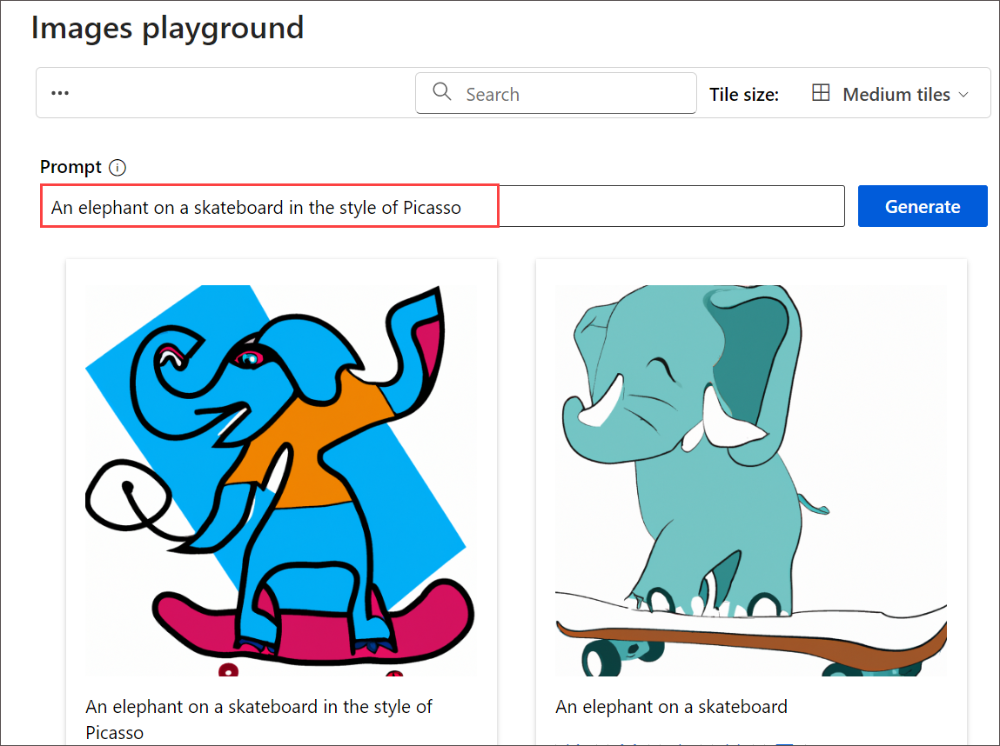

### Task 3: Use the REST API to generate images

The Azure OpenAI service provides a REST API that you can use to submit prompts for content generation - including images generated by a DALL-E model.

#### Task 3.1: Prepare the app environment

In this task, you will use a simple Python or C# app to generate images by calling the REST API and running the code in the Cloud Shell console interface within the Azure portal.

1. In the [Azure portal](https://portal.azure.com?azure-portal=true), select the **[>_]** (*Cloud Shell*) button at the top of the page to the right of the search box. A Cloud Shell pane will open at the bottom of the portal. 

    

2. The first time you open the Cloud Shell, you may be prompted to choose the type of shell you want to use (*Bash* or *PowerShell*). Select **Bash**. If you don't see this option, skip the step.  

    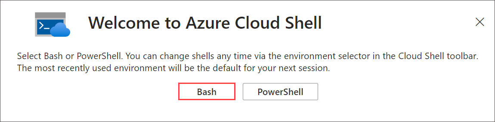
   
3. If you're prompted as Getting Started click on the **Mount storage account**, select the **Subscription** and click on **Apply**.

     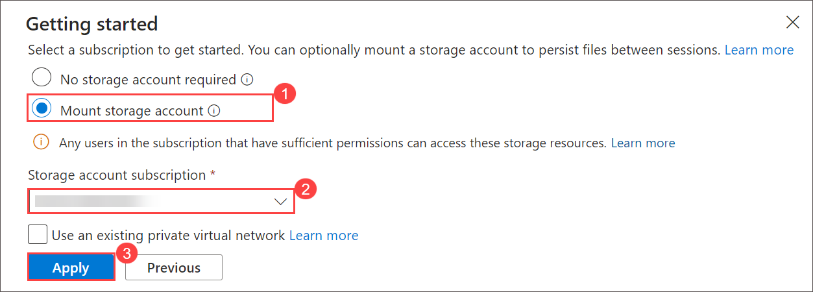

   > **Note**: If you already have a cloud shell set up in your Azure subscription, you may need to use the **Reset user settings** option in the ⚙️ menu to ensure the latest versions of Python and the .NET Framework are installed.

4. Select **I want to create a storage account** and click on **Next**.

    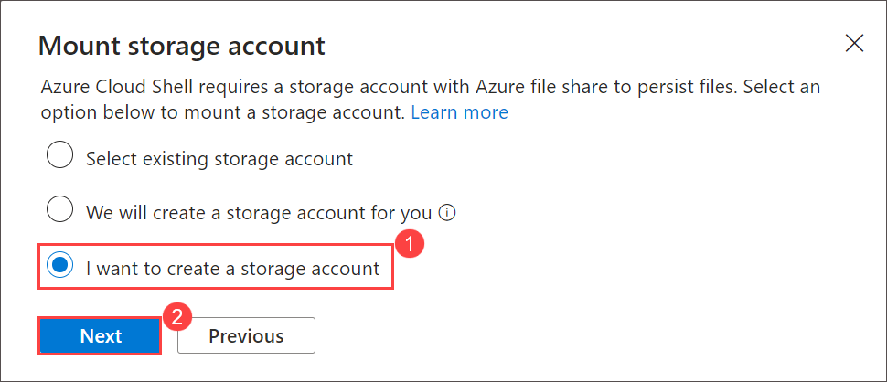

5. Within the **Create storage account** pane, enter the following details and then click on **Create**:

    - **Subscription**: Default- Choose the only existing subscription assigned for this lab
    - **Resource group**: Select **Use existing**.
      - openai-<inject key="Deployment-ID" enableCopy="false"></inject>
    - **Region**: Select <inject key="Region" enableCopy="false" />
    - **Storage account name**: storage<inject key="Deployment-ID" enableCopy="false"></inject>
    - **File share**: Create a new file share named **none**

       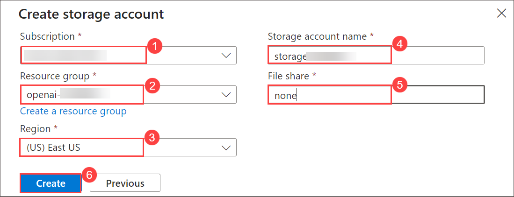

6. Make sure the type of shell indicated on the top left of the Cloud Shell pane is switched to *Bash*. If it's *PowerShell*, switch to *Bash* by using the drop-down menu.

7. Once the terminal starts, enter the following command to download the application code you are going to work with.

    ```bash
   rm -r azure-openai -f
   git clone https://github.com/MicrosoftLearning/mslearn-openai azure-openai
    ```

    The files are downloaded to a folder named **azure-openai**. Applications for both C# and Python have been provided. Both apps feature the same functionality.

8. Navigate to the folder for the language of your preference  by running the appropriate command.

    **Python**

    ```bash
   cd azure-openai/Labfiles/05-image-generation/Python
    ```

    **C#**

    ```bash
   cd azure-openai/Labfiles/05-image-generation/CSharp
    ```

9. Use the following command to open the built-in code editor and see the code files you will be working with.

    ```bash
   code .
    ```
   > **Note**: If you receive a popup to **Switch to Classic Cloud Shell** while running the **code .** command, click **Confirm**. Re-run commands from **steps 8 and 9** to make sure you are in the correct project path.

   

   
#### Task 3.2: Configure your application

In this task, you will use a configuration file in the application to store the details needed to connect to your Azure OpenAI service account.

1. In the code editor, select the configuration file for your app - depending on your language preference.

    - C#: `appsettings.json`
    - Python: `.env`
    
2. Update the configuration values to include the **Endpoint** and **Key1** for your Azure OpenAI service. Then save the file by right-clicking the file from the left pane.

    - C#: `appsettings.json`

      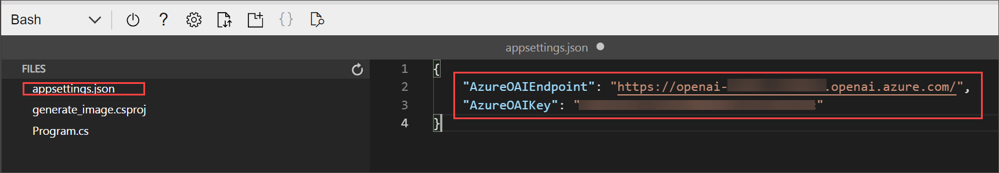
    
    - Python: `.env`

      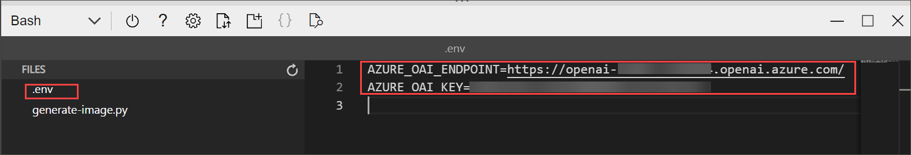

    > **Tip**: You can adjust the split at the top of the cloud shell pane to see the Azure portal, and get the endpoint and key values from the **Keys and Endpoint** page for your Azure OpenAI service.

3. If you are using **Python**, you'll also need to install the **python-dotenv** package used to read the configuration file. In the console prompt pane, ensure the current folder is **~/azure-openai/Labfiles/05-image-generation/Python**. Then enter this command:

    ```bash
   pip install python-dotenv
    ```

#### Task 3.3: View application code

In this task, you will explore the code used to call the REST API and generate an image.

1. In the code editor pane, select the main code file for your application:

    - C#: `Program.cs`
    - Python: `generate-image.py`

2. Review the code that the file contains, noting the following key features:

   >**Note**: right-click on the file from the left pane, and hit **Save**
   
    - The code makes https requests to the endpoint for your service, including the key for your service in the header. Both of these values are obtained from the configuration file.
    - The process consists of <u>two</u> REST requests: One to initiate the image-generation request, and another to retrieve the results.
    The initial request includes the following data:
        - The user-provided prompt that describes the image to be generated
        - The number of images to be generated (in this case, 1)
        - The resolution (size) of the image to be generated.
    - The response header from the initial request includes an **operation-location** value that is used for the subsequent callback to get the results.
    - The code polls the callback URL until the status of the image-generation task is *succeeded*, and then extracts and displays a URL for the generated image.
   
#### Validation

<validation step="46dc5a95-0801-4085-b021-c775e7b1b06b" />

> **Congratulations** on completing the task! Now, it's time to validate it. Here are the steps:
> - Hit the Validate button for the corresponding task. If you receive a success message, you can proceed to the next task. 
> - If not, carefully read the error message and retry the step, following the instructions in the lab guide.
> - If you need any assistance, please contact us at labs-support@spektrasystems.com. We are available 24/7 to help you out.

### Task 4: Run the app

In this task, you will run the reviewed code to generate some images.

1. In the Cloud Shell bash terminal, navigate to the folder for your preferred language.

2. If your using as **C#** language kindly open **generate_image.csproj** file replace with following code and save the file.

   ```
      <Project Sdk="Microsoft.NET.Sdk">
      
      <PropertyGroup>
      <OutputType>Exe</OutputType>
      <TargetFramework>net8.0</TargetFramework>
      <ImplicitUsings>enable</ImplicitUsings>
      <Nullable>enable</Nullable>
      </PropertyGroup>
      
       <ItemGroup>
       <PackageReference Include="Azure.AI.OpenAI" Version="1.0.0-beta.14" />
       <PackageReference Include="Microsoft.Extensions.Configuration" Version="8.0.*" />
       <PackageReference Include="Microsoft.Extensions.Configuration.Json" Version="8.0.*" />
       </ItemGroup>
      
       <ItemGroup>
         <None Update="appsettings.json">
           <CopyToOutputDirectory>PreserveNewest</CopyToOutputDirectory>
          </None>
        </ItemGroup>
      
       </Project>
      ```

3. In the console prompt pane, enter the appropriate command to run your application:

    **Python**

    ```bash
   pip install requests
   python generate-image.py
    ```

    **C#**

    ```bash
   dotnet run
    ```

4. When prompted, enter a description for an image. For example, *A giraffe flying a kite*.

   >**Note**: If you encounter an issue after entering prompts kindly follow the below steps:

   - Navigate back to **Azure OpenAI Studio**. From the top menu bar, turn on the toggle for **Switch to the old version**. click on **Skip** when **Feedback** window prompted.

      

   - In **Deployment**, ensure that **Dalle 3** is selected.

      

   - Enter a description of an image you'd like to generate in the **Prompt** box (for example, *An elephant on a skateboard*), and then select **Generate** to view the resulting image.

      >**Note**: if you encounter error **The API deployment for this resource does not exist**, kindly wait 2 mins and try again to generate. 

   - Navigate back to CloudShell and reperform step no 3. 
    
5. Wait for the image to be generated - a hyperlink will be displayed in the console pane. Then select the hyperlink to open a new browser tab and review the image that was generated.

    

    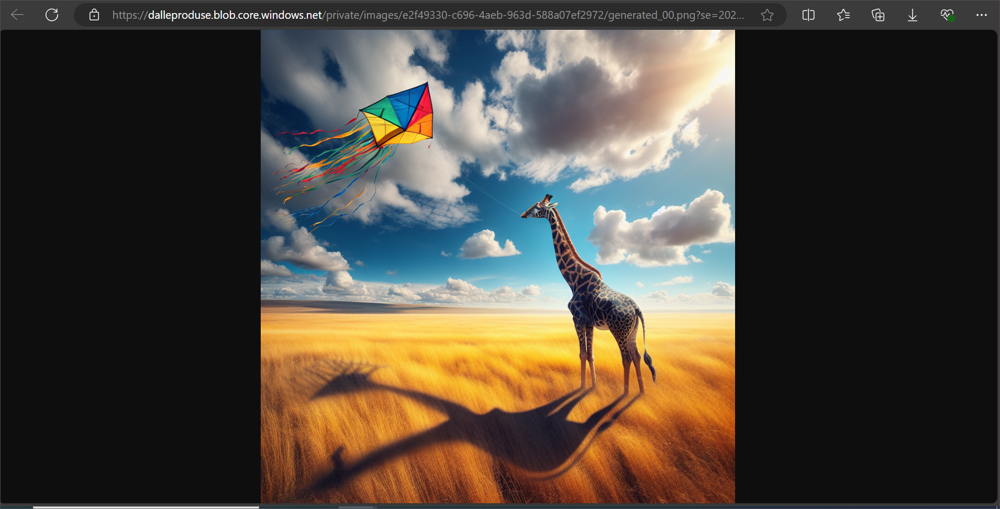
   
6. Close the tab containing the generated image and re-run the app to generate a new image with a different prompt.

## Summary

In this lab, you have accomplished the following:

- Provisioned an Azure OpenAI resource
- Understood the concepts of image generation via the DALL-E model
- Implemented image generation into your applications using this model

### You have successfully completed the lab.
