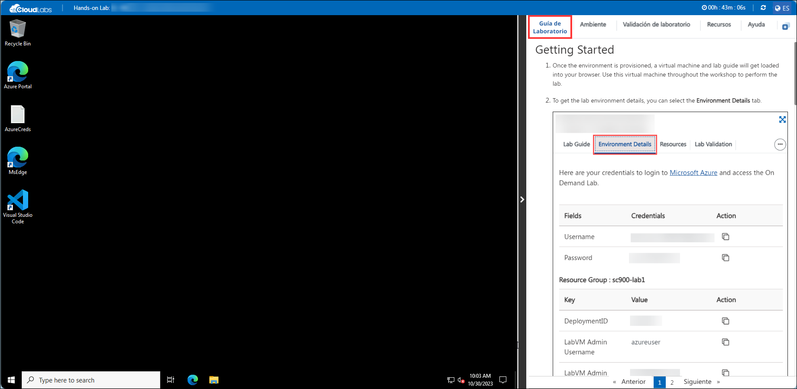
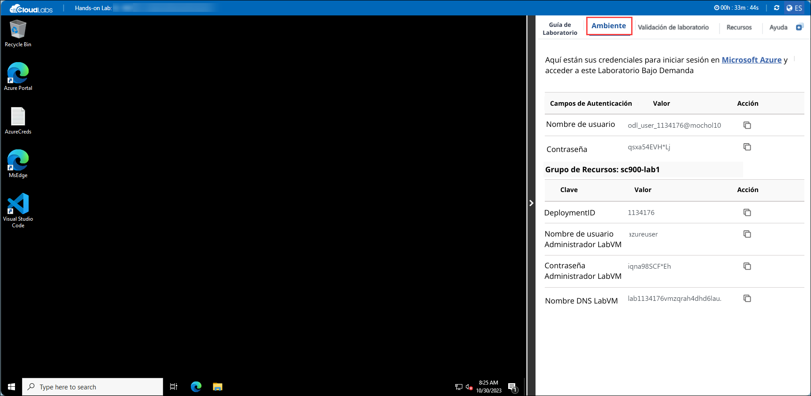
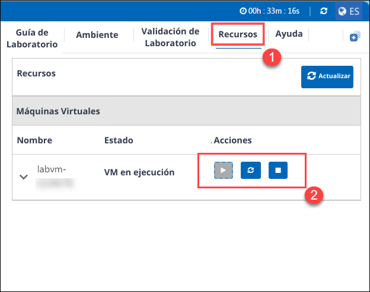
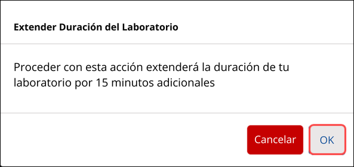
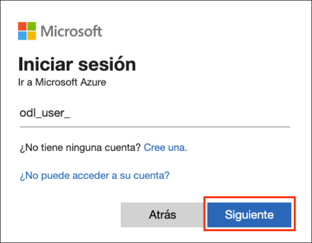
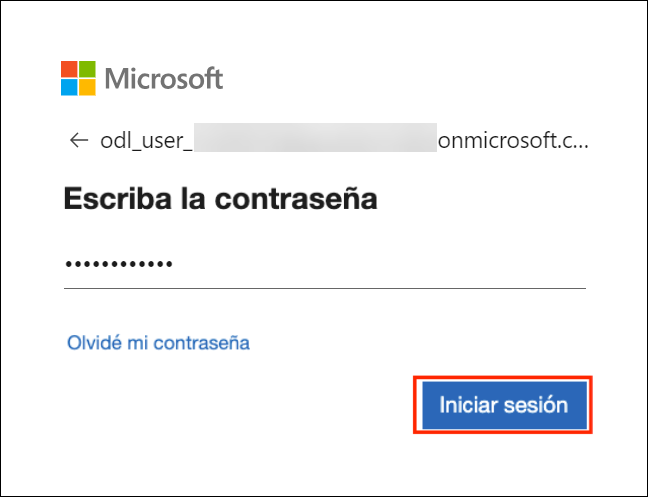

# Build Prompt Engineering with Azure OpenAI Service

### Overall Estimated Duration: 4 Hours

## Overview

In this hands-on lab, you will explore the concept of prompt engineering, learning how to craft effective prompts for AI models. You'll get hands-on experience with Azure OpenAI Playground, experimenting with different types of prompts and understanding their elements and design tips. The way developers shape their prompts significantly impacts the generative AI model's responses, allowing for tailored and formatted content when requested clearly and concisely. You'll learn how different prompts for similar content can shape the AI model's response to better satisfy your requirements.

You will explore how to use generative AI to improve advertising emails and categorize articles for your team. The prompt engineering techniques used in the exercise are applicable to various use cases. Tuning prompts to achieve the desired results is the core idea behind prompt engineering.

## Objective

By the end of this lab, you will be able to:

- **Introduction to Prompt Engineering & Azure OpenAI Studio**: Learn to craft effective prompts for AI models using Azure OpenAI Playground, experimenting with different types and design tips. This hands-on experience will help you understand how different prompt styles influence AI responses and improve your results.
- **Utilize prompt engineering in your app**: Provision an Azure OpenAI resource, deploy a model, apply prompt engineering in the chat playground, set up and configure an application in Cloud Shell, and run your application to see the results.
- **Advanced Concepts (Read-Only)**: Master the art of tuning prompts to achieve specific outcomes and explore advanced methods for refining AI outputs, all without the need for fine-tuning GPT models. Learn how to leverage prompt adjustments and design techniques to enhance model responses effectively.
- **Fine Tuning (Read-Only)**: Master prompt engineering using Azure OpenAI Playground to refine AI responses, tailoring outputs for specific tasks such as enhancing advertising emails and categorizing articles.
  
## Pre-requisites

Participants should have:

- Familiarity with Azure OpenAI Service.
- Prompt Engineering Basics

## Architecture

In this hands-on lab, you'll delve into prompt engineering by first grasping the basics and its impact on AI responses. You'll then gain practical experience using Azure OpenAI Playground, experimenting with various types of prompts and learning their design elements and tips. As you explore how to tailor prompts for improving advertising emails and categorizing articles, you'll see how effective prompt engineering can shape AI model outputs to meet specific requirements. The lab emphasizes how tuning prompts is crucial for optimizing AI responses across different use cases.

## Architecture Diagram

## Explanation of Components

The architecture for this lab involves the following key components:

1. **Azure OpenAI**: Azure OpenAI Service provides REST API access to OpenAI's powerful language models and these models integrate with your data, enabling customized and secure interactions.
1. **Azure OpenAI Models**: Offers pre-trained and customizable large language models for various AI applications. These models allow for powerful AI-driven solutions by generating tailored and contextually relevant content based on well-crafted prompts.
1. **Azure CloudShell**: Azure CloudShell offers an integrated, browser-based shell experience for managing Azure resources. It provides a ready-to-use environment with pre-installed tools and access to both Bash and PowerShell.
   
## Getting Started with the Lab
 
## Accessing Your Lab Environment
 
Once you're ready to dive in, your virtual machine and lab guide will be right at your fingertips within your web browser.

   

### Virtual Machine & Lab Guide
 
Your virtual machine is your workhorse throughout the workshop. The lab guide is your roadmap to success.
 
## Exploring Your Lab Resources
 
To get a better understanding of your lab resources and credentials, navigate to the **Environment** tab.
 
   
 
## Utilizing the Split Window Feature
 
For convenience, you can open the lab guide in a separate window by selecting the **Split Window** button from the Top right corner.
 
 
 
## Managing Your Virtual Machine
 
Feel free to start, stop, or restart your virtual machine as needed from the **Resources** tab. Your experience is in your hands!
 

## Lab Validation

1. After completing the task, hit the **Validate** button under the Validation tab integrated within your lab guide. If you receive a success message, you can proceed to the next task, if not, carefully read the error message and retry the step, following the instructions in the lab guide.

   

1. You can also validate the task by navigating to the **Lab Validation** tab, from the upper right corner in the lab guide section.

   

1. If you need any assistance, please contact us at labs-support@spektrasystems.com.

## Lab Duration Extension

1. To extend the duration of the lab, kindly click the **Hourglass** icon in the top right corner of the lab environment. 

    

    >**Note:** You will get the **Hourglass** icon when 10 minutes are remaining in the lab.

2. Click **OK** to extend your lab duration.
 
   

3. If you have not extended the duration prior to when the lab is about to end, a pop-up will appear, giving you the option to extend. Click **OK** to proceed.

## Let's Get Started with Azure Portal

1. On your virtual machine, click on the Azure Portal icon as shown below:

   .png)
   
1. You'll see the **Sign into Microsoft Azure** tab. Here, enter your credentials:
 
   - **Email/Username:** <inject key="AzureAdUserEmail"></inject>
 
       
 
1. Next, provide your password:
 
   - **Password:** <inject key="AzureAdUserPassword"></inject>
 
       

1. If **Action required** pop-up window appears, click on **Ask later**.

   

   >**NOTE:** Do not enable MFA, select **Ask Later**.
    
1. If prompted to stay signed in, you can click "No."
 
1. If a **Welcome to Microsoft Azure** pop-up window appears, simply click "Maybe Later" to skip the tour.

This hands-on lab will help you master prompt engineering by crafting effective prompts with Azure OpenAI Playground to shape AI responses. You'll apply these techniques to enhance advertising emails and categorize articles, learning to optimize AI outputs for various use cases.

## Support Contact

The CloudLabs support team is available 24/7, 365 days a year, via email and live chat to ensure seamless assistance at any time. We offer dedicated support channels tailored specifically for both learners and instructors, ensuring that all your needs are promptly and efficiently addressed.

Learner Support Contacts:

- Email Support: cloudlabs-support@spektrasystems.com
- Live Chat Support: https://cloudlabs.ai/labs-support

Now, click on **Next** from the lower right corner to move on to the next page.

.png)

### Happy Learning!!
